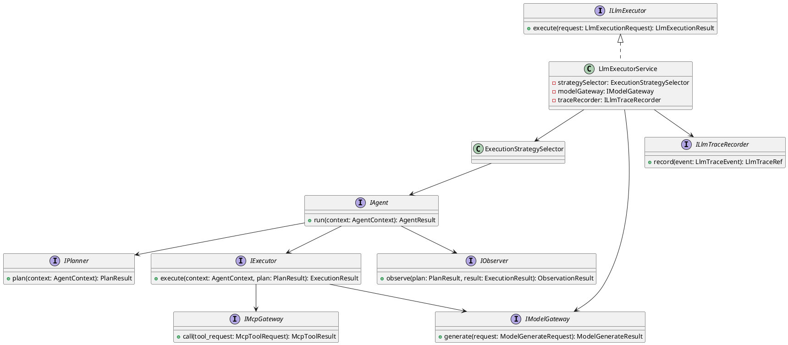
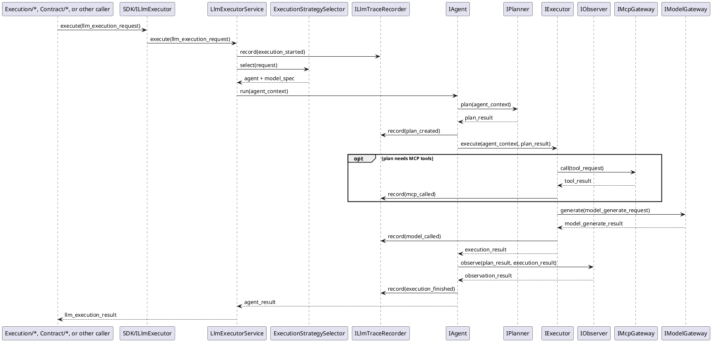

# LlmExecutor Design

## 1. Goal

### 1.1 Purpose

Define the module design of `SDK/LlmExecutor`.

### 1.2 Involved Modules

This module design directly involves:

- `SDK/LlmExecutor`

This module design collaborates with:

- `Execution/ArchitectureDesignGenerator`
- `Execution/ModuleDesignGenerator`
- `Execution/ImplementationGenerator`
- `Execution/RequirementInterpreter`
- `Contract/*`
- `QualityGate/*`

### 1.3 Core Functions

`SDK/LlmExecutor` is the shared LLM SDK capability module.

Its core functions are:

- accept prompt input from upstream modules
- organize agent execution flow for one generation request
- select an available model according to execution policy
- call the selected model and return model response

`LlmExecutor` does not decide business-stage workflow progression or artifact persistence.

## 2. Core Classes

### 2.1 Class Diagram



### 2.2 `LlmExecutorService`

Role:

- module entry point
- owns llm execution orchestration

Responsibilities:

- accept prompt execution requests
- select the proper agent strategy
- select the proper model
- emit internal runtime trace events
- call the model gateway
- return normalized model result

### 2.3 `ExecutionStrategySelector`

Role:

- execution strategy selection component

Responsibilities:

- choose which agent implementation to use for a request
- choose which model should be used for a request
- return one consistent execution strategy for the request

### 2.4 `IAgent`

Role:

- abstract agent execution interface

Responsibilities:

- organize the execution steps for one prompt request
- call model execution through the provided gateway abstraction
- normalize intermediate and final outputs

### 2.5 `IPlanner`

Role:

- agent planning interface

Responsibilities:

- build the execution plan for one request
- decide whether the agent should use direct generation or multi-step execution

### 2.6 `IExecutor`

Role:

- agent execution interface

Responsibilities:

- execute the planned steps
- call the model gateway
- call MCP tools when the plan requires external tool usage

### 2.7 `IObserver`

Role:

- agent observation interface

Responsibilities:

- inspect execution result
- decide whether the current result is acceptable or whether another iteration is needed

### 2.8 `IMcpGateway`

Role:

- abstract MCP tool gateway

Responsibilities:

- expose MCP tool invocation to the agent execution layer
- isolate MCP protocol details from the agent implementation

### 2.9 `IModelGateway`

Role:

- abstract model provider interface

Responsibilities:

- execute the actual model call
- hide provider-specific SDK details

### 2.10 `ILlmExecutor`

Role:

- abstract llm execution interface

Responsibilities:

- expose prompt-in / model-result-out contract to upstream modules

### 2.11 `ILlmTraceRecorder`

Role:

- llm runtime trace output interface

Responsibilities:

- expose internal llm execution progress to external callers
- provide stable trace references for runtime observation

## 3. Core Runtime Flow

### 3.1 Main Sequence Diagram



## 4. Detailed Design

### 4.1 Core APIs And Fields

#### 4.1.1 Public API

```ts
interface ILlmExecutor {
  execute(request: LlmExecutionRequest): LlmExecutionResult
}
```

#### 4.1.2 Prompt Input Types

```ts
interface PromptInput {
  system_prompt: string
  user_prompt: string
}

interface LlmExecutionRequest {
  prompt: PromptInput
  execution_policy?: string
}

type LlmTraceRef = string
```

#### 4.1.3 Agent Types

```ts
interface AgentContext {
  prompt: PromptInput
  model_spec: ModelSpec
}

interface AgentResult {
  content: string
}

interface IAgent {
  run(context: AgentContext): AgentResult
}

interface PlanResult {
  steps: string[]
  use_mcp: boolean
}

interface ExecutionResult {
  content: string
}

interface ObservationResult {
  accepted: boolean
}

interface IPlanner {
  plan(context: AgentContext): PlanResult
}

interface IExecutor {
  execute(context: AgentContext, plan: PlanResult): ExecutionResult
}

interface IObserver {
  observe(plan: PlanResult, result: ExecutionResult): ObservationResult
}
```

Agent design notes:

- V1 should default to a single-agent design.
- the single agent may still internally follow `plan -> execute -> observe`.
- `plan -> execute -> observe` is the standard internal execution shape for agents in this module.
- if a request is simple, `IPlanner` may produce a one-step direct generation plan.
- if a request needs tools, `IExecutor` may call `IMcpGateway` before or between model calls.
- the outer `IAgent` abstraction remains stable whether the internal execution is single-step or multi-step.

#### 4.1.4 Model Selection And Invocation Types

```ts
interface ModelSpec {
  model_name: string
}

interface ModelGenerateRequest {
  model: ModelSpec
  prompt: PromptInput
}

interface ModelGenerateResult {
  content: string
}

interface IModelGateway {
  generate(request: ModelGenerateRequest): ModelGenerateResult
}

interface McpToolRequest {
  tool_name: string
  arguments: Record<string, unknown>
}

interface McpToolResult {
  content: string
}

interface IMcpGateway {
  call(tool_request: McpToolRequest): McpToolResult
}

interface LlmTraceEvent {
  event_type: string
  summary: string
}

interface ILlmTraceRecorder {
  record(event: LlmTraceEvent): LlmTraceRef
}
```

Model selection notes:

- business modules should not bind directly to concrete model names.
- `ExecutionStrategySelector` should own model choice based on request policy.
- different modules may request different model policies while sharing the same `ILlmExecutor`.
- MCP capability is optional and should only be used when the selected agent strategy requires tools.

#### 4.1.5 Return Types

```ts
interface LlmExecutionResult {
  content: string
}
```

### 4.2 Constraints

- `LlmExecutor` input is prompt data, not business documents directly.
- `LlmExecutor` output is model result data, not stage output files directly.
- upstream modules should not couple to concrete model SDKs.
- agent design and model selection should remain replaceable without changing caller interfaces.
- `LlmExecutor` should expose internal runtime trace through `ILlmTraceRecorder`.
