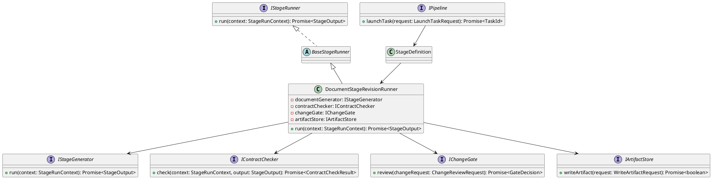
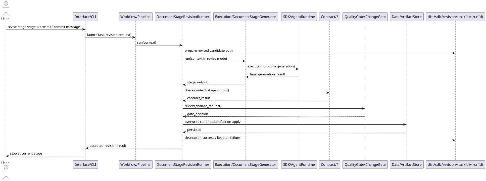
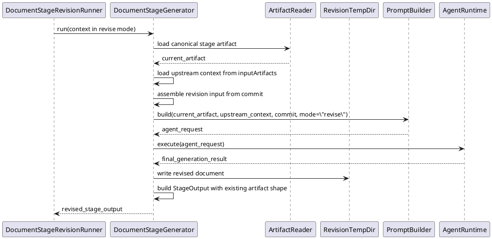

<!--
{
  "document_contracts": [
    {
      "check_item": "document_structure_complete",
      "description": "The document should contain the required top-level sections and expected subsection structure.",
      "severity": "high"
    },
    {
      "check_item": "section_contract_alignment",
      "description": "Each major section should be described by an explicit SectionContract-style comment including section_id, title, expected_format, and hints.",
      "severity": "high"
    },
    {
      "check_item": "format_consistency",
      "description": "The document should keep section formatting, code-block style, and terminology consistent across all sections.",
      "severity": "medium"
    }
  ]
}
-->

# DocumentStageRevisionFlow Design

## 1. Goal

### 1.1 Purpose

<!--
{
  "section_contract": {
    "section_id": "1.1",
    "title": "Purpose",
    "checkitems": [
      "define the purpose of the current module design document",
      "make the module boundary explicit"
    ],
    "severity": "medium",
    "expected_format": "`{Purpose}`"
  }
}
-->

Define the workflow design for stage-local revision of an already accepted document artifact within the AI-RD staged workflow.

### 1.2 Involved Modules

<!--
{
  "section_contract": {
    "section_id": "1.2",
    "title": "Involved Modules",
    "checkitems": [
      "list the directly involved module",
      "list the collaborating modules only when they are necessary for understanding the design"
    ],
    "severity": "medium",
    "expected_format": "This module design directly involves:\n\n- `{ModulePath}`\n\nThis module design collaborates with:\n\n- `{CollaboratorA}`\n- `{CollaboratorB}`"
  }
}
-->

This module design directly involves:

- `Workflow/DocumentStageRevisionFlow`
- `Workflow/StageRunners`
- `Workflow/Pipeline`

This module design collaborates with:

- `Interface/CLI`
- `Execution/DocumentStageGenerator`
- `SDK/AgentRuntime`
- `Contract/*`
- `QualityGate/ChangeGate`
- `Data/ArtifactStore`

### 1.3 Core Functions

<!--
{
  "section_contract": {
    "section_id": "1.3",
    "title": "Core Functions",
    "checkitems": [
      "summarize the module role",
      "list the core functions only",
      "explicitly state what is out of scope for this module"
    ],
    "severity": "medium",
    "expected_format": "`{ModulePath}` is the `{ModuleRole}` module.\n\nIts core functions are:\n\n- `{CoreFunction1}`\n- `{CoreFunction2}`\n- `{CoreFunction3}`\n- `{CoreFunction4}`\n\n`{ModuleName}` does not `{OutOfScope1}`, `{OutOfScope2}`, or `{OutOfScope3}`."
  }
}
-->

`Workflow/DocumentStageRevisionFlow` is the stage-local workflow module for revising an existing accepted document artifact.

Its core functions are:

- load the current accepted stage artifact from the workspace
- assemble upstream context and revision input for the same stage
- call the existing stage document generator in `revise` mode and receive a canonical `StageOutput`
- reuse the canonical stage contract, review gate, and artifact persistence path after generation
- update the accepted artifact for the current stage through workflow-facing data adapters
- expose revision execution as a pipeline-registered stage path triggered from CLI
- stop at the current stage after accepted persistence

`DocumentStageRevisionFlow` does not regenerate downstream stages, produce implementation/code patches, or automatically continue the pipeline after revision.

## 2. Core Classes

### 2.1 Class Diagram

<!--
{
  "section_contract": {
    "section_id": "2.1",
    "title": "Class Diagram",
    "checkitems": [
      "show the important classes, interfaces, and dependencies",
      "keep the diagram focused on core module structure"
    ],
    "severity": "medium",
    "expected_format": "```plantuml\n' UML class diagram here\n```"
  }
}
-->



### 2.2 Core Class Responsibilities

<!--
{
  "section_contract": {
    "section_id": "2.2",
    "title": "Core Class Responsibilities",
    "checkitems": [
      "describe the role and responsibilities of the key classes or interfaces shown in the class diagram",
      "keep one subsection per important class, interface, or component",
      "do not restate every field unless it affects responsibilities or boundaries"
    ],
    "severity": "medium",
    "expected_format": "### 2.2 `PrimaryService`\n\nRole:\n\n- `{PrimaryRole}`\n\nResponsibilities:\n\n- `{Responsibility1}`\n- `{Responsibility2}`\n- `{Responsibility3}`"
  }
}
-->

### 2.2 `DocumentStageRevisionRunner`

Role:

- workflow owner for a single stage-local revision run

Responsibilities:

- orchestrate one stage-local revision run under the workflow layer
- keep revision flow limited to the current stage
- prepare a revision temp directory under `workspace/dist/sdlc/revision/{taskId}/{runId}/`
- call the existing document generator in `revise` mode, then reuse existing contract, gate, and data adapters
- persist the accepted artifact for the current stage through workflow-facing collaborators
- stop without automatic downstream continuation
- bind the concrete document generator according to `stageId`
- run only when selected by a revision-specific `StageDefinition` in `Workflow/Pipeline`

### 2.3 `IStageGenerator`

Role:

- execution-side document generation interface reused by both `generate` and `revise` flows

Responsibilities:

- accept stage-specific generation input via `StageRunContext`
- read the current stage artifact directly from the canonical workspace path
- write the revised candidate document into the revision temp directory first
- return `StageOutput` whose `artifacts` shape matches the canonical output shape of the current stage
- delegate any multi-turn interaction to the underlying agent capability instead of owning session orchestration by itself
- stay limited to stage-specific input assembly and canonical output construction

### 2.4 `IContractChecker`

Role:

- current-stage quality gate for revised document validity

Responsibilities:

- check the same `StageOutput.artifacts` returned by the document generator without introducing a revision-specific contract shape
- validate the revised document content represented in that canonical stage output
- reuse the canonical stage contract implementation directly for the current stage
- return structured pass/fail result with issues

### 2.5 `IChangeGate`

Role:

- human review gate for stage-local revision result

Responsibilities:

- present revision result to the user
- return `apply`, `reject`, or `wait`

### 2.6 `IArtifactStore`

Role:

- workflow-facing persistence adapter for the current stage artifact

Responsibilities:

- write the accepted revised document to the canonical artifact path
- keep persistence limited to the current stage boundary

## 3. Core Runtime Flow

### 3.1 Main Sequence Diagram

<!--
{
  "section_contract": {
    "section_id": "3.1",
    "title": "Main Sequence Diagram",
    "checkitems": [
      "show the main runtime interaction between caller, module, and collaborators",
      "keep the flow focused on the primary success path"
    ],
    "severity": "medium",
    "expected_format": "```plantuml\n' UML sequence diagram here\n```"
  }
}
-->



### 3.2 Generator Internal Flow



### 3.3 End-To-End Input/Output Responsibility

```ts
interface CliRevisionCommandInput {
  stageId: "requirement_interpretation" | "architecture_design" | "module_design" | "implementation_plan"
  workspaceRoot: string
  commit: string
  targetModule?: string
}

interface CliRevisionCommandOutput {
  request: LaunchTaskRequest
}

interface PipelineRevisionDispatchInput {
  request: LaunchTaskRequest
}

interface PipelineRevisionDispatchOutput {
  stageDefinition: RevisionStageDefinition
  context: StageRunContext
}

interface RevisionTempSnapshotInput {
  taskId: string
  runId: string
  canonicalArtifactPath: string
}

interface RevisionTempSnapshotOutput {
  tempDirectoryRoot: string
  revisedArtifactPath: string
}

interface RevisionGeneratorInput {
  context: StageRunContext
  canonicalArtifactPath: string
  revisedArtifactPath: string
  commit: string
  mode: "revise"
}

interface RevisionGeneratorOutput {
  stageOutput: StageOutput
  revisedArtifactPath: string
}

interface RevisionContractCheckInput {
  context: StageRunContext
  stageOutput: StageOutput
}

interface RevisionContractCheckOutput {
  contractResult: ContractCheckResult
}

interface RevisionReviewInput {
  context: StageRunContext
  canonicalArtifactPath: string
  revisedArtifactPath: string
  contractResult: ContractCheckResult
}

interface RevisionReviewOutput {
  gateDecision: GateDecision
}

interface AcceptedRevisionPersistenceInput {
  gateDecision: "apply"
  canonicalArtifactPath: string
  revisedArtifactPath: string
}

interface AcceptedRevisionPersistenceOutput {
  persisted: true
}

interface RevisionRunnerOutput {
  stageOutput: StageOutput
  accepted: boolean
  stoppedAtCurrentStage: true
}

interface RevisionReadWriteOwnership {
  cliOwns: "request field assembly only"
  pipelineOwns: "revision StageDefinition selection and StageRunContext assembly"
  runnerOwns:
    | "temp directory root selection"
    | "canonical artifact path selection"
    | "reuse canonical contract/gate/persistence flow after generation"
    | "copy accepted revised artifact back to canonical path"
  generatorOwns:
    | "read current stage artifact from canonical workspace path"
    | "read upstream context from StageRunContext.inputArtifacts"
    | "write revised candidate artifact into temp directory"
    | "call underlying agent capability with revise-mode generation input"
    | "construct canonical StageOutput only"
  contractOwns: "consume canonical StageOutput only"
  gateOwns: "review decision only"
}

type RevisionInputOutputChain = [
  {
    step: "cli_request"
    output: "LaunchTaskRequest"
    nextInput: "PipelineRevisionDispatchInput.request"
  },
  {
    step: "pipeline_dispatch"
    output: "StageRunContext"
    nextInput: "RevisionGeneratorInput.context"
  },
  {
    step: "temp_snapshot"
    output: "RevisionTempSnapshotOutput.revisedArtifactPath"
    nextInput: "RevisionGeneratorInput.revisedArtifactPath"
  },
  {
    step: "revision_generation"
    output: "RevisionGeneratorOutput.stageOutput | RevisionGeneratorOutput.revisedArtifactPath"
    nextInput:
      | "RevisionContractCheckInput.stageOutput"
      | "RevisionReviewInput.revisedArtifactPath"
      | "RevisionRunnerOutput.stageOutput"
  },
  {
    step: "contract_check"
    output: "RevisionContractCheckOutput.contractResult"
    nextInput: "RevisionReviewInput.contractResult"
  },
  {
    step: "review"
    output: "RevisionReviewOutput.gateDecision"
    nextInput:
      | "AcceptedRevisionPersistenceInput.gateDecision"
      | "RevisionRunnerOutput.accepted"
  },
  {
    step: "accepted_persistence"
    output: "AcceptedRevisionPersistenceOutput.persisted"
    nextInput: "RevisionRunnerOutput.accepted"
  }
]
```

## 4. Detailed Design

### 4.1 Core APIs And Fields

#### 4.1.1 Public API

<!--
{
  "section_contract": {
    "section_id": "4.1.1",
    "title": "Public API",
    "checkitems": [
      "define only the public API that upstream modules need to call",
      "keep the API structure stable and minimal"
    ],
    "severity": "medium",
    "expected_format": "```ts\ninterface I{ModuleName} {\n  {PublicMethod}({PrimaryInputName}: {PrimaryInputType}): {PrimaryOutputType}\n}\n```"
  }
}
-->

```ts
interface DocumentStageRevisionRunner {
  run(context: StageRunContext): Promise<StageOutput>
}
```

#### 4.1.2 Input Types

<!--
{
  "section_contract": {
    "section_id": "4.1.2",
    "title": "Input Types",
    "checkitems": [
      "define only input structures that belong to this module",
      "do not repeat upstream shared types unless this module owns them",
      "when the module contains contract-style section definitions, prefer stable names such as `document_contracts` and `section_contracts`",
      "input format must be defined explicitly in code blocks",
      "do not use natural-language prose to describe input structure"
    ],
    "severity": "medium",
    "expected_format": "```ts\ninterface {PrimaryInputType} {\n  {InputFieldA}: {InputFieldTypeA}\n  {InputFieldB}?: {InputFieldTypeB}\n}\n\ninterface ContractSpec {\n  document_contracts: DocumentContract[]\n  section_contracts: SectionContract[]\n}\n```\n\nNo prose outside code blocks."
  }
}
-->

```ts
interface StageRevisionRequest {
  stageId: "requirement_interpretation" | "architecture_design" | "module_design" | "implementation_plan"
  workspaceRoot: string
  commit: string
  targetModule?: string
}
```

#### 4.1.3 Runtime Types

<!--
{
  "section_contract": {
    "section_id": "4.1.3",
    "title": "Runtime Types",
    "checkitems": [
      "define internal runtime structures only when they are necessary for understanding the design",
      "keep runtime types implementation-oriented but concise"
    ],
    "severity": "medium",
    "expected_format": "```ts\ninterface {RuntimeTypeA} {\n  {RuntimeFieldA}: {RuntimeFieldTypeA}\n}\n\ninterface {RuntimeTypeB} {\n  {RuntimeFieldB}: {RuntimeFieldTypeB}\n}\n```"
  }
}
-->

```ts
interface RevisionRuntimeState {
  canonicalArtifactPath: string
  revisedArtifactPath: string
}
```

#### 4.1.4 Output Types

<!--
{
  "section_contract": {
    "section_id": "4.1.4",
    "title": "Output Types",
    "checkitems": [
      "define the stable output structure produced by this module",
      "make downstream-consumed fields explicit",
      "output format must be defined explicitly in code blocks",
      "do not use natural-language prose to describe output structure"
    ],
    "severity": "medium",
    "expected_format": "```ts\ninterface {PrimaryOutputType} {\n  {OutputFieldA}: {OutputFieldTypeA}\n  {OutputFieldB}?: {OutputFieldTypeB}\n}\n```\n\nNo prose outside code blocks."
  }
}
-->

```ts
interface StageRevisionResult {
  stageId: string
  artifactPath: string
  accepted: boolean
  summary: string
  stoppedAtCurrentStage: true
}
```

#### 4.1.5 Module-Specific Rules

<!--
{
  "section_contract": {
    "section_id": "4.1.5",
    "title": "Module-Specific Rules",
    "checkitems": [
      "define module-specific invariants, constraints, or decision rules",
      "keep the rules concrete and implementation-relevant"
    ],
    "severity": "medium",
    "expected_format": "- `{Rule1}`\n- `{Rule2}`\n- `{Rule3}`"
  }
}
-->

- The current artifact must already exist at the canonical stage path, otherwise revision fails immediately.
- The document generator revision-mode input is `current artifact + commit + upstream context`.
- The document generator must return a full revised document, not a patch fragment.
- Stage template bindings and contract resource bindings remain canonical and unchanged in revision mode.
- Before revision generation starts, the runner prepares `workspace/dist/sdlc/revision/{taskId}/{runId}/revised.md` for the current run.
- Contract check, review, and accepted persistence reuse the same canonical downstream collaborators as the non-revision stage flow.
- Contract check consumes the canonical `StageOutput` returned by the document generator and does not introduce a revision-only artifact shape.
- Revision flow reuses the canonical stage contract implementation directly and does not introduce a revision-specific contract class.
- The document generator reads the current stage artifact by itself; `DocumentStageRevisionRunner` only passes `StageRunContext`.
- The document generator reads the current stage artifact from the canonical workspace path and writes only the revised candidate into the revision temp directory.
- Multi-turn interaction is provided by the underlying agent capability; the generator owns only stage-specific input assembly and canonical output construction.
- Review result `apply` overwrites the existing current-stage artifact file.
- Review result `reject` or `wait` does not write any file.
- Accepted revision must overwrite only the current stage artifact through workflow-facing persistence.
- No downstream stage launch is allowed from the revision flow.
- Revision-flow `StageOutput.artifacts` keeps the same artifact shape as the current stage contract and does not introduce a new artifact structure.

#### 4.1.6 Runner-To-Generator Binding

```ts
interface DocumentStageRevisionRunnerDependencies {
  requirementDocumentGenerator: IStageGenerator
  architectureDocumentGenerator: IStageGenerator
  moduleDesignDocumentGenerator: IStageGenerator
  implementationPlanDocumentGenerator: IStageGenerator
}

interface RevisionStageDefinition {
  stageId:
    | "requirement_interpretation_revision"
    | "architecture_design_revision"
    | "module_design_revision"
    | "implementation_plan_revision"
  runner: IStageRunner
}
```

- runner-side binding is owned by the workflow layer
- `DocumentStageRevisionRunner` selects the concrete document generator according to `stageId`
- `Interface/CLI` does not choose the concrete generator binding
- `Interface/CLI` launches revision through `Workflow/Pipeline`
- `Workflow/Pipeline` owns the revision-stage registration through dedicated `StageDefinition` entries
- `DocumentStageRevisionRunner` provides only `StageRunContext` and does not decide the read location of the current stage artifact
- each concrete document generator decides how to resolve and read the current stage artifact for its own stage contract

#### 4.1.7 Revision Temp Directory Rule

```ts
interface RevisionTempDirectory {
  root: "dist/sdlc/revision/{taskId}/{runId}"
  revisedArtifactPath: string
}
```

- each revision run gets an isolated temp directory under `workspace/dist/sdlc/revision/{taskId}/{runId}/`
- before creating temp files for the current run, the runner deletes any existing temp directory for the same `{taskId}/{runId}`
- the generator reads the current accepted artifact directly from the canonical workspace path
- the generator writes the revised candidate document into that temp directory first
- only after contract passes and review returns `apply`, the revised temp artifact is copied back to the canonical stage artifact path
- after a successful accepted revision, the temp directory is deleted
- after a failed revision, the temp directory is kept for inspection

### 4.2 Stage Binding Reference

#### 4.2.1 Stage Mapping

| stage_id | current stage input | current stage output | bound contract | primary design docs |
| --- | --- | --- | --- | --- |
| `requirement_interpretation` | `sdlc/docs/Requirement.md` | `sdlc/docs/Requirement.md` | `Contract/RequirementContract` | `Contract/RequirementContract.md`, `Workflow/StageRunners.md` |
| `architecture_design` | `sdlc/docs/Requirement.md` | `sdlc/docs/TechnicalArchitecture.md` | `Contract/ArchitectureDesignContract` | `Contract/ArchitectureDesignContract.md`, `Execution/ArchitectureDesignGenerator.md` |
| `module_design` | `sdlc/docs/TechnicalArchitecture.md` plus `targetModule` | `sdlc/docs/module_design/{ModuleName}.md` | `Contract/ModuleDesignContract` | `Contract/ModuleDesignContract.md`, `Execution/ModuleDesignGenerator.md` |
| `implementation_plan` | `sdlc/docs/Requirement.md`, `sdlc/docs/TechnicalArchitecture.md`, `sdlc/docs/module_design/*.md` | `sdlc/docs/CodeGenerationExecutionPlan.md` | `Contract/ImplementationPlanContract` | `Contract/ImplementationPlanContract.md`, `Execution/ImplementationPlanGenerator.md` |
| `implementation_execution` | `sdlc/docs/CodeGenerationExecutionPlan.md`, `sdlc/docs/Requirement.md`, `sdlc/docs/TechnicalArchitecture.md`, `sdlc/docs/module_design/*.md` | `src/...` and accepted execution-state update | `Contract/ImplementationContract` | `Contract/ImplementationContract.md`, `Execution/ImplementationGenerator.md` (`reference only`) |
| `validation` | current `workspaceRoot` project state | `reports/validation/ValidationResult.json` | `none` | `Workflow/StageRunners.md`, `Workflow/Pipeline.md` (`reference only`) |

#### 4.2.2 Stage-Local Revision Scope

- `requirement_interpretation`
  - revision target is `sdlc/docs/Requirement.md`
  - workflow keeps the requirement stage local and does not relaunch `architecture_design`
- `architecture_design`
  - revision target is `sdlc/docs/TechnicalArchitecture.md`
  - workflow keeps the architecture stage local and does not relaunch `module_design`
- `module_design`
  - revision target is one file under `sdlc/docs/module_design/`
  - workflow keeps the selected module local and does not relaunch `implementation_plan`
- `implementation_plan`
  - revision target is `sdlc/docs/CodeGenerationExecutionPlan.md`
  - workflow keeps the implementation-plan stage local and does not relaunch `implementation_execution`

`implementation_execution` and `validation` are included in the stage mapping reference for completeness, but they are not first-version targets of this document-stage revision flow.
