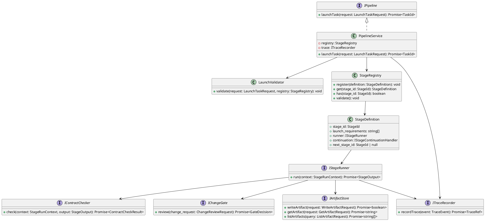
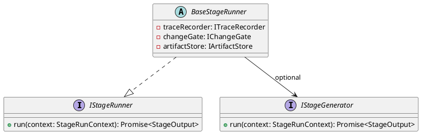
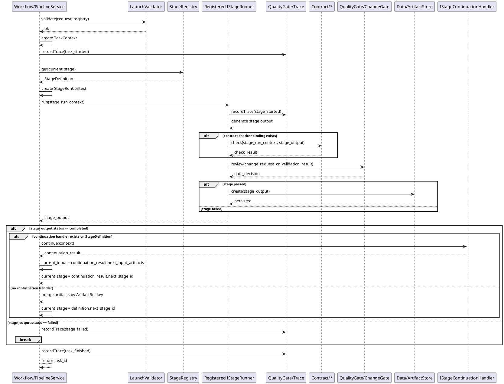
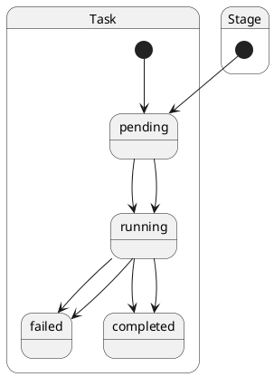
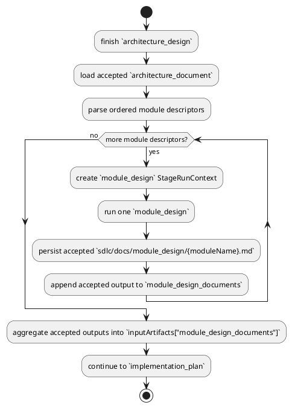

# Pipeline Design

## 1. Goal

### 1.1 Purpose

Define the module design of `Workflow/Pipeline`.

### 1.2 Involved Modules

This module design directly involves:

- `Workflow/Pipeline`
- `Contract/*`
- `QualityGate/ChangeGate`
- `QualityGate/Trace`
- `Data/ArtifactStore`

This module design collaborates with:

- `Interface/CLI`

### 1.3 Core Functions

`Workflow/Pipeline` is a generic stage orchestrator.

Its core functions are:

- accept a workflow launch request
- resolve the requested stage from registered stage definitions
- run stages one by one
- merge successful stage outputs into downstream workflow input
- stop the workflow when a stage fails

`Workflow/Pipeline` does not know business-stage semantics.

`Workflow/Pipeline` also owns the shared collaboration interfaces used across module boundaries in the workflow runtime. External modules implement these interfaces, and concrete bindings may be created either in workflow assembly code or inside stage runners when the binding stays stage-local.

## 2. Core Classes

### 2.1 Class Diagram



### 2.2 `PipelineService`

Role:

- workflow entry point
- owns task-level orchestration

Responsibilities:

- validate launch request
- create and update task-level runtime context
- load the current `StageDefinition` from `StageRegistry`
- call the registered `IStageRunner`
- decide whether to continue to the next stage or stop
- stop after the current stage when the launch request declares single-step execution

### 2.3 `StageRegistry`

Role:

- stage definition registry

Responsibilities:

- register available stages
- resolve a stage definition by `stage_id`
- validate whether a stage exists

### 2.4 `StageDefinition`

Role:

- immutable stage configuration unit used by the workflow

Responsibilities:

- declare `stage_id`
- declare stage launch requirements
- bind the stage to one `IStageRunner`
- declare the next stage id

### 2.5 `IStageRunner`

Role:

- execution unit for one registered stage

Responsibilities:

- run one stage based on `StageRunContext`
- record stage trace through `ITraceRecorder`
- run bound `IContractChecker` when contract binding is defined; otherwise skip
- submit stage change content or validation final result information to bound `IChangeGate` when review binding is defined; otherwise skip
- persist stage output through bound `IArtifactStore` when storage binding is defined; otherwise skip
- return `StageOutput`

Contract boundary rule:

- document stages and `implementation_execution` are contract-enabled stages and must emit `contract_checked`
- `validation` is the workflow-owned exception and does not bind or emit a contract-check step

### 2.6 `LaunchValidator`

Role:

- request validation component

Responsibilities:

- validate `launchTask` input
- validate that requested stage exists
- validate that required launch inputs are present

### 2.7 `ITraceRecorder`

Role:

- workflow trace output adapter

Responsibilities:

- record task-level events
- record stage-level events

Shared trace taxonomy rule:

- `TraceEvent.eventType` must use the shared `TraceEventType` taxonomy defined in the pipeline contract
- current shared event set includes:
  - `task_launch_requested`
  - `task_started`
  - `task_finished`
  - `stage_started`
  - `stage_failed`
  - `contract_checked`
  - `gate_reviewed`
  - `artifact_persisted`
  - `generation_started`
  - `generation_finished`
  - `agent_plan_created`
  - `agent_execution_started`
  - `agent_execution_finished`
  - `agent_observation_finished`
  - `llm_execution_started`
  - `llm_execution_finished`
  - `validation_finished`
  - `step_completed`
- workflow code should not introduce ad hoc trace event strings outside this shared taxonomy without first extending the contract

Single-step execution rule:

- `LaunchTaskRequest` may declare single-step execution intent.
- When single-step execution is requested, `PipelineService` must run only the requested stage.
- In single-step execution, `PipelineService` must ignore `StageDefinition.next_stage_id` and stage-continuation handlers after the current stage finishes.
- This rule applies equally to normal generation stages and revision stages.

Ownership rule:

- `ITraceRecorder`, `IChangeGate`, and `IArtifactStore` are pipeline-owned collaboration interfaces.
- `QualityGate/*` and `Data/*` modules implement these interfaces when they provide workflow-facing capabilities.
- `Pipeline` and stage runners depend only on these interfaces and do not directly depend on external module implementation files.
- Shared workflow-wide bindings may be completed in workflow assembly code.
- Stage-local execution and contract bindings may be created inside concrete stage runners.

### 2.8 StageRunner Implementation Model

`Pipeline` executes one registered `IStageRunner` per stage. This section only defines the pipeline-side runner abstraction model.

Design pattern:

- parent class (`BaseStageRunner`) binds shared pipeline adapter dependencies:
  - `ITraceRecorder`
  - `IChangeGate`
  - `IArtifactStore`
- `BaseStageRunner` is an abstract class that implements `IStageRunner`.
- child runners bind stage-specific capability dependencies:
  - bind stage execution capability through `IStageGenerator` when execution binding is defined
  - bind stage check capability through `IContractChecker` when contract binding is defined
  - stage-local bindings may be created directly inside the concrete runner
  - unbound capabilities are skipped by runner behavior
  - concrete stage runner implementations are defined in [StageRunners.md](./StageRunners.md), not in `Pipeline`

Concrete stage-to-module mapping is defined in [System Interaction Design](../SystemInteractionDesign.md), not in this module design document.



Type sketch:

```ts
abstract class BaseStageRunner implements IStageRunner {
  protected traceRecorder: ITraceRecorder
  protected changeGate: IChangeGate
  protected artifactStore: IArtifactStore
  abstract run(context: StageRunContext): Promise<StageOutput>
}

interface IStageGenerator {
  run(context: StageRunContext): Promise<StageOutput>
}

// concrete stage runner classes are module-specific and defined outside Pipeline
// each concrete stage runner extends BaseStageRunner
// bind `IStageGenerator` and `IContractChecker` according to stage mapping
```

## 3. Core Runtime Flow

### 3.1 Main Flow



## 4. Detailed Design

### 4.1 Status Model

```ts
type TaskStatus =
  | "pending"
  | "running"
  | "failed"
  | "completed"
  | "cancelled"

type StageStatus =
  | "pending"
  | "running"
  | "failed"
  | "completed"
```



### 4.2 Core APIs And Fields

#### 4.2.1 Public API

```ts
interface IPipeline {
  launchTask(request: LaunchTaskRequest): Promise<TaskId>
}
```

#### 4.2.2 Launch Request

```ts
type TaskId = string
type StageId = string
type ArtifactRef = string
type ActorId = string

interface LaunchTaskRequest {
  task_id?: TaskId
  project_id: string
  requested_by: ActorId
  start_stage: StageId
  input_refs: Record<string, ArtifactRef>
  trigger_reason: "new_run" | "manual_stage_entry" | "retry_current_stage" | "incremental_update"
  options?: Record<string, string | number | boolean>
}
```

#### 4.2.3 Core Runtime Types

```ts
interface StageDefinition {
  stage_id: StageId
  launch_requirements: string[]
  runner: IStageRunner
  continuation?: IStageContinuationHandler
  next_stage_id: StageId | null
}

class StageRegistry {
  register(definition: StageDefinition): void
  get(stage_id: StageId): StageDefinition
  has(stage_id: StageId): boolean
  validate(): void
}

interface TaskContext {
  task_id: TaskId
  project_id: string
  requested_by: ActorId
  current_stage: StageId
  status: TaskStatus
  input_refs: Record<string, ArtifactRef>
  options: Record<string, string | number | boolean>
}

interface StageRunContext {
  task_id: TaskId
  stage_id: StageId
  attempt: number
  input_refs: Record<string, ArtifactRef>
  task_options: Record<string, string | number | boolean>
}

class StageOutput {
  stage_id: StageId
  status: StageStatus
  artifacts: Record<string, object>
  error?: StageError
}
```

#### 4.2.4 Stage Execution Related Types

```ts

interface ValidationResult {
  passed: boolean
  summary: string
  passed_commands: string[]
  failed_commands: string[]
  logs?: string
}

interface IStageRunner {
  run(context: StageRunContext): Promise<StageOutput>
}

interface IStageContinuationHandler {
  continue(context: StageContinuationContext): Promise<StageContinuationResult>
}

interface ContractCheckResult {
  passed: boolean
}

interface GateDecision {
  action: string
  summary: string
  comment?: string
}

interface WriteArtifactRequest {
  taskId: TaskId
  stageId: StageId
  filePath: string
  content: string
}

interface GetArtifactRequest {
  taskId: TaskId
  stageId: StageId
  filePath: string
}

interface ListArtifactRequest {
  taskId: TaskId
  stageId: StageId
  rootDir: string
}

interface IArtifactStore {
  writeArtifact(request: WriteArtifactRequest): Promise<boolean>
  getArtifact(request: GetArtifactRequest): Promise<string>
  listArtifacts(query: ListArtifactRequest): Promise<string[]>
}
```

`Workflow/Pipeline` owns these adapter interfaces (`IArtifactStore`, `IChangeGate`, `IContractChecker`, `ITraceRecorder`) and depends on external module implementations through stable collaboration boundaries.

Binding rule:

- external modules implement pipeline-owned collaboration interfaces instead of owning cross-module workflow interfaces themselves
- shared workflow-level bindings may be assembled at application startup
- stage-local bindings may be created inside concrete stage runners when that keeps the workflow simpler and remains within pipeline-owned boundaries

Artifact persistence mapping rule:

- `IArtifactStore.writeArtifact(request)` is the pipeline-side persistence API.
- stage runners build `WriteArtifactRequest` directly from accepted stage artifacts.
- `getArtifact(request)` and `listArtifacts(query)` are the corresponding read-side APIs used by execution and contract modules.

#### 4.2.5 Check, Gate And Trace Types

```ts
interface IContractChecker {
  check(context: StageRunContext, output: StageOutput): Promise<ContractCheckResult>
}

interface IChangeGate {
  review(change_request: ChangeReviewRequest): Promise<GateDecision>
}

interface ChangeReviewRequest {
  task_id: TaskId
  stage_id?: StageId
  summary: string
  changed_files: ChangedFile[]
}

interface ChangedFile {
  path: string
  operation: string
  content?: string
}

interface ITraceRecorder {
  recordTrace(event: TraceEvent): Promise<TraceRef>
}

interface TraceEvent {
  task_id: TaskId
  stage_id?: StageId
  event_type: string
  summary: string
}

interface StageError {
  code: string
  message: string
}
```

### 4.3 Registration Example

```ts
registry.register({
  stage_id: "stage_a",
  launch_requirements: ["input_doc"],
  runner: stageARunner,
  next_stage_id: "stage_b",
})

registry.register({
  stage_id: "stage_b",
  launch_requirements: ["requirement_artifact"],
  runner: stageBRunner,
  next_stage_id: "stage_c",
})

registry.register({
  stage_id: "stage_c",
  launch_requirements: ["design_artifact"],
  runner: stageCRunner,
  next_stage_id: null,
})
```

Stage-level collaboration mapping is defined in [System Interaction Design](../SystemInteractionDesign.md). `Pipeline.md` focuses on pipeline module design only.

Special stage-continuation rule for `module_design`:



### 4.4 Constraints

- `Pipeline` may depend on concrete stage capability only through registered `IStageRunner`.
- `Pipeline` must not hard-code business-stage identifiers in its main orchestration loop.
- stage-specific continuation may exist, but it should be declared through `StageDefinition.continuation` instead of pipeline-owned stage-id branching.
- `IStageRunner` may call `Data/ArtifactStore` through the pipeline-owned `IArtifactStore` interface to persist stage outputs inside stage execution.
- `Pipeline` must treat stage result as `completed` or `failed`.
- stage behavior must follow interface binding: execute bound interfaces and skip unbound interfaces.
- only `StageRegistry` defines which stages exist and how they connect.
