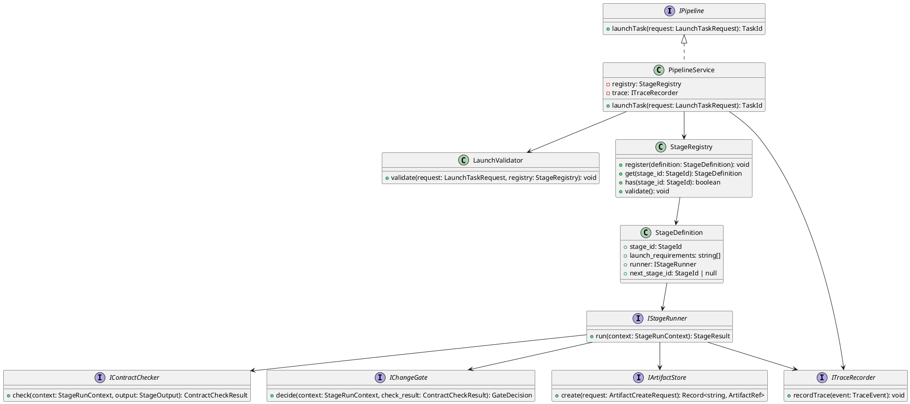
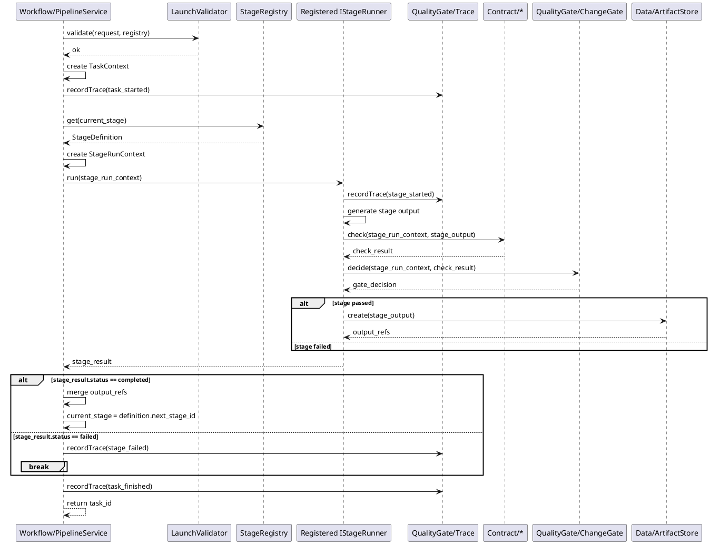
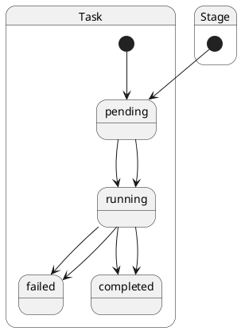

# Pipeline Design

## 1. Goal

### 1.1 Purpose

Define the module design of `Workflow/Pipeline`.

### 1.2 Involved Modules

This module design directly involves:

- `Workflow/Pipeline`
- `Contract/*`
- `QualityGate/ChangeGate`
- `QualityGate/Trace`
- `Data/ArtifactStore`

This module design collaborates with:

- `Interface/CLI`

### 1.3 Core Functions

`Workflow/Pipeline` is a generic stage orchestrator.

Its core functions are:

- accept a workflow launch request
- resolve the requested stage from registered stage definitions
- run stages one by one
- merge successful stage outputs into downstream workflow input
- stop the workflow when a stage fails

`Workflow/Pipeline` does not know business-stage semantics.

## 2. Core Classes

### 2.1 Class Diagram



### 2.2 `PipelineService`

Role:

- workflow entry point
- owns task-level orchestration

Responsibilities:

- validate launch request
- create and update task-level runtime context
- load the current `StageDefinition` from `StageRegistry`
- call the registered `IStageRunner`
- decide whether to continue to the next stage or stop

### 2.3 `StageRegistry`

Role:

- stage definition registry

Responsibilities:

- register available stages
- resolve a stage definition by `stage_id`
- validate whether a stage exists

### 2.4 `StageDefinition`

Role:

- immutable stage configuration unit used by the workflow

Responsibilities:

- declare `stage_id`
- declare stage launch requirements
- bind the stage to one `IStageRunner`
- declare the next stage id

### 2.5 `IStageRunner`

Role:

- execution unit for one registered stage

Responsibilities:

- run one stage based on `StageRunContext`
- record stage trace through `ITraceRecorder`
- check stage result through `IContractChecker`
- ask `IChangeGate` whether the stage passes
- persist stage output through `IArtifactStore`
- return `StageResult`

### 2.6 `LaunchValidator`

Role:

- request validation component

Responsibilities:

- validate `launchTask` input
- validate that requested stage exists
- validate that required launch inputs are present

### 2.7 `ITraceRecorder`

Role:

- workflow trace output adapter

Responsibilities:

- record task-level events
- record stage-level events

## 3. Core Runtime Flow

### 3.1 Main Flow



## 4. Detailed Design

### 4.1 Status Model

```ts
type TaskStatus =
  | "pending"
  | "running"
  | "failed"
  | "completed"
  | "cancelled"

type StageStatus =
  | "pending"
  | "running"
  | "failed"
  | "completed"
```



### 4.2 Core APIs And Fields

#### 4.2.1 Public API

```ts
interface IPipeline {
  launchTask(request: LaunchTaskRequest): TaskId
}
```

#### 4.2.2 Launch Request

```ts
type TaskId = string
type StageId = string
type ArtifactRef = string
type ActorId = string

interface LaunchTaskRequest {
  task_id?: TaskId
  project_id: string
  requested_by: ActorId
  start_stage: StageId
  input_refs: Record<string, ArtifactRef>
  trigger_reason: "new_run" | "manual_stage_entry" | "retry_current_stage" | "incremental_update"
  options?: Record<string, string | number | boolean>
}
```

#### 4.2.3 Core Runtime Types

```ts
interface StageDefinition {
  stage_id: StageId
  launch_requirements: string[]
  runner: IStageRunner
  next_stage_id: StageId | null
}

class StageRegistry {
  register(definition: StageDefinition): void
  get(stage_id: StageId): StageDefinition
  has(stage_id: StageId): boolean
  validate(): void
}

interface TaskContext {
  task_id: TaskId
  project_id: string
  requested_by: ActorId
  current_stage: StageId
  status: TaskStatus
  input_refs: Record<string, ArtifactRef>
  options: Record<string, string | number | boolean>
}

interface StageRunContext {
  task_id: TaskId
  stage_id: StageId
  attempt: number
  input_refs: Record<string, ArtifactRef>
  task_options: Record<string, string | number | boolean>
}

interface StageResult {
  stage_id: StageId
  status: StageStatus
  output_refs: Record<string, ArtifactRef>
  error?: StageError
}
```

#### 4.2.4 Stage Execution Related Types

```ts
interface StageOutput {
  artifacts: Record<string, unknown>
}

interface IStageRunner {
  run(context: StageRunContext): StageResult
}

interface ContractCheckResult {
  passed: boolean
}

interface GateDecision {
  passed: boolean
}

interface ArtifactCreateRequest {
  task_id: TaskId
  stage_id: StageId
  output: StageOutput
}

interface IArtifactStore {
  create(request: ArtifactCreateRequest): Record<string, ArtifactRef>
}
```

#### 4.2.5 Check, Gate And Trace Types

```ts
interface IContractChecker {
  check(context: StageRunContext, output: StageOutput): ContractCheckResult
}

interface IChangeGate {
  decide(context: StageRunContext, check_result: ContractCheckResult): GateDecision
}

interface ITraceRecorder {
  recordTrace(event: TraceEvent): void
}

interface TraceEvent {
  task_id: TaskId
  stage_id?: StageId
  event_type: string
  summary: string
}

interface StageError {
  code: string
  message: string
}
```

### 4.3 Registration Example

```ts
registry.register({
  stage_id: "stage_a",
  launch_requirements: ["input_doc"],
  runner: stageARunner,
  next_stage_id: "stage_b",
})

registry.register({
  stage_id: "stage_b",
  launch_requirements: ["requirement_artifact"],
  runner: stageBRunner,
  next_stage_id: "stage_c",
})

registry.register({
  stage_id: "stage_c",
  launch_requirements: ["design_artifact"],
  runner: stageCRunner,
  next_stage_id: null,
})
```

### 4.4 Constraints

- `Pipeline` may depend on concrete stage capability only through registered `IStageRunner`.
- `Pipeline` must not hard-code business-stage identifiers.
- `IStageRunner` may call `Data/ArtifactStore` through `IArtifactStore` to persist stage outputs inside stage execution.
- `Pipeline` must treat stage result as `completed` or `failed`.
- only `StageRegistry` defines which stages exist and how they connect.
