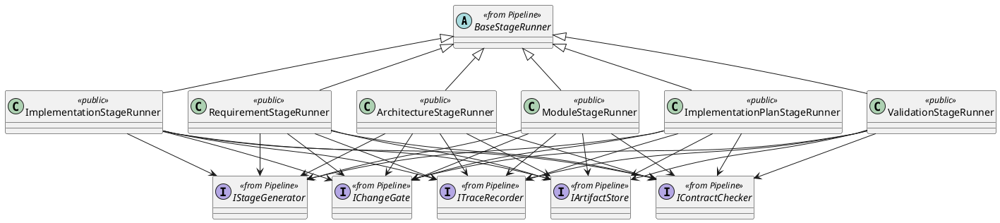

# StageRunners Design

## 1. Scope

Define the consolidated design of all concrete stage runner classes owned by `Workflow`.

This document is the single place for:

- concrete runner class list per stage
- runner inheritance from `BaseStageRunner`
- stage-level dependency binding (`Execution/*`, `Contract/*`, `QualityGate/*`, `Data/*`)

`BaseStageRunner` and shared contracts are defined in [Pipeline.md](./Pipeline.md). This document does not redefine them.

## 2. Runner Model

### 2.1 Class Diagram



### 2.2 Shared API

```ts
class RequirementStageRunner extends BaseStageRunner {
  run(context: StageRunContext): Promise<StageOutput>
}

class ArchitectureStageRunner extends BaseStageRunner {
  run(context: StageRunContext): Promise<StageOutput>
}

class ModuleStageRunner extends BaseStageRunner {
  run(context: StageRunContext): Promise<StageOutput>
}

class ImplementationPlanStageRunner extends BaseStageRunner {
  run(context: StageRunContext): Promise<StageOutput>
}

class ImplementationStageRunner extends BaseStageRunner {
  run(context: StageRunContext): Promise<StageOutput>
}

class ValidationStageRunner extends BaseStageRunner {
  run(context: StageRunContext): Promise<StageOutput>
}
```

All runners keep the same public signature as `BaseStageRunner`.

## 3. Stage Binding

| stage_id | runner_class | execution_binding | contract_binding | gate_policy |
| --- | --- | --- | --- | --- |
| `requirement_interpretation` | `RequirementStageRunner` | `Execution/RequirementGenerator.run` | `Contract/RequirementContract.check` | `review_required` |
| `architecture_design` | `ArchitectureStageRunner` | `Execution/ArchitectureDesignGenerator.run` | `Contract/ArchitectureDesignContract.check` | `review_required` |
| `module_design` | `ModuleStageRunner` | `Execution/ModuleDesignGenerator.run` | `Contract/ModuleDesignContract.check` | `review_required` |
| `implementation_plan_generation` | `ImplementationPlanStageRunner` | `Execution/ImplementationPlanGenerator.run` | `Contract/ImplementationPlanContract.check` | `review_required` |
| `implementation_step_execution` | `ImplementationStageRunner` | `Execution/ImplementationGenerator.run` | `Contract/ImplementationContract.check` | `review_required_per_step` |
| `validation` | `ValidationStageRunner` | `none` | `Contract/ValidationContract.check` | `review_required_for_final_result` |

Stage exceptions:

- `validation` does not bind an execution module and uses `Contract/ValidationContract.check` as its validation confirmation input before gate review.
- `validation` reads `inputArtifacts["project_path"]` as its only required runtime input.

## 4. Runtime Responsibilities

For each stage runner:

1. record stage start trace
2. call bound `Execution/*` run when execution binding is defined
3. load upstream review/check input directly when the stage has no execution binding
4. call bound `Contract/*` check when enabled for that stage
5. call `QualityGate/ChangeGate.review`
6. call `IArtifactStore.writeArtifact` on pass
7. return `StageOutput`

Persistence mapping rule for document stages:

- `requirement_interpretation`
  - read `StageOutput.artifacts.artifactKey == "requirement_document"`
  - persist content to `docs/requirements/Requirement.md`
  - pass persisted content downstream as `inputArtifacts["requirement_document"]`
- `architecture_design`
  - read `StageOutput.artifacts.artifactKey == "architecture_document"`
  - persist content to `docs/architecture/TechnicalArchitecture.md`
  - pass persisted content downstream as `inputArtifacts["architecture_document"]`
- `module_design`
  - read `StageOutput.artifacts.artifactKey == "module_design_document"`
  - persist content to `docs/module_design/{moduleName}.md`
  - aggregate accepted outputs downstream as `inputArtifacts["module_design_documents"]`
- `implementation_plan_generation`
  - read `StageOutput.artifacts.artifactKey == "implementation_workplan"`
  - persist content to `plans/implementation/ImplementationWorkPlan.md`
  - pass accepted output downstream as `inputArtifacts["implementation_workplan"]`
- `implementation_step_execution`
  - read `StageOutput.artifacts.generatedFiles`
  - persist each generated file to its `generatedFiles[*].path`
  - use `inputArtifacts["current_step"]` plus review result for next-step transition
- `validation`
  - read `inputArtifacts["project_path"]`
  - do not persist new artifacts by default

Dependency rule:

- concrete stage runners depend only on pipeline-owned collaboration interfaces such as `ITraceRecorder`, `IChangeGate`, and `IArtifactStore`
- concrete stage runners may directly create stage-local generator and contract bindings inside the runner when the implementation stays within workflow-owned composition boundaries
- stage runners should not rely on a separate application composition root for stage-local execution and contract binding
