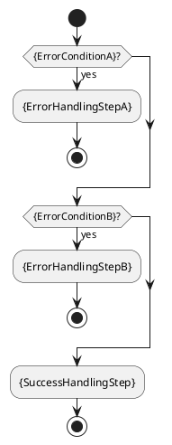

# {LayerName} Design

<!--
{
  "document_contracts": [
    {
      "check_item": "document_structure_complete",
      "description": "The document should contain the required top-level sections and expected subsection structure defined by the current layer-module breakdown format.",
      "severity": "high"
    },
    {
      "check_item": "module_centered_structure",
      "description": "The document should stay centered on the designed modules in the current layer rather than expanding into generic layer summary.",
      "severity": "high"
    },
    {
      "check_item": "format_consistency",
      "description": "The document should keep section formatting, code-block style, terminology, and numbering consistent across all sections.",
      "severity": "medium"
    },
    {
      "check_item": "codegen_readiness",
      "description": "The document should contain enough module-internal runtime logic, class collaboration, and failure-path structure to guide code generation within the architecture-supported scope.",
      "severity": "high"
    }
  ]
}
-->

## 1. Goal

<!--
{
  "section_contract": {
    "section_id": "1",
    "title": "Goal",
    "checkitems": [
      "describe the purpose of the current document",
      "make the covered design boundary explicit",
      "keep the description concise and directly understandable"
    ],
    "severity": "medium",
    "expected_format": "{PurposeSentenceOrShortParagraph}"
  }
}
-->

This document is the internal design document for modules defined in `{LayerName}`. In the current architecture scope, it provides detailed internal design needed to derive code-level core logic, module-internal class collaboration, and module-facing API shape for the currently defined layer modules.

## 2.1 Designed Module

<!--
{
  "section_contract": {
    "section_id": "2.1",
    "title": "Designed Module",
    "checkitems": [
      "enumerate the modules directly covered by this document",
      "for each covered module, list only core functions",
      "keep the wording module-centered"
    ],
    "severity": "medium",
    "expected_format": "- `{DesignedModuleA}`\\n  - `{CoreFunctionA1}`: `{DescriptionA1}`\\n  - `{CoreFunctionA2}`: `{DescriptionA2}`\\n- `{DesignedModuleB}`\\n  - `{CoreFunctionB1}`: `{DescriptionB1}`"
  }
}
-->

- `{DesignedModuleA}`
  - `{CoreFunctionA1}`: `{DescriptionA1}`
  - `{CoreFunctionA2}`: `{DescriptionA2}`

## 2.2 Collaborating Items

<!--
{
  "section_contract": {
    "section_id": "2.2",
    "title": "Collaborating Items",
    "checkitems": [
      "enumerate only the collaborating layers needed to understand the covered module",
      "state the collaboration target of each collaborating layer",
      "link each collaborating layer to its design document",
      "emphasize that collaboration happens through APIs exposed by modules in those layers",
      "do not restate collaborator details that will be expanded later in the document"
    ],
    "severity": "medium",
    "expected_format": "- collaborating layer: `{CollaboratingLayer}`\\n  - collaboration target: `{CollaborationTarget}`\\n  - collaboration rule: use APIs exposed by modules in this layer\\n  - design doc: `{CollaboratingLayerDesignDoc}`"
  }
}
-->

- collaborating layer: `{CollaboratingLayer}`
  - collaboration target: `{CollaborationTarget}`
  - collaboration rule: use APIs exposed by modules in this layer
  - design doc: `{CollaboratingLayerDesignDoc}`

## 3. Modules

<!--
{
  "section_contract": {
    "section_id": "3",
    "title": "Modules",
    "checkitems": [
      "treat this as the main design section",
      "expand each designed module one by one",
      "keep each module subsection centered on module function, module logic, and module API"
    ],
    "severity": "high",
    "expected_format": "### 3.x `{ModuleName}`",
    "subsection_contracts": [
      {
        "section_id": "3.x.1",
        "title": "Core Functions",
        "checkitems": [
          "summarize the module role",
          "list only the module core functions",
          "avoid implementation trivia"
        ],
        "severity": "medium",
        "expected_format": "- `{CoreFunction1}`\\n- `{CoreFunction2}`"
      },
      {
        "section_id": "3.x.2",
        "title": "API",
        "checkitems": [
          "define the stable module-facing API and the owned input/output types",
          "keep the API minimal and stable",
          "when an interface or type has already been declared in another breakdown design document, reuse that declared interface or type instead of redefining it locally",
          "do not repeat interface-layer or collaborating-layer interface/type definitions that are already the source of truth in other breakdown documents",
          "use TypeScript code blocks"
        ],
        "severity": "high",
        "expected_format": "```typescript\\ninterface {PublicApiName} {\\n  {MethodName}({InputName}: {InputType}): {OutputType}\\n}\\n```"
      },
      {
        "section_id": "3.x.3",
        "title": "Core Class Responsibilities",
        "checkitems": [
          "describe the key classes or interfaces used by the current module",
          "keep one subsection per important class, interface, or component",
          "state the role, responsibilities, and public methods of each class or interface",
          "map the core functions in `3.x.1 Core Functions` to the roles defined in `3.x.3 Core Class Responsibilities`",
          "do not leave any core function without at least one explicit owning class or interface in this section",
          "do not use one placeholder class to absorb multiple distinct module responsibilities when those responsibilities can be separated into different roles",
          "use one concise fixed field format for each class block",
          "express each public method signature using code formatting",
          "when a public method uses parameter or return types, those types must already be defined in the current design document or in a collaborating design document",
          "do not invent new type objects only to complete method signatures",
          "write responsibilities as positive ownership statements"
        ],
        "severity": "medium",
        "expected_format": "##### `{PrimaryClass}`\\n- role: {PrimaryRole}\\n- responsibilities:\\n  - {Responsibility1}\\n  - {Responsibility2}\\n- public methods:\\n  - `{MethodA}`"
      },
      {
        "section_id": "3.x.4",
        "title": "Runtime Processing Flow",
        "checkitems": [
          "describe how the core classes or interfaces collaborate during runtime",
          "use one `plantuml` code block",
          "keep the flow centered on class-to-class runtime collaboration",
          "only include module-internal classes and directly collaborating layer APIs",
          "do not expand into indirect downstream runtime layers"
        ],
        "severity": "high",
        "expected_format": "```plantuml\\n@startuml\\nactor {Actor}\\nparticipant {ClassA}\\nparticipant {ClassB}\\nparticipant {CollaboratingApi}\\n{Actor} -> {ClassA}: {StepA}\\n{ClassA} -> {ClassB}: {StepB}\\n{ClassA} -> {CollaboratingApi}: {StepC}\\n@enduml\\n```"
      },
      {
        "section_id": "3.x.5",
        "title": "Error Handling Skeleton",
        "checkitems": [
          "show the main failure paths of the module",
          "use one `plantuml` code block",
          "show what the module does after each failure point",
          "only describe failure handling visible at the current module boundary"
        ],
        "severity": "high",
        "expected_format": "```plantuml\\n@startuml\\nstart\\nif ({ErrorConditionA}?) then (yes)\\n  :{ErrorHandlingStepA};\\n  stop\\nendif\\nstop\\n@enduml\\n```"
      }
    ]
  }
}
-->

### 3.1 `{ModuleName}`

#### 3.1.1 Core Functions

- `{CoreFunction1}`
- `{CoreFunction2}`

#### 3.1.2 API

```typescript
export interface {ModuleEntryApi} {
  {MethodName}({InputName}: {InputType}): Promise<{OutputType}>
}

export interface {InputType} {
  {InputFieldA}: {InputFieldTypeA}
}

export interface {OutputType} {
  {OutputFieldA}: {OutputFieldTypeA}
}
```

#### 3.1.3 Core Class Responsibilities

Assumption: the following classes are module-internal decomposition inside `{ModuleName}`. They do not create new cross-layer boundaries and do not change the external ownership of `{LayerName}`.

##### `{PrimaryClass}`
- role: {PrimaryRole}
- responsibilities:
  - {Responsibility1}
  - {Responsibility2}
- public methods:
  - `{MethodA}`

##### `{SupportingClass}`
- role: {SupportingRole}
- responsibilities:
  - {Responsibility3}
  - {Responsibility4}
- public methods:
  - `{MethodB}`

#### 3.1.4 Runtime Processing Flow

```plantuml
@startuml
actor {Actor}
participant {ModuleFacade}
participant {InternalClassA}
participant {InternalClassB}
participant {CollaboratingApi}

{Actor} -> {ModuleFacade}: {StartStep}
{ModuleFacade} -> {InternalClassA}: {StepA}
{InternalClassA} --> {ModuleFacade}: {StepB}
{ModuleFacade} -> {CollaboratingApi}: {StepC}
{CollaboratingApi} --> {ModuleFacade}: {StepD}
{ModuleFacade} -> {InternalClassB}: {StepE}
{InternalClassB} --> {Actor}: {StepF}
@enduml
```

#### 3.1.5 Error Handling Skeleton



## 4. Constraints

<!--
{
  "section_contract": {
    "section_id": "4",
    "title": "Constraints",
    "checkitems": [
      "record the key design constraints and non-goals of this document",
      "use bullet list only",
      "include dependency limits",
      "include ownership limits",
      "include explicit `TBD` areas that are not supported by the source architecture",
      "avoid restating runtime flow detail here"
    ],
    "severity": "medium",
    "expected_format": "- `{Constraint1}`\\n- `{Constraint2}`\\n- `{Constraint3}`"
  }
}
-->

- `{Constraint1}`
- `{Constraint2}`
- `{Constraint3}`
