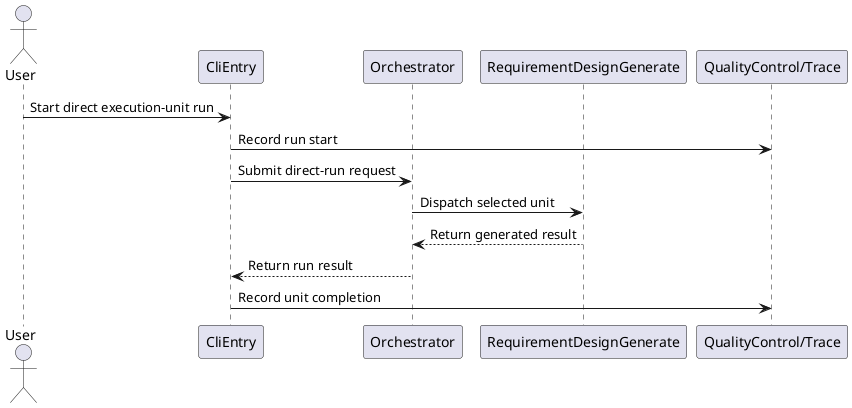
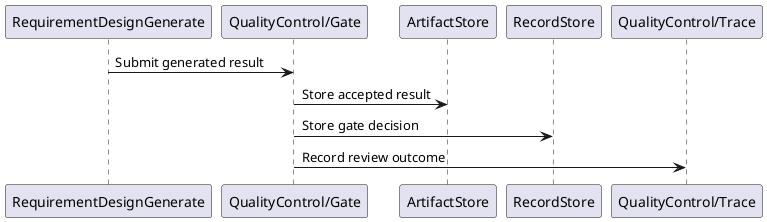
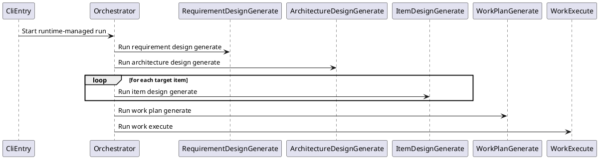
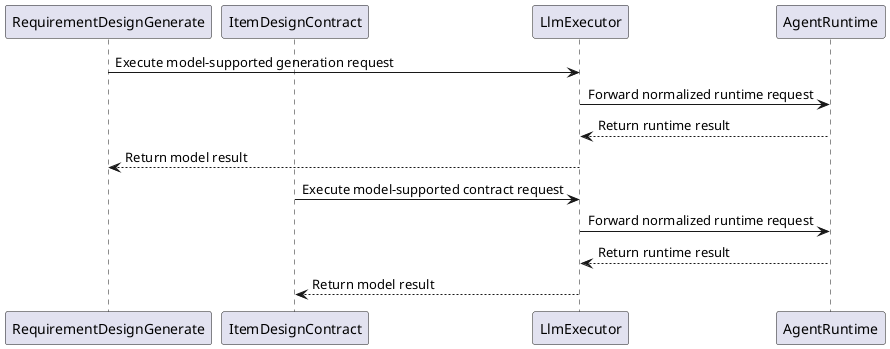
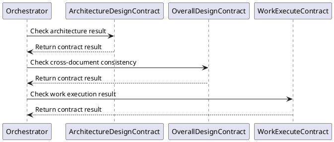
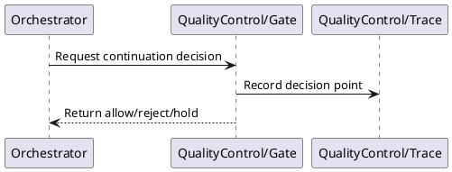
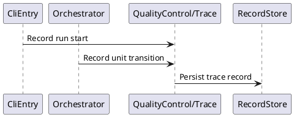
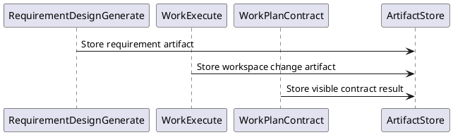

<!--
{
  "document_contracts": [
    {
      "check_item": "document_structure_complete",
      "description": "The document should contain the required architecture sections, subsection structure, and lightweight architecture-level detail.",
      "severity": "high"
    },
    {
      "check_item": "architecture_level_consistency",
      "description": "The document should stay at technical architecture level and should not drift into module-internal implementation detail.",
      "severity": "high"
    },
    {
      "check_item": "cross_section_alignment",
      "description": "Architecture style, dependency rules, runtime interactions, design document breakdown, and open issues should remain logically consistent across sections.",
      "severity": "high"
    },
    {
      "check_item": "architecture_level_boundary",
      "description": "The document must stay at architecture level. Detailed API fields, prompt wording, storage schema, and module-internal retry or algorithm logic should be moved to follow-up design documents.",
      "severity": "high"
    },
    {
      "check_item": "interaction_structure_clarity",
      "description": "Primary Interaction Path should describe the reusable backbone. Interaction Model may expand by scenario or stage, but each scenario must stay focused on module collaboration, control handoff, and ownership boundaries.",
      "severity": "medium"
    },
    {
      "check_item": "scope_stage_clarity",
      "description": "If future-stage capabilities are mentioned, they must be explicitly labeled so readers can distinguish target architecture from current delivery scope.",
      "severity": "medium"
    },
    {
      "check_item": "design_doc_derivation",
      "description": "Core Modules should list only architecture-relevant modules, and follow-up design documents should be derived from the architecture rather than copied from an existing folder tree.",
      "severity": "medium"
    }
  ]
}
-->

# Technical Architecture

## 1. Purpose

<!--
{
  "section_contract": {
    "section_id": "1",
    "title": "Purpose",
    "checkitems": [
      "state the purpose of this document in one short sentence",
      "list the main readers and why they should read it",
      "keep the content at overall architecture level"
    ],
    "severity": "medium",
    "expected_format": "Define the overall technical architecture of the `{SystemName}` platform.\n\n- Team members: provide a shared high-level baseline for the team.\n- Senior engineers: review architecture direction and boundaries.\n- Junior engineers: understand system and module structure for later design and implementation."
  }
}
-->

Define the overall technical architecture of the AI-RD platform.

- Team members: provide a shared high-level baseline for the team.
- Senior engineers: review architecture direction and boundaries.
- Junior engineers: understand system and module structure for later design and implementation.

## 2. Scope

<!--
{
  "section_contract": {
    "section_id": "2",
    "title": "Scope",
    "checkitems": [
      "define what this document covers",
      "define what this document does not cover",
      "clarify the boundary between overall architecture and follow-up design documents"
    ],
    "severity": "medium"
  }
}
-->

### 2.1 In Scope

<!--
{
  "section_contract": {
    "section_id": "2.1",
    "title": "In Scope",
    "checkitems": [
      "list only architecture-level concerns",
      "focus on runtime modes, major modules, boundaries, and key constraints"
    ],
    "severity": "medium",
      "expected_format": "- Overall runtime modes from requirement input to design generation, work execution, review, validation, and acceptance.\n- Major modules and their responsibilities at architecture level.\n- Collaboration boundaries and dependency direction between major parts of the system.\n- Key architecture constraints related to reviewability, controllability, validation, and evolution."
  }
}
-->

- Overall architecture support for the Basic Execution Units defined in the requirement document.
- Runtime modes for running one execution unit independently or combining multiple execution units.
- Quality control boundaries for `gate`, `trace`, and `contract`.
- Major architecture partitions, dependency direction, and shared runtime constraints.

### 2.2 Out of Scope

<!--
{
  "section_contract": {
    "section_id": "2.2",
    "title": "Out of Scope",
    "checkitems": [
      "exclude module internals and implementation-level detail",
      "exclude storage schema, UI detail, and runbook detail unless they materially shape architecture"
    ],
    "severity": "medium",
    "expected_format": "- Detailed module internals and implementation logic.\n- Detailed API contracts, prompt content, and parameter definitions inside each module.\n- Database schema details and storage-level design.\n- UI-level interaction design and visual behavior details.\n- Deployment runbooks, environment setup, and operational procedures.\n\nCross-module interaction contracts are covered at a lightweight shared-boundary level in a separate design document, not in full module-level detail here."
  }
}
-->

- Detailed module internals and implementation logic.
- Detailed API contracts, prompt content, and parameter definitions inside each module.
- Database schema details and storage-level design.
- UI-level interaction design and visual behavior details.
- Deployment runbooks, environment setup, and operational procedures.

Cross-module interaction contracts are covered at a lightweight shared-boundary level in a separate design document, not in full module-level detail here.

Independent SDK runtimes define their own internal collaboration contracts and expose only stable SDK APIs to external callers.

---

## 3. Design Drivers

<!--
{
  "section_contract": {
    "section_id": "3",
    "title": "Design Drivers",
    "checkitems": [
      "capture only drivers that materially shape architecture decisions",
      "include functional and non-functional drivers when they affect structure",
      "avoid generic statements that do not influence architecture"
    ],
    "severity": "medium"
  }
}
-->

### 3.1 independently runnable execution units

<!--
{
  "section_contract": {
    "section_id": "3.1",
    "title": "independently runnable execution units",
    "checkitems": [
      "state the driver clearly",
      "explain why independently runnable units shape architecture"
    ],
    "severity": "medium",
    "expected_format": "The architecture must support independently runnable execution units so users or external callers can launch one capability without running the whole process."
  }
}
-->

The architecture must support independently runnable execution units so users or external callers can launch one capability without running the whole process.

### 3.2 requirement interpretation as stable upstream input

<!--
{
  "section_contract": {
    "section_id": "3.2",
    "title": "requirement interpretation as stable upstream input",
    "checkitems": [
      "explain why raw requirement documents cannot be consumed directly downstream",
      "connect the driver to requirement interpretation and contract-based checks"
    ],
    "severity": "medium",
    "expected_format": "Requirement documents written in natural language must be checked and stabilized before they are used as downstream input. So the architecture needs requirement interpretation and contract-based checks to make requirement outputs become stable input for the next stage."
  }
}
-->

Requirement documents written in natural language must be checked and stabilized before they are used as downstream input. So the architecture needs requirement interpretation and contract-based checks to make requirement outputs become stable input for downstream execution units.

### 3.3 design outputs as stable upstream input

<!--
{
  "section_contract": {
    "section_id": "3.3",
    "title": "design outputs as stable upstream input",
    "checkitems": [
      "explain why design outputs need stabilization before downstream use",
      "connect the driver to contract checks and gate decisions"
    ],
    "severity": "medium",
      "expected_format": "Design outputs generated in upstream execution units must be checked and stabilized before they are used as downstream input. So the architecture needs contract-based checks and gate decisions to make architecture design outputs and item design outputs become stable input for the next unit."
  }
}
-->

Requirement, architecture, item design, and work plan outputs generated in upstream execution units must be checked and stabilized before they are used as downstream input. So the architecture needs contract-based checks and gate decisions to make these outputs become stable input for the next unit.

### 3.4 external composition support

<!--
{
  "section_contract": {
    "section_id": "3.4",
    "title": "external composition support",
    "checkitems": [
      "state why callers need composition flexibility",
      "connect the driver to composition boundaries"
    ],
    "severity": "medium",
    "expected_format": "Callers may need to combine multiple execution units in different orders, so the architecture needs stable composition boundaries and required-input checks."
  }
}
-->

Callers may need to combine multiple execution units in different orders, so the architecture needs stable runtime coordination boundaries and required-input checks.

### 3.5 human-in-the-loop control

<!--
{
  "section_contract": {
    "section_id": "3.5",
    "title": "human-in-the-loop control",
    "checkitems": [
      "state why human review remains necessary",
      "connect the driver to explicit review and apply points"
    ],
    "severity": "medium",
    "expected_format": "Important changes must remain human-reviewable and require users to confirm. So the architecture needs explicit review and apply points."
  }
}
-->

Important changes must remain human-reviewable and require users to confirm. So the architecture needs explicit review and apply points.

### 3.6 validation visibility

<!--
{
  "section_contract": {
    "section_id": "3.6",
    "title": "validation visibility",
    "checkitems": [
      "state why validation feedback must be visible",
      "explain why validation is a first-class runtime concern"
    ],
    "severity": "medium",
    "expected_format": "The system must provide validation or test feedback for generated outputs, so validation needs to be a first-class part of the runtime control path."
  }
}
-->

The system must provide validation or test feedback for generated outputs, so validation needs to be a first-class architecture concern.

### 3.7 execution transparency and traceability

<!--
{
  "section_contract": {
    "section_id": "3.7",
    "title": "execution transparency and traceability",
    "checkitems": [
      "state why users need runtime transparency",
      "connect the driver to runtime status and trace visibility"
    ],
    "severity": "medium",
    "expected_format": "Users need to understand what the platform is doing during each runtime step, so the architecture should make execution process, runtime status, and important changes visible and traceable."
  }
}
-->

Users need to understand what the platform is doing during each execution unit or runtime-managed process, so the architecture should make execution process, status, and important changes visible and traceable.

### 3.8 incremental update on requirement changes

<!--
{
  "section_contract": {
    "section_id": "3.8",
    "title": "incremental update on requirement changes",
    "checkitems": [
      "state why requirement changes are expected",
      "connect the driver to change comparison and downstream update support"
    ],
    "severity": "medium",
    "expected_format": "Requirement changes are frequent, so the architecture should support comparing changes between different versions and generating downstream updates."
  }
}
-->

Requirement changes are frequent, so the architecture should support comparing changes between different versions and generating downstream updates instead of recreating all artifacts by default.

### 3.9 composition-mode launch flexibility

<!--
{
  "section_contract": {
    "section_id": "3.9",
    "title": "composition-mode launch flexibility",
    "checkitems": [
      "state why users may need to start from an intermediate execution point",
      "connect the driver to required-input availability"
    ],
    "severity": "medium",
    "expected_format": "The architecture should support launching from a selected execution point when the required inputs are available, so users can start from an intermediate point without rerunning the whole runtime-managed path."
  }
}
-->

The architecture should support launching from a selected execution unit or runtime-managed process when the required inputs are available, so users can start from an intermediate point without rerunning everything upstream.

# 4. Architecture Design

<!--
{
  "section_contract": {
    "section_id": "4",
    "title": "Architecture Design",
    "checkitems": [
      "describe the overall architecture of the system",
      "start from architectural approach and partitioning",
      "explain dependency direction and structural constraints",
      "include one high-level diagram"
    ],
    "severity": "medium"
  }
}
-->

### 4.1 Architecture Style

<!--
{
  "section_contract": {
    "section_id": "4.1",
    "title": "Architecture Style",
    "checkitems": [
      "describe the overall architectural style such as layered, modular monolith, service-oriented, event-driven, or hybrid",
      "keep the description at system architecture level"
    ],
    "severity": "medium",
    "expected_format": "The system adopts a `{ArchitectureStyle}` architecture."
  }
}
-->

The system adopts a layered modular architecture centered on independently runnable execution units, explicit quality control, and optional runtime coordination.

### 4.2 Layers or Partitions

<!--
{
  "section_contract": {
    "section_id": "4.2",
    "title": "Layers or Partitions",
    "checkitems": [
      "list the major architecture partitions only",
      "make responsibility boundaries explicit",
      "keep names aligned with the rest of the architecture document"
    ],
    "severity": "medium",
    "expected_format": "- `{LayerA}`: `{ResponsibilityA}`\n- `{LayerB}`: `{ResponsibilityB}`\n- `{LayerC}`: `{ResponsibilityC}`"
  }
}
-->

- Interface: system entry and information display, for example current-scope CLI and future-stage UI.
- Runtime: overall runtime control for command input/output, capability invocation dispatch, and coordination across direct runs and runtime-managed runs.
- Capability: one architecture layer responsible for execution capabilities and contract checking. This layer contains the `Execution` and `Contract` modules.
- Test: testing support for unit testing, black-box testing, integration testing, functional testing, and cross-partition validation across `Interface`, `Runtime`, `Capability`, `SDK`, and `Data`.
- SDK: shared technical capabilities, including external `AgentRuntime` and internal `QualityControl`.
- Data: shared persistence for artifacts, change history, trace records, and related metadata.

### 4.3 Allowed Dependencies

<!--
{
  "section_contract": {
    "section_id": "4.3",
    "title": "Allowed Dependencies",
    "checkitems": [
      "define dependency rules by allowed relations only",
      "treat all unspecified dependencies as forbidden by default",
      "keep the rules aligned with the defined layers or partitions"
    ],
    "severity": "medium",
    "expected_format": "ALLOW:\n- `{SourceA}` -> `{TargetA}`\n- `{SourceB}` -> `{TargetB}`\n- `{SourceC}` -> `{TargetC}`"
  }
}
-->

Rules:

- Upper-layer partitions may depend on lower-layer partitions.
- Same-layer partitions may depend on each other.
- Lower-layer partitions must not depend on upper-layer partitions.
- `Test/*` is a cross-partition testing partition and may depend on `Interface/*`, `Runtime/*`, `Capability/*`, `SDK/*`, and `Data/*`.
- Product partitions must not depend on `Test/*`.

Order:

1. Interface
2. Runtime
3. Capability
4. SDK and Data

### 4.4 High-level Diagram

<!--
{
  "section_contract": {
    "section_id": "4.4",
    "title": "High-level Diagram",
    "checkitems": [
      "show the main architecture parts and dependency direction",
      "keep the diagram high level and readable"
    ],
    "severity": "medium",
    "expected_format": "```text\n[High-level architecture diagram here]\n```"
  }
}
-->

```text
+------------------+
|    Interface     |
|   CLI / Future   |
|       UI         |
+------------------+
      |
      v
+---------------+
|   Runtime     |
| command / run |
+---------------+
      |
      v
+------------------------------+
|          Capability          |
| +---------+ +---------+      |
| |Execution| |Contract |      |
| |basic    | |checks   |      |
| |units    | |rules    |      |
| +---------+ +---------+      |
+------------------------------+
      |          \           \
      v           v           v
+----------+    +----------------+
|   Data   |    |      SDK       |
|artifacts |    | AgentRuntime + |
|records   |    | QualityControl |
+----------+    +----------------+

            +------------------+
            |       Test       |
            | cross-partition  |
            |    validation    |
            +------------------+
             /    /   |   \    \
            v    v    v    v    v
     Interface Runtime Capability SDK Data
```

### 4.5 Runtime Topology

<!--
{
  "section_contract": {
      "section_id": "4.5",
      "title": "Runtime Topology",
      "checkitems": [
      "describe the runtime view in a lightweight way",
      "clarify which major parts run together, which parts may be separated, and how shared resources are used",
      "keep the content at topology level rather than operational detail"
    ],
    "severity": "medium",
    "expected_format": "- `{RuntimePartA}`: `{RoleA}`\n- `{RuntimePartB}`: `{RoleB}`\n- `{SharedPart}`: `{RoleC}`"
  }
}
-->

- Local runtime: hosts `Interface`, `Runtime`, and `Capability` in the current scope.
- Test runtime: hosts `Test` for unit testing, black-box testing, integration testing, functional testing, and cross-partition validation.
- SDK runtime: provides the external `AgentRuntime` capability and the SDK-contained `QualityControl` module.
- Runtime and Capability use the internal `LlmExecutor` adapter to access `AgentRuntime` when model support is required.
- Shared resources: `Data/ArtifactStore` and `Data/RecordStore` provide persistent resources for artifacts, records, and trace data.
- Composition root: binds stable interfaces to concrete implementations before runtime execution starts.
- Future separation path: heavy execution units, test execution, or shared runtime capabilities can be separated later without changing the current partition boundaries.

### 4.6 Technology Choices

<!--
{
  "section_contract": {
    "section_id": "4.6",
    "title": "Technology Choices",
    "checkitems": [
      "state the implementation technology choices for each major layer, partition, or module",
      "keep the description at technology-stack selection level rather than implementation detail",
      "make the mapping between architecture parts and technology choices explicit"
    ],
    "severity": "medium",
    "expected_format": "- `{LayerOrModuleA}`: `{TechStackA}` for `{WhyOrResponsibilityA}`\n- `{LayerOrModuleB}`: `{TechStackB}` for `{WhyOrResponsibilityB}`\n- `{LayerOrModuleC}`: `{TechStackC}` for `{WhyOrResponsibilityC}`"
  }
}
-->

- `Interface`: `Python` for the current CLI entry and interactive control flow.
- `Runtime`: `TypeScript` on `NodeJS` for overall runtime control, command input/output handling, capability dispatch, and coordination.
- `Capability`: `TypeScript` on `NodeJS` for execution units, contract modules, and the internal `LlmExecutor` adapter.
- `Test`: `TypeScript` on `NodeJS` plus test-runner support for unit testing, black-box testing, integration testing, functional testing, and cross-partition validation.
- `SDK`: external `AgentRuntime` plus SDK-contained `QualityControl` with `Gate` and `Trace`.
- `Data`: `LocalFile` in the current scope for artifact persistence and record storage.

Selection principles:

- Prefer proven and maintainable technologies for V1 and V3 minimum scope.
- Keep architecture boundaries stable when replacing implementation libraries or providers.
- Record system-level technology choices here first, and let follow-up design documents inherit them.

---

## 5. System Interactions

<!--
{
  "section_contract": {
    "section_id": "5",
    "title": "System Interactions",
    "checkitems": [
      "describe only the runtime interactions needed to understand the system behavior",
      "focus on module collaboration, primary interaction paths, and control points rather than module internals",
      "make the primary interaction path explicit"
    ],
    "severity": "medium"
  }
}
-->

### 5.1 Primary Interaction Path

<!--
{
  "section_contract": {
    "section_id": "5.1",
    "title": "Primary Interaction Path",
    "checkitems": [
      "make the main execution, request, or event path explicit",
      "show the reusable control shape across the main interaction path",
      "identify gateways, retries, asynchronous handoffs, approvals, or other control points where relevant"
    ],
    "severity": "medium",
    "expected_format": "```text\n[Main flow diagram here]\n```\n\n1. `{Step1}`\n2. `{Step2}`\n3. `{Step3}`\n\n`{FlowSummary}`"
  }
}
-->

```text
Mode A: Direct execution unit run
Interface -> Runtime
              |
              +-> dispatch selected execution unit
              +-> read required artifacts by runtime convention
              +-> run related Contract when required
              +-> submit result to gate
              +-> write artifacts and trace by runtime convention
              +-> stop

Mode B: Runtime-managed run
Interface -> Runtime
              |
              +-> select next execution unit
              +-> read required artifacts by runtime convention
              +-> run execution unit
              +-> run related Contract when required
              +-> submit result to gate
              +-> write artifacts and trace by runtime convention
              +-> continue / stop / retry / wait review
```

1. Interface starts either one direct execution-unit run or one runtime-managed run.
2. For a direct unit run, `Runtime/*` dispatches the selected `Execution/*` module, reads required artifacts by runtime convention, invokes the related `Contract/*` module when that unit requires a contract result before downstream use or review, and writes outputs by runtime convention.
3. `QualityControl/Gate` receives generated artifacts, contract results, generated changes, or validation results and returns allow, reject, or hold decisions.
4. `QualityControl/Trace` records execution status, important changes, and decision points during the run.
5. `Data/*` stores accepted artifacts, contract outputs, trace records, and execution records.
6. For a runtime-managed run, `Runtime/*` decides whether to continue to the next execution unit, stop, retry, or wait for user action based on runtime-readable artifacts, runtime writing rules, and gate results.
7. The standard runtime-managed path follows requirement design, architecture design, item design, overall design contract, work plan, work execute, and work execute contract, but this is one supported runtime mode rather than the only runtime shape.

The reusable control shape is: select one execution unit, resolve required inputs, run it, expose changes and results, apply quality control, persist outputs, and then decide whether to continue.

### 5.2 Core Modules

<!--
{
  "section_contract": {
    "section_id": "5.2",
    "title": "Core Modules",
    "checkitems": [
      "list only the modules needed to understand the architecture",
      "group modules in a way that stays aligned with the architecture partitions when useful",
      "keep each module description at architecture level and focus on responsibility, boundary, and collaboration role",
      "allow lightweight notes on key inputs, outputs, or ownership boundaries only when they help explain the architecture",
      "module names must use English identifiers only",
      "module names must start with an uppercase letter",
      "module names must not contain spaces"
    ],
    "severity": "medium",
    "expected_format": "This section may be organized by architecture layer or partition when that improves readability.\n\n- **`LayerOrPartitionA`**\n  - `ModuleA`\n    - responsibility: `{ResponsibilityA}`\n    - inputs: `{InputBoundaryA}`\n    - outputs: `{OutputBoundaryA}`\n    - ownership boundary: `{OwnershipBoundaryA}`\n  - `ModuleB`\n    - responsibility: `{ResponsibilityB}`\n    - inputs: `{InputBoundaryB}`\n    - outputs: `{OutputBoundaryB}`\n\n- **`LayerOrPartitionB`**\n  - `ModuleC`\n    - responsibility: `{ResponsibilityC}`\n\nKeep the notes lightweight and architecture-oriented. Not every module needs every field, but the structure should stay consistent within the section. Do not split this section into an additional mandatory module-capabilities subsection."
  }
}
-->

This section is organized by architecture partition.

- **`Interface`**
  - `CliEntry`
    - responsibility: trigger direct execution-unit runs and runtime-managed runs in the current scope.
    - inputs: user commands and runtime context.
    - outputs: execution requests, review prompts, and visible run status.
    - ownership boundary: owns user-facing entry flow only and does not own execution logic.

- **`Runtime`**
  - `Orchestrator`
    - responsibility: handle command input/output, choose one runtime mode, dispatch capability calls, verify required inputs, and coordinate continuation across execution units.
    - inputs: direct-run or runtime-managed-run requests plus available upstream artifacts.
    - outputs: ordered execution-unit invocations and continuation decisions.
    - ownership boundary: owns overall capability runtime control and does not own execution-unit internals.

- **`Capability`**
  - `RequirementDesignGenerate`
    - responsibility: provide `[requirement_design_generate]`.
    - inputs: user input and requirement context.
    - outputs: requirement document artifacts.
  - `RequirementDesignUpdate`
    - responsibility: provide `[requirement_design_update]`.
    - inputs: user input and requirement context.
    - outputs: updated requirement document artifacts.
  - `ArchitectureDesignGenerate`
    - responsibility: provide `[architecture_design_generate]`.
    - inputs: user input and requirement document.
    - outputs: architecture document artifacts.
  - `ArchitectureDesignUpdate`
    - responsibility: provide `[architecture_design_update]`.
    - inputs: user input and requirement document.
    - outputs: updated architecture document artifacts.
  - `ItemDesignGenerate`
    - responsibility: provide `[item_design_generate]`.
    - inputs: user input, requirement document, and architecture document.
    - outputs: item design document artifacts.
  - `ItemDesignUpdate`
    - responsibility: provide `[item_design_update]`.
    - inputs: user input, requirement document, and architecture document.
    - outputs: updated item design document artifacts.
  - `WorkPlanGenerate`
    - responsibility: provide `[work_plan_generate]`.
    - inputs: upstream design artifacts and user input.
    - outputs: work plan artifacts.
  - `WorkPlanUpdate`
    - responsibility: provide `[work_plan_update]`.
    - inputs: upstream design artifacts and user input.
    - outputs: updated work plan artifacts.
  - `WorkExecute`
    - responsibility: provide `[work_execute]`.
    - inputs: upstream design artifacts, work plan, and current workspace files.
    - outputs: code and workspace changes.
  - `RequirementDesignContract`
    - responsibility: provide `[requirement_design_contract]`.
    - inputs: requirement document artifacts and requirement rules.
    - outputs: requirement contract results.
  - `ArchitectureDesignContract`
    - responsibility: provide `[architecture_design_contract]`.
    - inputs: architecture document artifacts and architecture rules.
    - outputs: architecture contract results.
  - `ItemDesignContract`
    - responsibility: provide `[item_design_contract]`.
    - inputs: item design document artifacts and item design rules.
    - outputs: item design contract results.
  - `OverallDesignContract`
    - responsibility: provide `[overall_design_contract]`.
    - inputs: requirement, architecture, and item design artifacts together.
    - outputs: cross-document consistency contract results.
  - `WorkPlanContract`
    - responsibility: provide `[work_plan_contract]`.
    - inputs: work plan artifacts and planning rules.
    - outputs: work plan contract results.
  - `WorkExecuteContract`
    - responsibility: provide `[work_execute_contract]`.
    - inputs: work directory and configured validation command set.
    - outputs: validation contract results.
  - `LlmExecutor`
    - responsibility: act as the internal adapter between capability modules and `AgentRuntime`.
    - inputs: normalized model execution requests from execution or contract modules.
    - outputs: adapter-normalized runtime requests and returned model results.

- **`SDK`**
  - `AgentRuntime`
    - responsibility: provide external SDK runtime capability for model and agent execution.
    - inputs: adapter-normalized runtime requests.
    - outputs: runtime execution results for project modules.
  - `QualityControl`
    - responsibility: provide review decision and execution visibility capability through `Gate` and `Trace`.
    - inputs: generated artifacts, contract results, generated changes, validation results, execution status events, and decision events.
    - outputs: review decisions, trace records, and visible runtime summaries.

- **`Test`**
  - `TestRunner`
    - responsibility: run unit testing, black-box testing, integration testing, functional testing, and cross-partition validation across `Interface`, `Runtime`, `Capability`, `SDK`, and `Data`.
    - inputs: test targets, runtime-accessible artifacts, and test configuration.
    - outputs: test results, failure diagnostics, and integrated validation feedback.

- **`Data`**
  - `ArtifactStore`
    - responsibility: store generated documents, work plans, code changes, and other artifacts.
    - inputs: visible artifacts and contract result artifacts.
    - outputs: persistent artifact lookup for later runs.
  - `RecordStore`
    - responsibility: store execution records, gate decisions, and trace records.
    - inputs: trace events and gate decisions.
    - outputs: persistent execution records and audit information.

### 5.3 Interaction Model

<!--
{
  "section_contract": {
    "section_id": "5.3",
    "title": "Interaction Model",
    "checkitems": [
      "explain how modules collaborate at a high level",
      "group interactions by major interaction step, user scenario, or control point",
      "make it clear which interactions belong to the current mainline and which are future-stage extensions when relevant",
      "keep this section at cross-module interaction level rather than module-internal detail"
    ],
    "severity": "medium",
    "expected_format": "This section describes high-level cross-module interaction. The concrete public APIs or interface contracts for these calls are defined in `{CrossModuleDocPath}`.\n\nWhen the system evolves in stages or has multiple major user scenarios, organize the section in two main steps:\n\n#### 5.3.x `{ScenarioName}`\n- user scenario: `{UserScenario}`\n- stage position: `{CurrentScopeOrFutureStage}`\n- goal: `{InteractionGoal}`\n\nUnder each `5.3.x` scenario, expand into concrete interaction cases:\n\n##### 5.3.x.x `{InteractionCaseName}`\n- summary: `{WhatThisInteractionCaseCovers}`\n- modules involved: `{ModuleA}`, `{ModuleB}`, `{ModuleC}`\n- control focus: `{RoutingOrApprovalOrAsyncBoundary}`\n\nWithin each `5.3.x.x` interaction case, continue to deeper levels only when needed for readability. The deepest useful level should typically be one of these structures:\n\n```plantuml\n@startuml\nactor User\nparticipant ModuleA\nparticipant ModuleB\nUser -> ModuleA: `{Action}`\nModuleA -> ModuleB: `{Delegation}`\nModuleB -> ModuleA: `{Result}`\n@enduml\n```\n\n```text\n{METHOD} {PATH} => request { `{RequestShape}` } => response { `{ResponseShape}` }\n```\n\nUse `plantuml` for cross-module interaction views and `text` for lightweight public API or shared interface shapes. These views should capture only the shared boundary and collaboration path that matter at architecture level.\n\nFor each scenario, prefer this information order:\n- user scenario or trigger\n- current stage versus future-stage position\n- interaction goal\n- interaction cases under `5.3.x.x`\n- lightweight shared interaction shape when needed\n\nDo not include detailed request fields, storage schema, or module-internal algorithms here."
  }
}
-->

This section describes high-level cross-module interaction at architecture level.

#### 5.3.1 DirectExecutionUnitRun

<!--
{
  "section_contract": {
    "section_id": "5.3.1",
    "title": "DirectExecutionUnitRun",
    "checkitems": [
      "describe how modules collaborate for one focused interaction case",
      "make user scenario, stage position, and interaction goal explicit"
    ],
    "severity": "medium",
    "expected_format": "- user scenario: `{UserScenario}`\n- stage position: `{CurrentScopeOrFutureStage}`\n- goal: `{InteractionGoal}`"
  }
}
-->

- user scenario: the caller wants one Basic Execution Unit without running a larger runtime-managed process.
- stage position: current scope.
- goal: run one selected execution unit with the minimum required control path.

##### 5.3.1.1 RequestAndDispatch

- summary: the interface selects direct-run mode and dispatches the request to the target execution unit.
- modules involved: `CliEntry`, `Orchestrator`, `RequirementDesignGenerate` or another selected execution unit, `QualityControl/Trace`.
- control focus: runtime-owned dispatch and visible run start.



##### 5.3.1.2 ReviewAndStore

- summary: the runtime sends the result to quality control and persistence before stopping.
- modules involved: `QualityControl/Gate`, `ArtifactStore`, `RecordStore`, `QualityControl/Trace`.
- control focus: review decision and visible completion boundary.



#### 5.3.2 RuntimeManagedRun

<!--
{
  "section_contract": {
    "section_id": "5.3.2",
    "title": "RuntimeManagedRun",
    "checkitems": [
      "describe how modules collaborate for one focused interaction case",
      "make user scenario, stage position, and interaction goal explicit"
    ],
    "severity": "medium",
    "expected_format": "- user scenario: `{UserScenario}`\n- stage position: `{CurrentScopeOrFutureStage}`\n- goal: `{InteractionGoal}`"
  }
}
-->

- user scenario: the caller wants the standard path from upstream design artifacts to work execution validation.
- stage position: current scope.
- goal: coordinate multiple execution units with required-input checks, review points, and downstream continuation control.

##### 5.3.2.1 ComposeAndRunUnits

- summary: the runtime module selects the next execution unit, provides required inputs, and advances through the standard path, including repeated item design execution for multiple target items.
- modules involved: `Orchestrator`, `RequirementDesignGenerate`, `ArchitectureDesignGenerate`, `ItemDesignGenerate`, `WorkPlanGenerate`, `WorkExecute`.
- control focus: runtime ownership, repeated item-level execution, and downstream continuation.



##### 5.3.2.2 SharedModelSupport

- summary: execution or contract modules call the internal adapter, which forwards project requests to the external SDK runtime when model support is required.
- modules involved: `RequirementDesignGenerate`, `ArchitectureDesignGenerate`, `ItemDesignContract`, `LlmExecutor`, `AgentRuntime`.
- control focus: adapter boundary, synchronous request/response waiting, and external SDK reuse.



#### 5.3.3 ContractAndGateControl

<!--
{
  "section_contract": {
    "section_id": "5.3.3",
    "title": "ContractAndGateControl",
    "checkitems": [
      "describe how modules collaborate for one focused interaction case",
      "make user scenario, stage position, and interaction goal explicit"
    ],
    "severity": "medium",
    "expected_format": "- user scenario: `{UserScenario}`\n- stage position: `{CurrentScopeOrFutureStage}`\n- goal: `{InteractionGoal}`"
  }
}
-->

- user scenario: one generated artifact or validation result needs a downstream continuation decision.
- stage position: current scope.
- goal: keep contract checking and review decisions separate from execution-unit logic.

##### 5.3.3.1 ContractCheck

- summary: the runtime module routes artifacts to the relevant contract module before downstream use.
- modules involved: `Orchestrator`, `RequirementDesignContract`, `ArchitectureDesignContract`, `ItemDesignContract`, `OverallDesignContract`, `WorkPlanContract`, `WorkExecuteContract`.
- control focus: contract ownership and downstream eligibility.



##### 5.3.3.2 GateDecision

- summary: quality control only returns the change review decision. How the reviewed artifact is used after that decision is determined by the caller.
- modules involved: `QualityControl/Gate`, `Orchestrator`, `QualityControl/Trace`.
- control focus: review handoff and decision return boundary.



#### 5.3.4 TraceAndPersistence

<!--
{
  "section_contract": {
    "section_id": "5.3.4",
    "title": "TraceAndPersistence",
    "checkitems": [
      "describe how modules collaborate for one focused interaction case",
      "make user scenario, stage position, and interaction goal explicit"
    ],
    "severity": "medium",
    "expected_format": "- user scenario: `{UserScenario}`\n- stage position: `{CurrentScopeOrFutureStage}`\n- goal: `{InteractionGoal}`"
  }
}
-->

- user scenario: the caller needs visible execution status and durable artifacts during direct or runtime-managed runs.
- stage position: current scope.
- goal: persist visible outputs and execution records without making execution units own storage policy.

##### 5.3.4.1 TraceRecording

- summary: the runtime records execution status, important changes, and decision points throughout the run.
- modules involved: `QualityControl/Trace`, `RecordStore`, `Orchestrator`, `CliEntry`.
- control focus: visibility ownership and durable history.



##### 5.3.4.2 ArtifactPersistence

- summary: generated artifacts and visible contract outputs are stored for later review, resume, or downstream use.
- modules involved: `ArtifactStore`, `RequirementDesignGenerate`, `WorkExecute`, `WorkPlanContract`.
- control focus: artifact durability and downstream lookup boundary.



### 5.4 Key Considerations

<!--
{
  "section_contract": {
    "section_id": "5.4",
    "title": "Key Considerations",
    "checkitems": [
      "capture important process, state, transition, quality, and consistency considerations",
      "keep the points architecture-relevant"
    ],
    "severity": "medium",
    "expected_format": "- `{ImportantConsideration1}`\n- `{ImportantConsideration2}`\n- `{ImportantConsideration3}`"
  }
}
-->

- Any Basic Execution Unit can be launched directly when its required inputs are available.
- The standard runtime-managed path from requirement design to work execute contract is current-scope behavior, not the only allowed runtime mode.
- Downstream execution units must not start until required upstream artifacts are available and relevant contract checks have passed.
- Important generated artifacts, contract results, code changes, and validation results must remain reviewable through `gate`.
- Failures stop the current execution unit or contract path, do not trigger automatic rollback, and must support resume from the failed or an earlier related unit.

---

## 6. Non-Functional Considerations

<!--
{
  "section_contract": {
    "section_id": "6",
    "title": "Non-Functional Considerations",
    "checkitems": [
      "deep-dive into the non-functional considerations that materially shape the architecture",
      "use concrete examples such as availability, scalability, and performance when relevant"
    ],
    "severity": "medium"
  }
}
-->

### 6.1 High Availability

<!--
{
  "section_contract": {
    "section_id": "6.1",
    "title": "High Availability",
    "checkitems": [
      "state why availability matters",
      "list only architectural support points that materially address availability"
    ],
    "severity": "medium",
    "expected_format": "- Why it matters:\n  - `{Reason1}`\n- Architectural support:\n  - `{Support1}`\n  - `{Support2}`"
  }
}
-->

- Why it matters:
  - The platform should remain available when part of the system fails.
- Architectural support:
  - Execution units can be invoked independently, so one failed runtime-managed run does not prevent all other unit runs.
  - Quality control and data recording should keep failure information visible to support safe retry or resume.
  - Runtime partitions can be separated later to reduce single-point failure risk.

### 6.2 High Scalability

<!--
{
  "section_contract": {
    "section_id": "6.2",
    "title": "High Scalability",
    "checkitems": [
      "state why scalability matters",
      "list only architectural support points that materially address scalability"
    ],
    "severity": "medium",
    "expected_format": "- Why it matters:\n  - `{Reason1}`\n- Architectural support:\n  - `{Support1}`\n  - `{Support2}`"
  }
}
-->

- Why it matters:
  - The platform should support more execution units, more runtime modes, and more user-defined rules in the future.
- Architectural support:
  - New Basic Execution Units can be added without redefining all existing runtime modes.
  - Contract and quality-control boundaries remain separate so rule growth does not force execution modules to absorb review logic.

### 6.3 High Performance

<!--
{
  "section_contract": {
    "section_id": "6.3",
    "title": "High Performance",
    "checkitems": [
      "state why performance matters",
      "list only architectural support points that materially address performance"
    ],
    "severity": "medium",
    "expected_format": "- Why it matters:\n  - `{Reason1}`\n- Architectural support:\n  - `{Support1}`\n  - `{Support2}`"
  }
}
-->

- Why it matters:
  - The platform should reduce waiting time for generation, update, contract, and validation tasks.
- Architectural support:
  - Direct execution-unit runs avoid unnecessary upstream reruns.
  - Parallelization should be supported when independent item design or contract checks can run without violating input dependencies.

## 7. Design Documents

<!--
{
  "section_contract": {
    "section_id": "7",
    "title": "Design Documents",
    "checkitems": [
      "keep this section lightweight",
      "list only follow-up design documents that are really needed after this architecture document",
      "focus on document scope rather than module internals"
    ],
    "severity": "medium"
  }
}
-->

### 7.1 Design Document Categories

<!--
{
  "section_contract": {
    "section_id": "7.1",
    "title": "Design Document Categories",
    "checkitems": [
      "describe the main design-document categories and their focus",
      "keep the categories aligned with architecture boundaries"
    ],
    "severity": "medium",
      "expected_format": "Different design documents have different focus. All of them must still follow the module boundaries, dependency rules, and shared architectural constraints defined in this architecture.\n\n- `{CategoryA}`\n- `{CategoryB}`\n- `{CategoryC}`"
  }
}
-->

Different design documents have different focus. All of them must still follow the module boundaries, dependency rules, and shared architectural constraints defined in this architecture.

Design categories:

- Runtime design
  - focus on runtime modes, command input/output, capability dispatch, continuation rules, error handling, and resume behavior
- Execution unit design
  - focus on one Basic Execution Unit or a closely related execution-unit pair such as generate and update
- Rule and contract design
  - focus on validation target, rule definitions, check logic, issue model, and result structure
- Data and visibility design
  - focus on artifact storage, record storage, trace visibility, and gate decision recording
- Interface contract design
  - focus on shared APIs, request/response boundaries, and interaction rules between modules

### 7.2 Design Document Breakdown

<!--
{
    "section_contract": {
      "section_id": "7.2",
      "title": "Design Document Breakdown",
      "checkitems": [
        "output this section as a design-document directory view",
        "list follow-up design documents that map directly to the modules identified in the architecture document",
        "include dedicated design documents for key cross-module interactions when the architecture document identifies them",
        "state each document path together with its type, intended scope, and included items",
        "use markdown link format as [document_name](document_path)",
        "document_name must not contain spaces"
      ],
      "severity": "high",
      "expected_format": "- [document_name_a](./breakdown_docs/document_name_a.md)\n  - type: `{DocumentTypeA}`\n  - scope: `{DocumentFunctionA}`\n  - include: `{IncludedItemA}`, `{IncludedItemB}`\n\n- [document_name_b](./breakdown_docs/document_name_b.md)\n  - type: `{DocumentTypeB}`\n  - scope: `{DocumentFunctionB}`\n  - include: `{IncludedItemC}`, `{IncludedItemD}`\n\n- [document_name_c](./breakdown_docs/document_name_c.md)\n  - type: `{DocumentTypeC}`\n  - scope: `{DocumentFunctionC}`\n  - include: `{IncludedItemE}`, `{IncludedItemF}`\n\nThe document directory should correspond to the modules and key interactions explicitly listed in the architecture document.\n\nDocument naming rules:\n- use markdown link format [document_name](document_path)\n- document_name must not contain spaces\n- prefer stable lowercase snake_case or other repository-standard identifiers\n- keep document names aligned with module or interaction identifiers when practical\n\nAllowed document types:\n- `functional_group_design`\n- `test_design`\n- `reference_design`\n- `protocol_design`"
    }
}
-->

- [cli_entry_design](./breakdown_docs/cli_entry_design.md)
  - type: `functional_group_design`
  - scope: define current CLI entry behavior, request normalization, and user-facing control handoff
  - include: `CliEntry`

- [orchestrator_design](./breakdown_docs/orchestrator_design.md)
  - type: `functional_group_design`
  - scope: define runtime modes, command input/output handling, capability dispatch, continuation rules, and resume behavior
  - include: `Orchestrator`

- [llm_capability_design](./breakdown_docs/llm_capability_design.md)
  - type: `functional_group_design`
  - scope: define the internal LLM adapter boundary and the external runtime capability reference boundary
  - include: `LlmExecutor`, `AgentRuntime`

- [requirement_design](./breakdown_docs/requirement_design.md)
  - type: `functional_group_design`
  - scope: define requirement artifact generation, requirement update behavior, and requirement contract checking
  - include: `RequirementDesignGenerate`, `RequirementDesignUpdate`, `RequirementDesignContract`

- [architecture_design](./breakdown_docs/architecture_design.md)
  - type: `functional_group_design`
  - scope: define architecture artifact generation, architecture update behavior, and architecture contract checking
  - include: `ArchitectureDesignGenerate`, `ArchitectureDesignUpdate`, `ArchitectureDesignContract`

- [item_design](./breakdown_docs/item_design.md)
  - type: `functional_group_design`
  - scope: define item-level design generation, item update behavior, and item contract checking
  - include: `ItemDesignGenerate`, `ItemDesignUpdate`, `ItemDesignContract`

- [overall_design_contract_design](./breakdown_docs/overall_design_contract_design.md)
  - type: `functional_group_design`
  - scope: define cross-document consistency checking across requirement, architecture, and item design outputs
  - include: `OverallDesignContract`

- [work_design](./breakdown_docs/work_design.md)
  - type: `functional_group_design`
  - scope: define work-plan generation, work-plan update behavior, and work-plan contract checking
  - include: `WorkPlanGenerate`, `WorkPlanUpdate`, `WorkPlanContract`

- [work_execute](./breakdown_docs/work_execute.md)
  - type: `functional_group_design`
  - scope: define work execution behavior and work execution validation checking
  - include: `WorkExecute`, `WorkExecuteContract`

- [quality_control_design](./breakdown_docs/quality_control_design.md)
  - type: `functional_group_design`
  - scope: define review decision handling and execution visibility boundaries inside the quality-control subsystem
  - include: `QualityControl`, `Gate`, `Trace`

- [test_design](./breakdown_docs/test_design.md)
  - type: `test_design`
  - scope: define test coverage boundaries, test layers, and cross-partition validation guidance
  - include: `TestRunner`

- [data_store_design](./breakdown_docs/data_store_design.md)
  - type: `functional_group_design`
  - scope: define artifact persistence, record storage, downstream lookup, and runtime auditability boundaries
  - include: `ArtifactStore`, `RecordStore`

---

## 8. Open Issues

<!--
{
  "section_contract": {
    "section_id": "8",
    "title": "Open Issues",
    "checkitems": [
      "record unresolved questions, risks, or assumptions that still require clarification",
      "include only unresolved items that may affect architecture decisions",
      "separate real open issues from minor implementation details"
    ],
    "severity": "medium",
    "expected_format": "- `{OpenIssue1}`\n- `{OpenIssue2}`\n- `{RiskOrAssumption1}`"
  }
}
-->

- The requirement document defines `external_composition` as a product capability, but the exact boundary between external caller composition and the current `Runtime`-managed execution path still needs a dedicated interaction definition.
- The current architecture uses requirement-facing basic unit names and code-oriented partition names together. The long-term mapping between requirement basic units, runtime modules, and design documents still needs an explicit naming rule.
- The supported runtime modes for V3 Codex plugin adaptation still need a dedicated limit definition so the product does not over-commit beyond the current minimum goal.
