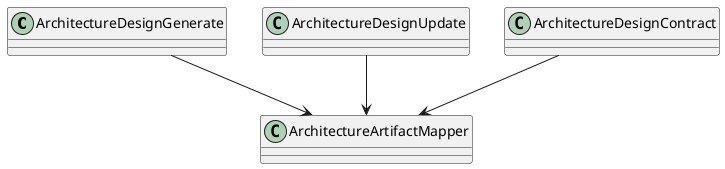
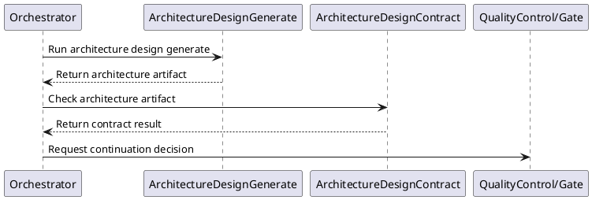

# Architecture Design

## 0. Document Type

- type: `functional_group_design`
- scope: define architecture artifact generation, architecture update behavior, and architecture contract checking
- includes: `ArchitectureDesignGenerate`, `ArchitectureDesignUpdate`, `ArchitectureDesignContract`
- downstream usage: guide follow-up design for architecture artifact production, update flow, and architecture-level validation rules

## 1. Goal

### 1.1 Purpose

Define the architecture-design basic units for generation, update, and contract checking.

### 1.2 Involved Items

This design document directly covers:

- `ArchitectureDesignGenerate`
- `ArchitectureDesignUpdate`
- `ArchitectureDesignContract`

This design document collaborates with:

- `Orchestrator`
- `LlmExecutor`
- `ArtifactStore`
- `QualityControl`

### 1.3 Core Functions

`Architecture Design` is the design item for architecture document generation, update, and validation.

Its core functions are:

- Generate architecture artifacts from approved upstream inputs.
- Update architecture artifacts after requirement changes.
- Validate architecture outputs against architecture rules.
- Expose stable architecture artifacts to item design and work planning.

`Architecture Design` does not own cross-document consistency beyond its own contract boundary, runtime control, or gate policy.

## 2. Core Classes

### 2.1 Class Diagram



### 2.2 Core Class Responsibilities

#### 2.2.1 `ArchitectureDesignGenerate`

Role:

- Produce initial architecture outputs.

Responsibilities:

- Read approved requirement artifacts.
- Generate architecture content.
- Return architecture artifacts for downstream use.

#### 2.2.2 `ArchitectureDesignContract`

Role:

- Validate architecture outputs.

Responsibilities:

- Check structure and rule compliance.
- Report architecture issues.
- Gate downstream use of architecture artifacts.

## 3. Core Runtime Flow

### 3.1 Main Sequence Diagram



## 4. Detailed Design

### 4.1 Core APIs And Types

#### 4.1.1 Public API

```typescript
interface ArchitectureDesignApi {
  generate(input: ArchitectureDesignInput): Promise<ArchitectureArtifact>
  update(input: ArchitectureDesignUpdateInput): Promise<ArchitectureArtifact>
  contract(input: ArchitectureContractInput): Promise<ArchitectureContractResult>
}
```

#### 4.1.2 Input Types

```typescript
interface ArchitectureDesignInput {
  requirementArtifact: string
  userInput?: string
}

interface ArchitectureDesignUpdateInput {
  requirementArtifact: string
  currentArchitectureArtifact: string
}
```

#### 4.1.3 Output Types

```typescript
interface ArchitectureArtifact {
  artifactId: string
  content: string
}

interface ArchitectureContractResult {
  passed: boolean
  issues: string[]
}
```

#### 4.1.4 Design-Item-Specific Rules

- Architecture generation depends on stable requirement input.
- Update must preserve reusable unchanged sections where practical.
- Contract output must be usable by runtime continuation logic.

### 4.2 Constraints

- Architecture design must not bypass approved requirement artifacts.
- Cross-document consistency beyond architecture scope belongs to `OverallDesignContract`.
- LLM-dependent work must go through `LlmExecutor`.
- Persistence remains external to this design item.
