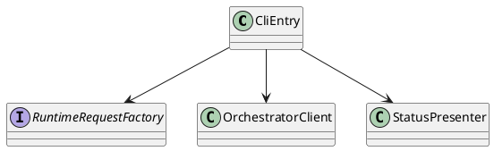
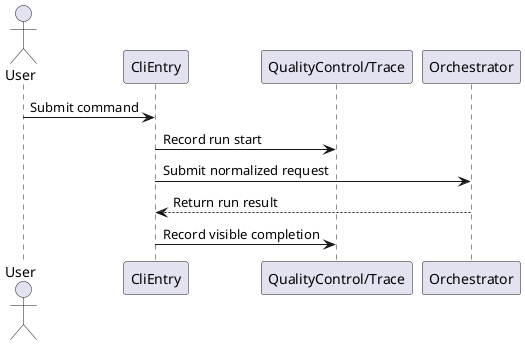

# CliEntry Design

## 0. Document Type

- type: `functional_group_design`
- scope: define current CLI entry behavior, request normalization, and user-facing control handoff
- includes: `CliEntry`
- downstream usage: guide follow-up design for command parsing, runtime request normalization, and interface-to-runtime handoff

## 1. Goal

### 1.1 Purpose

Define the CLI entry boundary for user commands, request normalization, and handoff into runtime control.

### 1.2 Involved Items

This design document directly covers:

- `CliEntry`

This design document collaborates with:

- `Orchestrator`
- `QualityControl/Trace`

### 1.3 Core Functions

`CliEntry` is the design item for current CLI entry and user-facing runtime handoff.

Its core functions are:

- Parse direct-run and runtime-managed-run commands.
- Normalize user input into stable runtime request shapes.
- Show visible run status, prompts, and final results.
- Hand off execution control to `Orchestrator`.

`CliEntry` does not own execution logic, contract logic, or persistence policy.

## 2. Core Classes

### 2.1 Class Diagram



### 2.2 Core Class Responsibilities

#### 2.2.1 `CliEntry`

Role:

- Own the current CLI command boundary.

Responsibilities:

- Parse user commands.
- Select direct-run or runtime-managed-run mode.
- Delegate normalized requests to runtime control.

#### 2.2.2 `RuntimeRequestFactory`

Role:

- Normalize CLI input into stable runtime requests.

Responsibilities:

- Map commands to runtime mode.
- Resolve initial request fields.
- Keep CLI parsing separate from runtime execution.

## 3. Core Runtime Flow

### 3.1 Main Sequence Diagram



## 4. Detailed Design

### 4.1 Core APIs And Types

#### 4.1.1 Public API

```typescript
interface CliEntryApi {
  run(commandText: string): Promise<CliRunResult>
}
```

#### 4.1.2 Input Types

```typescript
interface CliCommandInput {
  commandText: string
  workingDirectory?: string
}
```

#### 4.1.3 Output Types

```typescript
interface CliRunResult {
  mode: "direct" | "runtime_managed"
  status: "success" | "failed" | "waiting_review"
  summary: string
}
```

#### 4.1.4 Design-Item-Specific Rules

- `CliEntry` must normalize commands before handing off to runtime control.
- `CliEntry` must not contain capability-specific execution branches.
- Visible messages should be derived from runtime results rather than internal CLI state guesses.

### 4.2 Constraints

- `CliEntry` owns command parsing only.
- Runtime continuation logic belongs to `Orchestrator`.
- Trace visibility must use stable collaboration boundaries.
- Future UI should reuse the same runtime request boundary.
