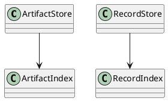
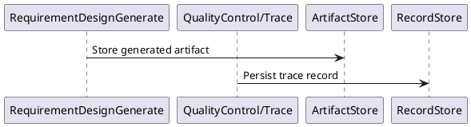

# DataStore Design

## 0. Document Type

- type: `functional_group_design`
- scope: define artifact persistence, record storage, downstream lookup, and runtime auditability boundaries
- includes: `ArtifactStore`, `RecordStore`
- downstream usage: guide follow-up design for storage APIs, persistence layout, lookup behavior, and audit record handling

## 1. Goal

### 1.1 Purpose

Define shared data persistence behavior for `ArtifactStore` and `RecordStore`.

### 1.2 Involved Items

This design document directly covers:

- `ArtifactStore`
- `RecordStore`

This design document collaborates with:

- `Orchestrator`
- `QualityControl`
- `RequirementDesignGenerate`
- `WorkExecute`

### 1.3 Core Functions

`DataStore` is the design item for artifact persistence and runtime record storage.

Its core functions are:

- Persist generated artifacts for downstream lookup and resume.
- Persist gate decisions and trace records for audit and visibility.
- Provide stable read boundaries for runtime and test usage.
- Keep data persistence separate from capability and review logic.

`DataStore` does not decide runtime continuation, review outcomes, or capability-specific rules.

## 2. Core Classes

### 2.1 Class Diagram



### 2.2 Core Class Responsibilities

#### 2.2.1 `ArtifactStore`

Role:

- Persist visible artifacts.

Responsibilities:

- Store generated documents and change artifacts.
- Support downstream lookup.
- Support resume and review access.

#### 2.2.2 `RecordStore`

Role:

- Persist runtime records.

Responsibilities:

- Store trace events.
- Store gate decisions.
- Store execution records for audit.

## 3. Core Runtime Flow

### 3.1 Main Sequence Diagram



## 4. Detailed Design

### 4.1 Core APIs And Types

#### 4.1.1 Public API

```typescript
interface ArtifactStoreApi {
  put(input: ArtifactPutInput): Promise<void>
  get(artifactId: string): Promise<StoredArtifact | null>
}

interface RecordStoreApi {
  append(input: RecordAppendInput): Promise<void>
}
```

#### 4.1.2 Input Types

```typescript
interface ArtifactPutInput {
  artifactId: string
  content: string
  artifactType: string
}

interface RecordAppendInput {
  recordType: string
  content: string
}
```

#### 4.1.3 Output Types

```typescript
interface StoredArtifact {
  artifactId: string
  content: string
  artifactType: string
}
```

#### 4.1.4 Design-Item-Specific Rules

- Artifact and record storage must remain separate responsibilities.
- Stored outputs must be runtime-readable for resume and downstream use.
- Persistence format should stay stable across direct and runtime-managed runs.

### 4.2 Constraints

- `Data` is a lower partition and must not depend on upper partitions.
- Storage APIs should remain simple and stable.
- Auditability requires durable records.
- Local-file implementation details are follow-up design concerns.
