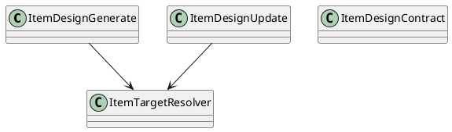
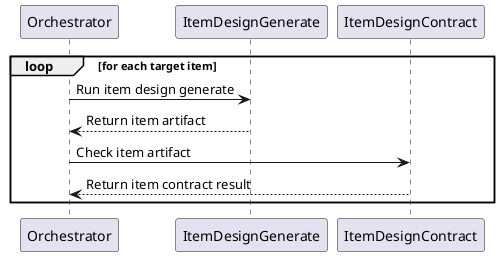

# Item Design

## 0. Document Type

- type: `functional_group_design`
- scope: define item-level design generation, item update behavior, and item contract checking
- includes: `ItemDesignGenerate`, `ItemDesignUpdate`, `ItemDesignContract`
- downstream usage: guide follow-up design for per-item artifact production, per-item update flow, and item-level validation rules

## 1. Goal

### 1.1 Purpose

Define item-design basic units, including generation, update, and item contract checking.

### 1.2 Involved Items

This design document directly covers:

- `ItemDesignGenerate`
- `ItemDesignUpdate`
- `ItemDesignContract`

This design document collaborates with:

- `Orchestrator`
- `LlmExecutor`
- `ArtifactStore`
- `QualityControl`

### 1.3 Core Functions

`Item Design` is the design item for per-item design outputs.

Its core functions are:

- Generate item design artifacts for one target item.
- Update item design artifacts incrementally.
- Validate item-level design outputs.

`Item Design` does not own cross-document consistency checking, runtime loops, gate decisions, or downstream work execution behavior.

## 2. Core Classes

### 2.1 Class Diagram



### 2.2 Core Class Responsibilities

#### 2.2.1 `ItemDesignGenerate`

Role:

- Produce one item-design artifact for one target item.

Responsibilities:

- Read approved upstream design inputs.
- Generate per-item design output.
- Return one item artifact per target.

#### 2.2.2 `ItemDesignContract`

Role:

- Validate item-level design output.

Responsibilities:

- Read one item-design artifact against its rules.
- Report item-level issues.
- Stabilize downstream use of item design outputs.

## 3. Core Runtime Flow

### 3.1 Main Sequence Diagram



## 4. Detailed Design

### 4.1 Core APIs And Types

#### 4.1.1 Public API

```typescript
interface ItemDesignApi {
  generate(input: ItemDesignInput): Promise<ItemDesignArtifact>
  update(input: ItemDesignUpdateInput): Promise<ItemDesignArtifact>
  contract(input: ItemDesignContractInput): Promise<ItemDesignContractResult>
}
```

#### 4.1.2 Input Types

```typescript
interface ItemDesignInput {
  requirementArtifact: string
  architectureArtifact: string
  targetItem: string
}

interface ItemDesignContractInput {
  itemArtifact: string
  targetItem: string
}
```

#### 4.1.3 Output Types

```typescript
interface ItemDesignArtifact {
  targetItem: string
  content: string
}

interface ItemDesignContractResult {
  passed: boolean
  issues: string[]
}
```

#### 4.1.4 Design-Item-Specific Rules

- Item design runs once per target item.
- Item contract checks one item-design artifact at a time.
- Item-level pass does not imply cross-document consistency.

### 4.2 Constraints

- Looping across target items belongs to runtime control.
- Item outputs must remain independently addressable artifacts.
- Cross-item parallelism must respect upstream input stability.
- Cross-document consistency checking belongs to `OverallDesignContract`.
