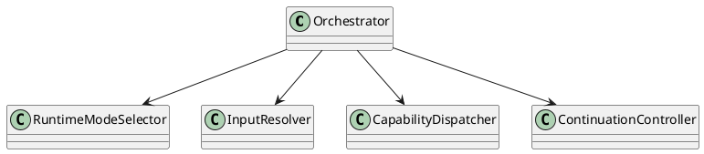
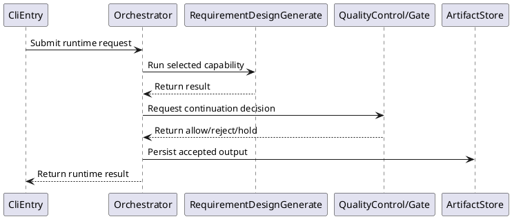

# Orchestrator Design

## 0. Document Type

- type: `functional_group_design`
- scope: define runtime modes, command input/output handling, capability dispatch, continuation rules, and resume behavior
- includes: `Orchestrator`
- downstream usage: guide follow-up design for runtime control, step dispatch, continuation decisions, and resume boundaries

## 1. Goal

### 1.1 Purpose

Define runtime control for command input/output handling, capability dispatch, continuation decisions, and resume behavior.

### 1.2 Involved Items

This design document directly covers:

- `Orchestrator`

This design document collaborates with:

- `CliEntry`
- `RequirementDesignGenerate`
- `ArchitectureDesignGenerate`
- `ItemDesignGenerate`
- `WorkPlanGenerate`
- `WorkExecute`
- `QualityControl`
- `ArtifactStore`
- `RecordStore`

### 1.3 Core Functions

`Orchestrator` is the design item for runtime-managed control and direct-run dispatch.

Its core functions are:

- Accept normalized requests from the interface layer.
- Resolve required inputs by runtime convention.
- Dispatch execution and contract calls in the correct order.
- Decide continue, stop, retry, or wait-review transitions.

`Orchestrator` does not own execution-unit internals, LLM provider logic, or storage implementation details.

## 2. Core Classes

### 2.1 Class Diagram



### 2.2 Core Class Responsibilities

#### 2.2.1 `Orchestrator`

Role:

- Own the stable runtime control boundary.

Responsibilities:

- Handle direct and runtime-managed requests.
- Coordinate capability calls.
- Return stable runtime results.

#### 2.2.2 `ContinuationController`

Role:

- Decide the next runtime step.

Responsibilities:

- Interpret gate outcomes.
- Respect required-input availability.
- Support stop, retry, resume, and wait-review behavior.

## 3. Core Runtime Flow

### 3.1 Main Sequence Diagram



## 4. Detailed Design

### 4.1 Core APIs And Types

#### 4.1.1 Public API

```typescript
interface OrchestratorApi {
  run(request: RuntimeRequest): Promise<RuntimeResult>
}
```

#### 4.1.2 Input Types

```typescript
interface RuntimeRequest {
  mode: "direct" | "runtime_managed"
  target?: string
  entryArtifacts?: string[]
  userInput?: string
}
```

#### 4.1.3 Runtime Types

```typescript
interface RuntimeStep {
  capability: string
  contract?: string
  requiredArtifacts: string[]
}
```

#### 4.1.4 Output Types

```typescript
interface RuntimeResult {
  status: "success" | "failed" | "waiting_review"
  lastStep: string
  outputArtifacts: string[]
}
```

#### 4.1.5 Design-Item-Specific Rules

- Direct-run and runtime-managed-run must share one stable orchestration boundary.
- Capability dispatch must be based on required-input availability.
- Continuation decisions must be made after contract and gate outputs are available.

### 4.2 Constraints

- `Orchestrator` must not embed capability-specific business rules.
- Resume behavior must be based on readable artifacts and records.
- Runtime mode selection must remain explicit.
- Storage policy is collaboration-driven, not orchestrator-owned.
