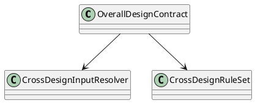
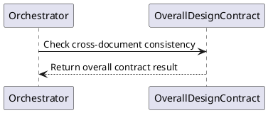

# OverallDesignContract Design

## 0. Document Type

- type: `functional_group_design`
- scope: define cross-document consistency checking across requirement, architecture, and item design outputs
- includes: `OverallDesignContract`
- downstream usage: guide follow-up design for cross-document validation rules, aggregated design inputs, and downstream planning gates

## 1. Goal

### 1.1 Purpose

Define cross-document consistency checking across requirement, architecture, and item design outputs.

### 1.2 Involved Items

This design document directly covers:

- `OverallDesignContract`

This design document collaborates with:

- `Orchestrator`
- `RequirementDesignContract`
- `ArchitectureDesignContract`
- `ItemDesignContract`
- `ArtifactStore`

### 1.3 Core Functions

`OverallDesignContract` is the design item for cross-document consistency validation.

Its core functions are:

- Read requirement, architecture, and item design artifacts together.
- Check cross-document consistency before downstream planning.
- Report design-level issues across document boundaries.
- Return stable contract results for runtime continuation decisions.

`OverallDesignContract` does not own item generation, item-level contract execution, or runtime sequencing.

## 2. Core Classes

### 2.1 Class Diagram



### 2.2 Core Class Responsibilities

#### 2.2.1 `OverallDesignContract`

Role:

- Validate consistency across design documents.

Responsibilities:

- Read multiple upstream design artifacts together.
- Check cross-document consistency rules.
- Return overall contract results for downstream control.

## 3. Core Runtime Flow

### 3.1 Main Sequence Diagram



## 4. Detailed Design

### 4.1 Core APIs And Types

#### 4.1.1 Public API

```typescript
interface OverallDesignContractApi {
  contract(input: OverallDesignContractInput): Promise<OverallDesignContractResult>
}
```

#### 4.1.2 Input Types

```typescript
interface OverallDesignContractInput {
  requirementArtifact: string
  architectureArtifact: string
  itemArtifacts: string[]
}
```

#### 4.1.3 Output Types

```typescript
interface OverallDesignContractResult {
  passed: boolean
  issues: string[]
}
```

#### 4.1.4 Design-Item-Specific Rules

- Cross-document consistency must consume multiple design artifacts together.
- Overall consistency checking must remain separate from item-level contract checks.
- Downstream work planning must not rely on unstable overall design outputs.

### 4.2 Constraints

- `OverallDesignContract` belongs to the contract capability set.
- Runtime control decides when to invoke the overall contract.
- Cross-document rules must remain readable and stable.
- This design item must not absorb generation behavior.
