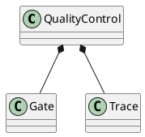
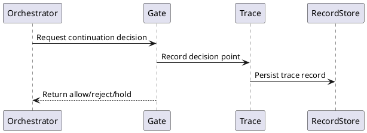

# QualityControl Design

## 0. Document Type

- type: `functional_group_design`
- scope: define review decision handling and execution visibility boundaries inside the quality-control subsystem
- includes: `QualityControl`, `Gate`, `Trace`
- downstream usage: guide follow-up design for review decision rules, trace recording, and quality-control collaboration boundaries

## 1. Goal

### 1.1 Purpose

Define review decision and execution visibility behavior inside the SDK-contained `QualityControl` module.

### 1.2 Involved Items

This design document directly covers:

- `QualityControl`
- `Gate`
- `Trace`

This design document collaborates with:

- `Orchestrator`
- `CliEntry`
- `ArtifactStore`
- `RecordStore`

### 1.3 Core Functions

`QualityControl` is the design item for review decision and runtime visibility.

Its core functions are:

- Provide `Gate` decisions for generated artifacts, contract results, and validation outputs.
- Provide `Trace` records for runtime visibility.
- Return stable review outcomes to callers.
- Keep review and visibility separate from execution-unit logic.

`QualityControl` does not decide how artifacts are stored or used after a decision is returned.

## 2. Core Classes

### 2.1 Class Diagram



### 2.2 Core Class Responsibilities

#### 2.2.1 `Gate`

Role:

- Return change review decisions.

Responsibilities:

- Read generated outputs and contract results.
- Return allow, reject, or hold.
- Record decision points through `Trace`.

#### 2.2.2 `Trace`

Role:

- Provide execution visibility.

Responsibilities:

- Record run start, transitions, and decision points.
- Emit stable trace records.
- Support visible runtime summaries.

## 3. Core Runtime Flow

### 3.1 Main Sequence Diagram



## 4. Detailed Design

### 4.1 Core APIs And Types

#### 4.1.1 Public API

```typescript
interface QualityControlApi {
  review(input: GateInput): Promise<GateResult>
  trace(input: TraceInput): Promise<void>
}
```

#### 4.1.2 Input Types

```typescript
interface GateInput {
  subjectType: string
  artifactIds?: string[]
  contractPassed?: boolean
  diagnostics?: string[]
}

interface TraceInput {
  eventType: string
  message: string
  relatedArtifacts?: string[]
}
```

#### 4.1.3 Output Types

```typescript
interface GateResult {
  decision: "allow" | "reject" | "hold"
  reasons: string[]
}
```

#### 4.1.4 Design-Item-Specific Rules

- `Gate` returns decisions only.
- `Trace` records visibility events only.
- Artifact usage after review is owned by the caller.

### 4.2 Constraints

- `QualityControl` belongs to `SDK`.
- `Gate` and `Trace` must stay separate concerns inside the same module.
- Persistence uses collaboration boundaries rather than internal storage ownership.
- Review policy details may evolve without changing execution-unit boundaries.
