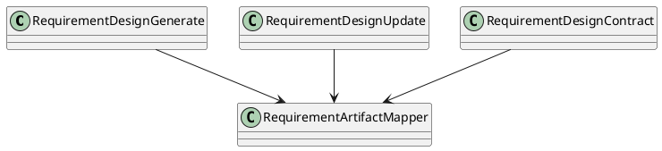
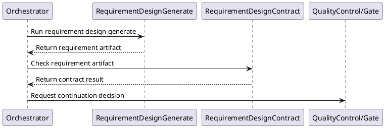

# Requirement Design

## 0. Document Type

- type: `functional_group_design`
- scope: define requirement artifact generation, requirement update behavior, and requirement contract checking
- includes: `RequirementDesignGenerate`, `RequirementDesignUpdate`, `RequirementDesignContract`
- downstream usage: guide follow-up design for requirement artifact production, update flow, and requirement-level validation rules

## 1. Goal

### 1.1 Purpose

Define the requirement-design basic units for generation, update, and contract checking.

### 1.2 Involved Items

This design document directly covers:

- `RequirementDesignGenerate`
- `RequirementDesignUpdate`
- `RequirementDesignContract`

This design document collaborates with:

- `Orchestrator`
- `LlmExecutor`
- `ArtifactStore`
- `QualityControl`

### 1.3 Core Functions

`Requirement Design` is the design item for requirement document generation, update, and validation.

Its core functions are:

- Generate requirement artifacts from user input.
- Update requirement artifacts incrementally when requirement changes arrive.
- Validate requirement outputs before downstream use.
- Expose stable requirement artifacts to later capability items.

`Requirement Design` does not own runtime continuation decisions, global persistence policy, or cross-document consistency checks outside requirement scope.

## 2. Core Classes

### 2.1 Class Diagram



### 2.2 Core Class Responsibilities

#### 2.2.1 `RequirementDesignGenerate`

Role:

- Produce initial requirement artifacts.

Responsibilities:

- Interpret user intent.
- Build requirement outputs.
- Return stable artifacts to runtime control.

#### 2.2.2 `RequirementDesignContract`

Role:

- Validate requirement outputs.

Responsibilities:

- Check structure and rule compliance.
- Report issues and pass/fail status.
- Support downstream stabilization.

## 3. Core Runtime Flow

### 3.1 Main Sequence Diagram



## 4. Detailed Design

### 4.1 Core APIs And Types

#### 4.1.1 Public API

```typescript
interface RequirementDesignApi {
  generate(input: RequirementDesignInput): Promise<RequirementArtifact>
  update(input: RequirementDesignUpdateInput): Promise<RequirementArtifact>
  contract(input: RequirementContractInput): Promise<RequirementContractResult>
}
```

#### 4.1.2 Input Types

```typescript
interface RequirementDesignInput {
  userInput: string
  contextArtifacts?: string[]
}

interface RequirementDesignUpdateInput {
  userInput: string
  currentRequirementArtifact: string
}
```

#### 4.1.3 Output Types

```typescript
interface RequirementArtifact {
  artifactId: string
  content: string
}

interface RequirementContractResult {
  passed: boolean
  issues: string[]
}
```

#### 4.1.4 Design-Item-Specific Rules

- `generate` and `update` are separate basic units even when they share helpers.
- Contract output must be stable enough for runtime continuation decisions.
- Requirement artifacts are downstream inputs and must be persisted after acceptance.

### 4.2 Constraints

- Requirement logic must not own cross-document validation.
- Runtime sequencing belongs to `Orchestrator`.
- LLM access, when needed, must go through `LlmExecutor`.
- Requirement outputs must remain readable by downstream design items.
