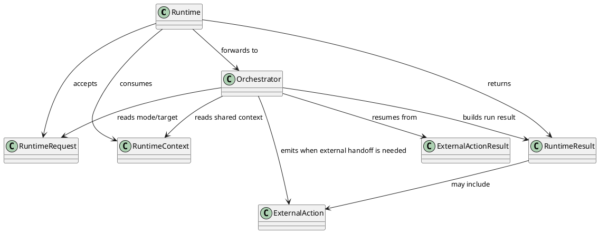
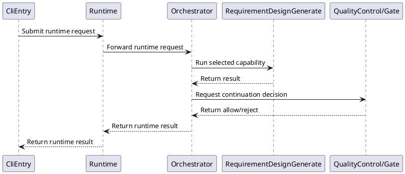
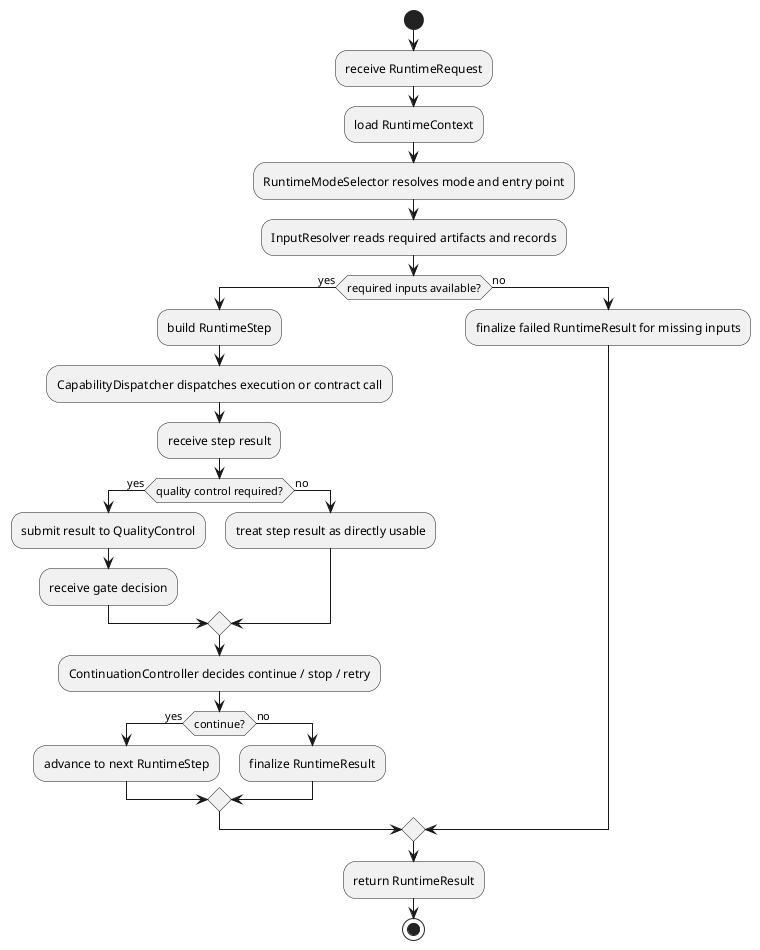
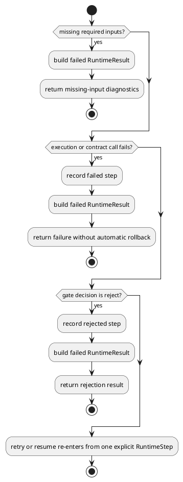

# Runtime Design

## 0. Document Type

- type: `functional_group_design`
- scope: define the unified runtime entry, runtime modes, runtime context, shared external action protocol, current lightweight dispatch behavior, and future compose-run orchestration boundary
- include: `Runtime`, `Orchestrator`
- downstream usage: guide follow-up design for run-level context, unified-entry runtime control, step dispatch, continuation decisions, and resume boundaries

## 1. Goal

### 1.1 Purpose

Define the runtime design for unified entry handling, run-level context, shared external action protocol, current lightweight dispatch behavior, and the future compose-run orchestration boundary.

### 1.2 Involved Items

This design document directly covers:

- `Runtime`
- `Orchestrator`

This design document collaborates with:

- `CliEntry`
- `RequirementDesignGenerate`
- `ArchitectureDesignGenerate`
- `ItemDesignGenerate`
- `WorkPlanGenerate`
- `WorkExecute`
- `QualityControl`
- `ArtifactStore`
- `RecordStore`

### 1.3 Core Functions

`Runtime` is the design item for the unified runtime entry, compose-run capability reservation, run-level context, and direct-run dispatch.

Its core functions are:

- Accept normalized requests from the interface layer.
- Accept direct-run and compose-run requests through one unified entry.
- Hold shared runtime context such as `runId`, `workDir`, and shared resource roots.
- Provide one shared external action protocol for update and execution handoff.
- Resolve required inputs by runtime convention.
- Dispatch execution and contract calls in the correct order.
- Decide continue, stop, or retry transitions after unit outputs are already persisted.
- Reserve the future compose-run orchestration boundary without claiming full current-version orchestration support.

`Runtime` does not own execution-unit internals, LLM provider logic, direct unit-output persistence, or storage implementation details.

## 2. Core Classes

### 2.1 Class Diagram



### 2.2 Core Class Responsibilities

#### 2.2.1 `Runtime`

Role:

- Own the stable run-level boundary.

Responsibilities:

- Hold runtime request handling and shared runtime context.
- Expose one unified runtime entry.
- Forward direct-run and compose-run requests to `Orchestrator`.
- Keep runtime-wide state separate from unit internals.

#### 2.2.2 `Orchestrator`

Role:

- Provide the current lightweight runtime-dispatch capability.

Responsibilities:

- Handle direct-run and compose-run requests inside the current version through the `Orchestrator` capability.
- Perform current mode selection, capability dispatch, and continuation control inside one internal runtime capability boundary.
- Coordinate capability calls.
- Return stable runtime results.
- Keep only simple dispatch behavior in the current version; compose-run currently exists as an entry and capability reservation, and richer orchestration remains a future need.

## 3. Core Runtime Flow

### 3.1 Main Sequence Diagram



## 4. Detailed Design

### 4.1 Core APIs And Types

#### 4.1.1 Public API

```typescript
interface RuntimeApi {
  run(request: RuntimeRequest): Promise<RuntimeResult>
}
```

Current version note:

- `RuntimeApi` is currently implemented through the lightweight `Orchestrator` capability.

#### 4.1.2 Input Types

```typescript
interface RuntimeRequest {
  mode: "direct" | "compose"
  target?: string
  entryArtifacts?: string[]
  userInput?: string
  workDir: string
  runId: string
}
```

#### 4.1.3 Runtime Types

```typescript
interface RuntimeStep {
  capability: string
  contract?: string
  requiredArtifacts: string[]
}

interface RuntimeContext {
  runId: string
  workDir: string
  templateRoot?: string
  specRoot?: string
  artifactRoot?: string
  recordRoot?: string
}

interface ExternalAction {
  tool: "external_plugin" | "external_execution"
  operation: string
  targetPath: string
  payload?: Record<string, unknown>
}

interface ExternalActionResult {
  status: "success" | "failed"
  targetPath: string
  changedFiles?: ChangedFile[]
  updatedArtifacts?: ExternalActionUpdatedArtifact[]
  resumeInput?: ArtifactMap
  payload?: Record<string, unknown>
  diagnostics?: Array<Record<string, unknown>>
}
```

#### 4.1.4 Output Types

```typescript
interface RuntimeResult {
  status: "success" | "failed"
  lastStep: string
  outputArtifacts: string[]
  externalAction?: ExternalAction
}
```

#### 4.1.5 Item-Specific Boundary Rules

- Direct-run and compose-run must share one stable unified entry boundary.
- Compose-run is currently an entry and capability reservation, not a fully implemented multi-step orchestration flow.
- Shared runtime context must be available before any unit dispatch begins.
- `workDir` must be passed in through the CLI/runtime request and must not be inferred implicitly.
- `runId` must be present before `Runtime` starts dispatching. When the caller does not provide one, `CliEntry` must generate it during the entry stage.
- Runtime fields other than `workDir` and `runId` must be loaded from `workDir/sdlc/local_env.json` during the entry stage.
- `RuntimeContext` must be assembled before the request is handed to `Runtime`.
- Capability dispatch must be based on required-input availability.
- Continuation decisions must be made after contract and gate outputs are available.
- Each unit must directly call `ArtifactStore` before returning its generated artifact, update output, contract result, or execution-related artifact.
- Continuation must be evaluated only after the unit-side `ArtifactStore` write is finished.
- Update-style units and `WorkExecute` must use one shared `ExternalAction` boundary instead of defining incompatible action shapes.
- `ExternalAction` must carry at least `tool`, `operation`, and `targetPath`.
- Update-style units must expose one stable payload with `handoffType`, `prompt`, and `targetArtifact` so external mcp consumers can bind the handoff without per-unit field translation.
- External execution feedback must return through one shared `ExternalActionResult` shape before any follow-up contract, gate, or persistence step is evaluated.
- `ExternalActionResult` must carry stable fields for `changedFiles`, `updatedArtifacts`, and `resumeInput` so later runtime ingestion does not need implicit file scanning.
- Gate continuation must be resolved by runtime-owned rules after `ExternalActionResult` ingestion instead of per-capability branching.
- Gate action `apply` must map to one explicit `continue` branch with continuation-ready artifact bindings.
- Gate action `reject` must map to one explicit stop path and must not expose downstream continuation input.
- Gate action `wait` must map to one explicit resumable return path with the minimum runtime-owned state boundary: `targetPath` plus continuation-ready artifact bindings.

### 4.2 Internal Runtime Skeleton



### 4.3 Runtime Processing Details

#### 4.3.1 Entry Resolution

Input loading:

- read one `RuntimeRequest`
- read one `RuntimeContext`
- resolve direct-run or compose-run entry mode
- read entry artifacts and runtime records when provided

Processing:

- normalize one unified runtime request shape
- trust `workDir` and `runId` from the already prepared request/context boundary
- consume the already assembled `RuntimeContext`
- resolve one starting `RuntimeStep`
- pass the normalized request into dispatch control

Output emission:

- emit one resolved first-step runtime state
- expose one bound runtime context for downstream dispatch
- expose normalized runtime input for downstream dispatch

#### 4.3.2 Step Dispatch And Continuation

Input loading:

- read one current `RuntimeStep`
- read required artifacts and records for that step
- read contract result or gate result when continuation depends on them

Processing:

- dispatch one execution or contract call
- collect one step result
- assume the unit has already directly written its own output artifact or contract result to `ArtifactStore`
- evaluate continuation through gate-aware runtime control

Output emission:

- emit one updated `RuntimeResult`
- emit one next-step decision or stop decision

#### 4.3.3 External Action Handoff

Input loading:

- read one `ExternalAction` returned by one update-style unit or by `WorkExecute`
- read one `RuntimeContext`
- read one `ExternalActionResult` when the external side completes

Processing:

- treat the returned action as one runtime-owned shared handoff protocol
- pass one stable `ExternalAction` to the external caller or adapter boundary
- expect the external side to execute against `targetPath` and return one `ExternalActionResult`
- resume follow-up contract, gate, or next-step evaluation only after the external result is available
- treat `updatedArtifacts` as the explicit artifact refresh source of truth and `resumeInput` as the continuation-ready artifact binding map
- map gate decision `apply` to one runtime `continue` branch with continuation-ready artifact bindings
- map gate decision `reject` to one runtime stop result without downstream continuation input
- map gate decision `wait` to one runtime `wait` branch with the minimum resumable state boundary of `targetPath` plus continuation-ready artifact bindings
- require update-style actions to keep one stable payload contract:
  - `handoffType`: current handoff category such as `document_update`
  - `prompt`: external update instruction content
  - `targetArtifact.artifactKey`: logical artifact binding name
  - `targetArtifact.filePath`: workspace-relative artifact path

Output emission:

- emit one stable external-action handoff payload
- emit one stable `ExternalActionResult` for downstream contract, gate, or continuation logic

### 4.4 Error Handling Skeleton



### 4.5 Extension Points

- Extension point: `runtime mode selection rules`
- replace mode-selection rules without changing `RuntimeApi`
- support additional compose-run modes later

- Extension point: `runtime input resolution rules`
  - extend artifact lookup rules
  - extend resume and record-reading rules

- Extension point: `capability dispatch rules`
  - register new basic execution units
  - register new contract modules

- Extension point: `runtime continuation rules`
  - refine continue / stop / retry policy
  - add future decision rules after contract, gate, or validation results

### 4.6 Constraints

- `Orchestrator` must not embed capability-specific business rules.
- `Runtime` must keep run-level context stable and readable across all unit calls.
- Resume behavior must be based on readable artifacts and records.
- Runtime mode selection must remain explicit.
- Storage policy is collaboration-driven, not orchestrator-owned.
- The current version must not claim full compose-run orchestration behavior beyond lightweight dispatch and boundary reservation.
- Runtime context assembly must be completed before `Runtime` dispatch starts, using request-provided `workDir`, caller-provided or entry-generated `runId`, and `workDir/sdlc/local_env.json` as the shared source of truth.
