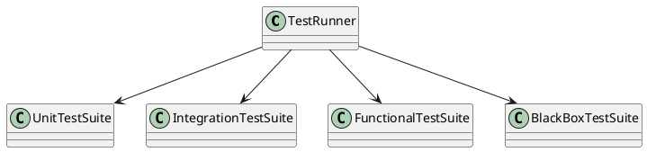
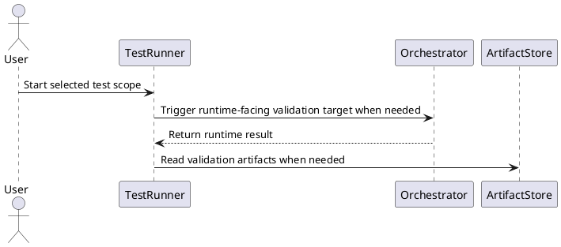

# Test Design

## 0. Document Type

- type: `test_design`
- scope: define test coverage boundaries, test layers, and cross-partition validation guidance
- includes: `TestRunner`
- downstream usage: guide follow-up test design, coverage planning, and concrete test-case organization

## 1. Goal

### 1.1 Purpose

Define the cross-partition test design for unit testing, black-box testing, integration testing, functional testing, and cross-partition validation.

### 1.2 Involved Items

This design document directly covers:

- `TestRunner`

This design document collaborates with:

- `Interface`
- `Runtime`
- `Capability`
- `SDK`
- `Data`

### 1.3 Core Functions

`Test` is the design item for cross-partition validation support.

Its core functions are:

- Run unit tests for isolated items.
- Run black-box and functional tests for end-to-end behavior.
- Run integration tests across partition boundaries.
- Return stable validation feedback and diagnostics.

`Test` does not become a runtime dependency of product partitions.

## 2. Core Classes

### 2.1 Class Diagram



### 2.2 Core Class Responsibilities

#### 2.2.1 `TestRunner`

Role:

- Own cross-partition test execution.

Responsibilities:

- Select test scope.
- Run test suites.
- Return stable results and diagnostics.

## 3. Core Runtime Flow

### 3.1 Main Sequence Diagram



## 4. Detailed Design

### 4.1 Core APIs And Types

#### 4.1.1 Public API

```typescript
interface TestRunnerApi {
  run(request: TestRunRequest): Promise<TestRunResult>
}
```

#### 4.1.2 Input Types

```typescript
interface TestRunRequest {
  scope: "unit" | "black_box" | "integration" | "functional" | "cross_partition"
  targets?: string[]
}
```

#### 4.1.3 Output Types

```typescript
interface TestRunResult {
  passed: boolean
  failedCases: string[]
  diagnostics: string[]
}
```

#### 4.1.4 Design-Item-Specific Rules

- `Test` may depend on product partitions.
- Product partitions must not depend on `Test`.
- Test outputs should be readable by review and audit flows when needed.

### 4.2 Constraints

- Test execution may run in a separate runtime.
- Test design must cover both isolated and cross-partition behavior.
- Test scope selection must remain explicit.
- Product runtime logic must not be embedded into test-only helpers.
