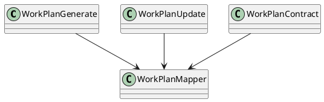
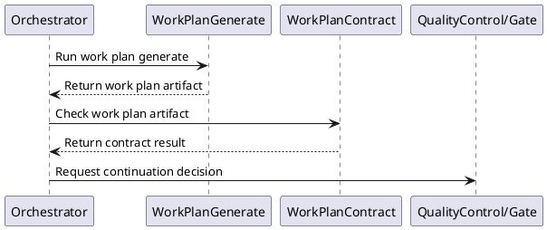

# Work Design

## 0. Document Type

- type: `functional_group_design`
- scope: define work-plan generation, work-plan update behavior, and work-plan contract checking
- includes: `WorkPlanGenerate`, `WorkPlanUpdate`, `WorkPlanContract`
- downstream usage: guide follow-up design for planning artifact production, plan updates, and planning validation rules

## 1. Goal

### 1.1 Purpose

Define work-plan basic units for generation, update, and contract checking.

### 1.2 Involved Items

This design document directly covers:

- `WorkPlanGenerate`
- `WorkPlanUpdate`
- `WorkPlanContract`

This design document collaborates with:

- `Orchestrator`
- `ArtifactStore`
- `QualityControl`

### 1.3 Core Functions

`Work Design` is the design item for work-plan generation, update, and validation.

Its core functions are:

- Generate a work plan from approved design artifacts.
- Update an existing work plan incrementally.
- Validate work-plan structure and planning rules.
- Expose stable work-plan outputs to work execution.

`Work Design` does not own code changes, validation command execution, or runtime continuation policy.

## 2. Core Classes

### 2.1 Class Diagram



### 2.2 Core Class Responsibilities

#### 2.2.1 `WorkPlanGenerate`

Role:

- Produce initial work-plan artifacts.

Responsibilities:

- Read approved upstream design artifacts.
- Generate plan items and execution order.
- Return stable work-plan outputs.

#### 2.2.2 `WorkPlanContract`

Role:

- Validate work-plan outputs.

Responsibilities:

- Check planning structure and rule compliance.
- Report plan issues.
- Stabilize downstream execution input.

## 3. Core Runtime Flow

### 3.1 Main Sequence Diagram



## 4. Detailed Design

### 4.1 Core APIs And Types

#### 4.1.1 Public API

```typescript
interface WorkPlanApi {
  generate(input: WorkPlanInput): Promise<WorkPlanArtifact>
  update(input: WorkPlanUpdateInput): Promise<WorkPlanArtifact>
  contract(input: WorkPlanContractInput): Promise<WorkPlanContractResult>
}
```

#### 4.1.2 Input Types

```typescript
interface WorkPlanInput {
  designArtifacts: string[]
  userInput?: string
}

interface WorkPlanContractInput {
  workPlanArtifact: string
}
```

#### 4.1.3 Output Types

```typescript
interface WorkPlanArtifact {
  artifactId: string
  content: string
}

interface WorkPlanContractResult {
  passed: boolean
  issues: string[]
}
```

#### 4.1.4 Design-Item-Specific Rules

- Work planning depends on approved upstream design artifacts.
- Plan updates should preserve stable completed or unchanged work items when possible.
- Downstream execution must not start from an unaccepted work plan.

### 4.2 Constraints

- Work-plan generation must stay separate from work execution.
- Contract output must remain runtime-readable.
- Plan artifacts must be stored for resume and review.
- Planning rules must not be embedded in runtime control.
