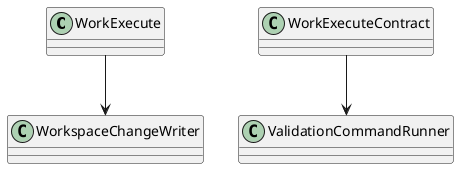
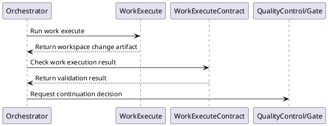

# WorkExecute Design

## 0. Document Type

- type: `functional_group_design`
- scope: define work execution behavior and work execution validation checking
- includes: `WorkExecute`, `WorkExecuteContract`
- downstream usage: guide follow-up design for workspace mutation, execution outputs, and execution-result validation

## 1. Goal

### 1.1 Purpose

Define work execution and work execution contract basic units, including code-change execution and validation command checking.

### 1.2 Involved Items

This design document directly covers:

- `WorkExecute`
- `WorkExecuteContract`

This design document collaborates with:

- `Orchestrator`
- `ArtifactStore`
- `RecordStore`
- `QualityControl`

### 1.3 Core Functions

`WorkExecute` is the design item for workspace change execution and validation-result checking.

Its core functions are:

- Apply work-plan-driven changes to the workspace.
- Produce visible code and workspace change artifacts.
- Run validation through `WorkExecuteContract`.
- Return execution and validation results to runtime control.

`WorkExecute` does not own work-plan generation, gate policy, or global test-partition strategy.

## 2. Core Classes

### 2.1 Class Diagram



### 2.2 Core Class Responsibilities

#### 2.2.1 `WorkExecute`

Role:

- Apply workspace changes from approved execution inputs.

Responsibilities:

- Read work plan and design artifacts.
- Produce code or file changes.
- Return visible execution outputs.

#### 2.2.2 `WorkExecuteContract`

Role:

- Validate execution outputs.

Responsibilities:

- Run configured validation commands.
- Report validation pass/fail and diagnostics.
- Support downstream review and continuation decisions.

## 3. Core Runtime Flow

### 3.1 Main Sequence Diagram



## 4. Detailed Design

### 4.1 Core APIs And Types

#### 4.1.1 Public API

```typescript
interface WorkExecuteApi {
  execute(input: WorkExecuteInput): Promise<WorkExecuteResult>
  contract(input: WorkExecuteContractInput): Promise<WorkExecuteContractResult>
}
```

#### 4.1.2 Input Types

```typescript
interface WorkExecuteInput {
  designArtifacts: string[]
  workPlanArtifact: string
  workspaceRoot: string
}

interface WorkExecuteContractInput {
  workspaceRoot: string
  validationCommands: string[]
}
```

#### 4.1.3 Output Types

```typescript
interface WorkExecuteResult {
  changedFiles: string[]
  artifactId: string
}

interface WorkExecuteContractResult {
  passed: boolean
  diagnostics: string[]
}
```

#### 4.1.4 Design-Item-Specific Rules

- Execution outputs must be visible as artifacts before review.
- Validation commands belong to contract execution, not generation.
- Execution and validation are separate basic units even when run back-to-back.

### 4.2 Constraints

- Workspace mutation must stay explicit.
- Validation command details belong to follow-up design, not architecture.
- Runtime control must decide continuation after validation.
- Execution records must remain persistable for audit and resume.
