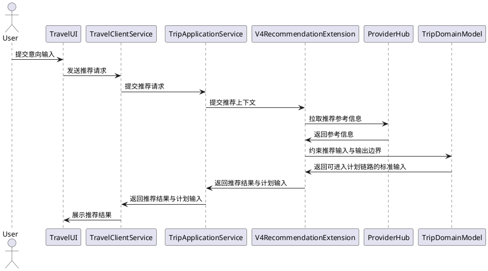
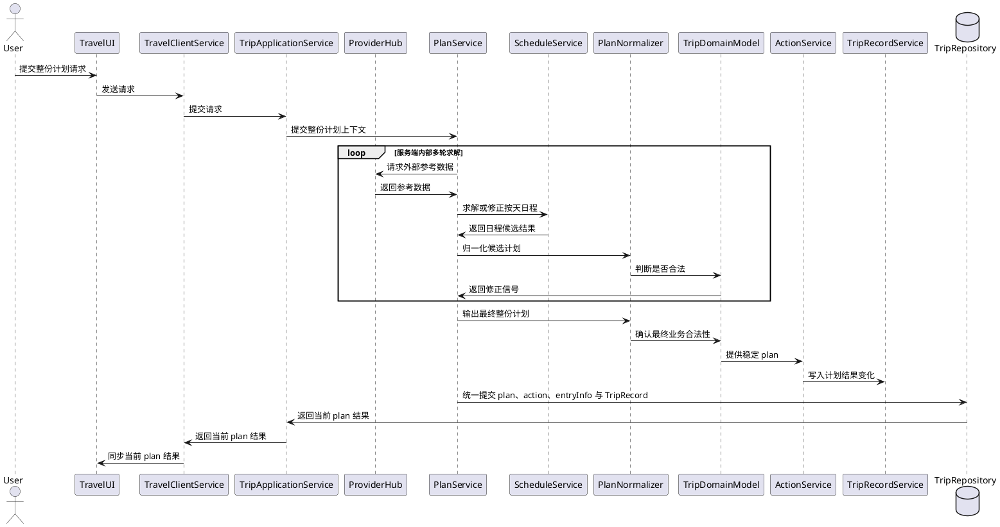
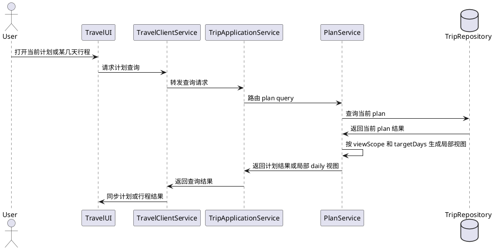
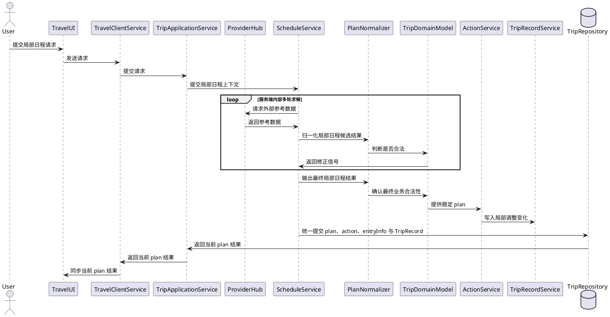
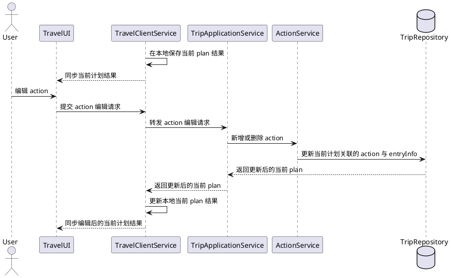
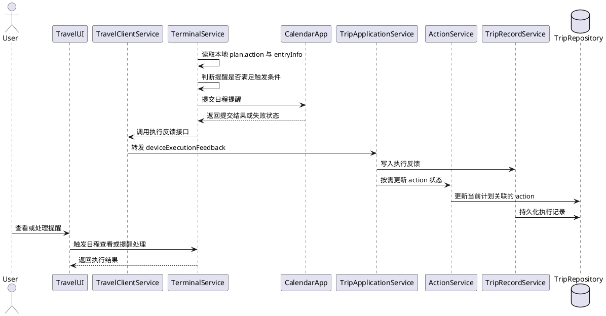
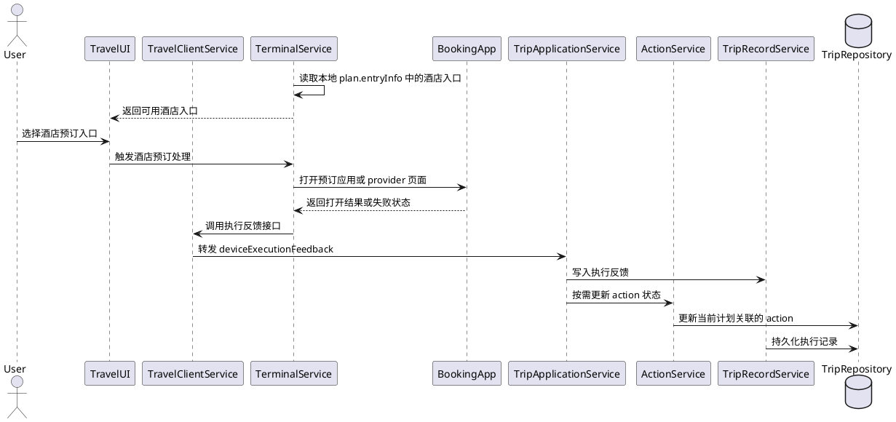
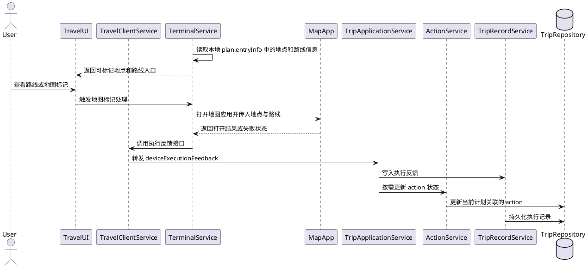
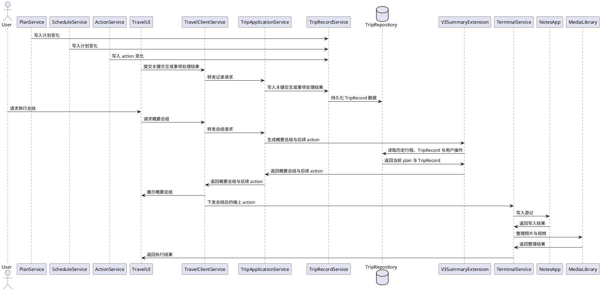

# Technical Architecture

## 1. Purpose

定义 `TravelAi` 平台的整体技术架构。

- Team members：为团队提供统一的高层技术基线，帮助理解 TravelAi 如何承接规划、过程支持与后续旅行总结的整体链路。
- Senior engineers：用于评审架构方向、系统边界，以及从 V1 到后续阶段的演进策略是否合理。
- Junior engineers：用于在进入详细设计前理解主要模块、依赖规则和运行时协作关系。

## 2. Scope

### 2.1 In Scope

- 从旅行输入到计划生成、计划细化、action 输出以及后续阶段扩展的整体系统交互与控制流程。
- 架构层面的主要模块与子系统，包括用户入口、流程编排、规划智能、状态存储和外部信息接入适配层。
- 核心平台模块与第三方提供方之间的协作边界与依赖方向。
- 与信息时效性边界、结果可解释性、外部依赖故障韧性以及从 V1 到 V5 分阶段演进相关的关键架构约束。

### 2.2 Out of Scope

- Planner、action 生成模块、summary 生成模块内部的详细实现逻辑。
- 详细 API 合同、消息字段、Prompt 内容、排序公式以及 action schema 的具体定义。
- 数据库 schema、索引策略和存储层优化设计。
- UI 交互细节、视觉表现和页面级信息架构。
- 部署 runbook、环境搭建、CI/CD 流程和运维操作手册。

---

## 3. Design Drivers

- **功能驱动：V1 以规划闭环为核心**：架构必须优先支持单人自由行的规划阶段闭环，因为 V1 的成败取决于是否能产出可使用的旅行方案，并把方案进一步落地为结构化结果，而不是一开始覆盖全部旅程阶段。
- **功能驱动：连续的旅行上下文**：系统必须能够在生成、细化和后续过程支持之间持续保留 trip context，因为产品价值来自于围绕同一趟旅行提供连续服务，而不是返回彼此割裂的单次答案。
- **功能驱动：外部数据是参考输入而非真值**：航班、酒店、地图、天气和 POI 等信息来自时效性和完整性都不稳定的外部系统，因此架构必须通过 adapter 隔离 provider 接入，并将这些返回结果视为带时效边界的参考输入，而不是权威真值。
- **功能驱动：需要结构化 action 输出**：规划结果需要被转换成可供执行层消费的结构化 action，因此架构必须明确区分“对话式生成结果”和“归一化后的 action 投影结果”这两个边界。
- **非功能驱动：结果必须可解释、可审阅**：旅行计划会直接影响用户真实的时间和花费，因此架构必须保留中间上下文、决策依据以及关键过程事件，以支持用户审阅当前结果并理解本次调整的主要变化。
- **非功能驱动：产品按阶段演进**：V2、V3、V4 和 V5 都是在同一条旅行生命周期上扩展能力，因此架构必须支持逐步加入过程支持、总结、意向推荐和多人协作，而不是过早拆散系统。
- **非功能驱动：规模适中但集成不确定性高**：早期流量有限，但 provider 不稳定和 AI 调用延迟都是真实风险，因此架构应优先选择 modular monolith，并在需要的地方引入选择性的异步处理，而不是过早微服务化。

---

# 4. Architecture Design

### 4.1 Architecture Style

系统采用 **modular monolith + capability-oriented application services + adapter-based external integrations** 的架构风格。

### 4.2 Layers or Partitions

- **ExperienceLayer**：负责提供 Web 与移动端友好的用户入口，承接旅行输入、计划查看、计划细化以及后续旅行过程中的使用界面；除展示外，也负责在终端侧调动可用能力执行本地动作，例如打开地图、唤起浏览器、触发系统分享或跳转提醒入口。
- **ApplicationLayer**：负责请求接入、能力路由、权限校验，以及 use case 级别的轻量协调；整体计划、日程调整和 action 更新分别由独立能力负责。
- **IntelligenceLayer**：负责“想方案”和“出结果”，内含 LLM 能力本身，例如基于模型完成规划推理、生成行程草案、细化已有计划、给出替代建议，并把自然语言结果整理成可继续处理的候选输出。
- **DomainLayer**：负责定义核心业务对象，并判断结果在业务上是否成立，例如 `TripDomainModel` 中的关键对象分别是什么，以及一个计划是否满足预算、节奏、顺路性和可执行性等规则。
- **IntegrationLayer**：负责接入地图、天气、酒店、票务、POI、通知、认证等具体外部能力提供方，不承载 LLM 求解逻辑；该层位于依赖链底部，向下只依赖 `DataLayer` 和外部 provider。
- **DataLayer**：负责持久化 trip context、当前生效计划、相关派生数据、TripRecord 数据，以及面向审计的事件日志；运行时 cache 由独立缓存机制承接，不进入长期持久化边界。

### 4.3 Allowed Dependencies

依赖规则采用“**单向向下依赖**”原则。

- 上层模块可以直接依赖任意下层模块，只要该依赖符合职责边界。
- 分层主要用于职责划分，不要求调用必须逐层穿透；实现上允许上层跨过中间层直接访问更下层能力。
- 不允许下层反向依赖上层。
- 不允许形成循环依赖。

ALLOW:
- `ExperienceLayer` -> `ApplicationLayer`
- `ExperienceLayer` -> terminal local capabilities
- `ApplicationLayer` -> `IntelligenceLayer`
- `ApplicationLayer` -> `DomainLayer`
- `ApplicationLayer` -> `IntegrationLayer`
- `ApplicationLayer` -> `DataLayer`
- `IntelligenceLayer` -> `DomainLayer`
- `IntelligenceLayer` -> `IntegrationLayer`
- `IntelligenceLayer` -> `DataLayer`
- `IntegrationLayer` -> `DomainLayer`
- `IntegrationLayer` -> `DataLayer`
- `IntegrationLayer` -> external provider systems
- `DataLayer` -> managed storage infrastructure

- 以上规则表达的是允许的依赖方向，不要求只能依赖相邻层。

### 4.4 High-level Diagram

该图用于表达 `TravelAi` 的长期目标全景架构，包含当前主干能力以及后续阶段预留的扩展挂点。

- 该图的主要作用是说明整体模块边界、长期演进方向和未来能力如何挂接到现有主干。
- 图中出现的 `V3`、`V4`、`V5` 扩展能力不表示这些能力在当前版本同等级落地。
- 当前版本的实际实现范围，以 `Scope`、`Interaction Model` 以及各场景中的阶段标注为准。

```text
                 [User]
                    |
                    v
        +---------------------------+
        |      ExperienceLayer      |
        | TravelUI / Client /       |
        | Terminal Actions          |
        +---------------------------+
                    |
                    v
        +---------------------------+
        |      ApplicationLayer     |
        | TripApplicationService    |
        | Access Ctrl / Routing     |
        +---------------------------+
             |            |
             v            v
        +---------------------------+
        |     IntelligenceLayer     |
        | LLM Reasoning /           |
        | Plan / Schedule / Action  |
        | / TripRecord              |
        | + V3 Summary              |
        | + V4 Recommendation       |
        +---------------------------+
             |            |
             v            v
        +---------------------------+
        |        DomainLayer        |
        | TripDomainModel           |
        | + V5 SharedDecisionCtx    |
        +---------------------------+
             |            |
             v            v
        +---------------------------+
        |     IntegrationLayer      |
        | Flight / Hotel / Map /    |
        | Wx / POI / Notify / Auth  |
        +---------------------------+
                    |
                    v
        +---------------------------+
        |         DataLayer         |
        | Postgres / Cache / Queue  |
        | Cache & Event Storage     |
        +---------------------------+
```

### 4.5 Runtime Topology

- **Web Client Runtime**：承载用户侧体验，包括旅行输入、计划查看、计划细化，以及后续过程支持视图。V1 以桌面 Web 为主，移动 Web 作为兼容入口。
- **API Runtime**：运行 modular monolith 后端，承载 trip API、认证控制、能力路由、当前计划状态管理和同步规划请求。
- **Worker Runtime**：处理耗时或可重试任务，例如 provider aggregation、plan regeneration、action 重新投影、TripRecord 写入，以及后续 summary generation。在 V1 可以与 API Runtime 同部署，但在逻辑上应保持可分离。
- **Shared Infrastructure**：包括用于持久 trip state 和当前计划状态的关系型存储、用于暂态协调的 cache/queue，以及用于日志、trace 和 metrics 的可观测性基础设施。

### 4.6 Technology Choices

- **ExperienceLayer**：`Next.js + TypeScript`，用于支持 Web 交付、共享组件开发，以及从桌面规划平滑扩展到移动端过程支持。
- **ApplicationLayer**：`Node.js + TypeScript`，配合结构化服务端框架如 `NestJS`，用于实现清晰的模块边界、依赖注入，以及面向能力的 API 路由与轻量协调。
- **IntelligenceLayer**：基于 `Node.js + TypeScript` 的智能编排模块，内含 LLM 调用与推理编排、规则校验和确定性后处理，把生成内容归一化为稳定的 `plan` 结构，并补全计划相关的派生结果。
- **DomainLayer**：使用 TypeScript 领域模型和服务契约，确保 trip 核心概念明确，避免 provider 格式或 UI 表达直接渗透到核心业务状态。
- **IntegrationLayer**：通过 adapter pattern 封装基于 HTTP 的 provider SDK 或 API，对接航班、酒店、地图、天气、通知和认证系统，并集中处理 retry、fallback 与 provider 访问策略；该层只提供具体外部能力访问，不承载规划推理。
- **DataLayer**：`PostgreSQL` 用于持久 trip 与 plan 状态，`Redis` 用于 cache 和 job queue 支撑，必要时引入 object storage 存放导出产物或轻量派生文件，但不用于保存原始媒体素材。
- **Observability**：使用结构化日志、metrics 和 distributed tracing，定位高延迟规划链路与 provider 故障问题。

---

## 5. System Interactions

### 5.1 Primary Interaction Path

```text
User
 -> TravelUI
 -> TravelClientService
 -> TripApplicationService
 -> PlanService or ScheduleService
 -> ProviderHub
 -> PlanNormalizer
 -> TripDomainModel
 -> ActionService
 -> TripRepository
 -> TripApplicationService
 -> TravelClientService / TravelUI
 -> User
```

1. 用户通过 `TravelUI` 提交目的地、日期、预算、偏好以及其他约束信息。
2. `ApplicationLayer` 校验最小必需输入，创建或加载 trip context，并根据用户意图把请求路由到对应能力；`TripApplicationService` 可能直接走 `PlanService` 处理整份计划，也可能直接走 `ScheduleService` 处理局部日程。
3. 被调用的能力模块自行聚合内部 trip state、当前计划以及当前请求可用的运行时 provider reference cache，并在需要时通过 `IntegrationLayer` 拉取额外外部参考数据，例如交通、住宿、地图和参考信息。
4. 无论进入 `PlanService` 还是 `ScheduleService`，对应能力都会在服务端单次请求内完成多轮内部求解；其中 `PlanService` 在整份计划求解过程中还会调用 `ScheduleService` 生成或修正按天日程。候选结果经 `PlanNormalizer` 和 `TripDomainModel` 检查后，如果仍不合法，则继续回到内部求解，直到形成稳定且合法的当前 plan 结果。
5. `ActionService` 基于最新 plan 生成或刷新结构化 action 与 entryInfo，例如日程相关动作、待办、提示项、预订节点和查看入口，并把它们挂回当前 `plan`。
6. 对于整份计划变更，由 `PlanService` 负责汇总最终待提交的 `plan`、`action`、`entryInfo` 和本次变化对应的 `TripRecord`；对于局部日程变更，由 `ScheduleService` 承担同样职责。`TripRepository` 负责对这些结果执行统一持久化提交。在物理存储上，`plan`、`action`、`entryInfo` 和 `TripRecord` 可以分开存，但对上层逻辑模型统一返回单一当前 `plan` 结果。
7. `TripApplicationService` 返回当前 `plan` 结果；`TravelClientService` 和 `TravelUI` 再在客户端侧组织日程展示、待办事项、查看入口和关键提示。
8. 当用户继续细化或发起行中调整时，`ApplicationLayer` 只负责把请求分发到正确能力，而不承担重业务决策。

`Flow Summary`：TravelAi 使用“能力独立化 + 薄应用层路由”的处理方式，以当前生效计划为中心，先生成稳定 `plan`，再补全计划相关的派生结果，并分别供 `ExperienceLayer` 和后续的日程展示、事项承接、查看入口组织等服务消费，而不是集中放进一个重 workflow 模块。

### 5.2 Core Modules

这一节只说明按层级分组后的模块能力；分层职责以 `4.2 Layers or Partitions` 为准。

#### 5.2.1 Module Capabilities

- **ExperienceLayer**
  - `TravelUI`
    - 功能：承接用户输入、计划查看、待办查看、日程查看、入口点击和局部调整交互。
    - 输入：用户输入、`plan`、提示、入口数据和前端状态。
    - 输出：规划请求、调整请求、查看操作和终端动作触发请求。
    - 内部展示模块：`DailyAgendaPresenter` 负责基于 `plan.daily` 组织当日展示数据；`TaskInboxPresenter` 负责基于 `plan.action` 组织待办和提醒结果；`InfoEntryPresenter` 负责基于 `plan.entryInfo` 组织查看入口结果。
  - `TravelClientService`
    - 功能：负责和服务端交互，请求封装、响应处理和前端状态同步。
    - 输入：来自 `TravelUI` 的规划、调整、查看请求，以及服务端返回的 `plan`、TripRecord 数据。
    - 输出：发送给服务端的标准请求，以及供 `TravelUI` 使用的前端状态和展示数据。
  - `TerminalService`
    - 功能：在终端侧调动地图、浏览器、分享、提醒等本地能力。
    - 输入：来自 `TravelUI` 的动作触发请求和终端能力上下文。
    - 输出：终端动作执行结果、失败反馈或回调状态。
    - 本地协议：`TerminalService` 通过统一的 `LocalExecutionProtocol` 交换端上执行任务与执行反馈。

- **ApplicationLayer**
  - `TripApplicationService`
    - 功能：接收外部请求，管理用户标识上下文，并把不同场景路由到对应模块；负责请求校验、轻量协调，以及把局部调整意图转换成 `ScheduleService` 可处理的标准变更请求。
    - 输入：来自 `TravelClientService` 或其他入口的规划、调整、查看请求，以及用户名标识上下文。
    - 输出：发送给下游模块的标准调用请求，以及返回给入口层的统一响应结果。

- **IntelligenceLayer**
  - `PlanService`
    - 功能：`PlanService` 是 `plan` 领域的单一模块能力，统一负责整份计划相关处理；具体进入生成、更新还是查询，由模块内部根据输入上下文自行分流。对 `plan` 领域而言，`PlanService` 同时承担领域内部协调者角色，按不同 API 场景组织 `ScheduleService`、`PlanNormalizer`、`ActionService`、`TripRecordService` 等相关能力完成整份计划处理，但该协调边界只存在于 `plan` 领域内部，不承担系统级总管编排职责。其中生成与更新路径会依赖 `ScheduleService` 生成或修正按天日程，并在单次请求内完成多轮内部求解、补充外部参考数据和自校验；查询路径只负责返回当前 `plan` 或其局部视图，不进入多轮求解。
    - 输入：trip 级目标与约束、当前生效计划、已有 provider reference cache、查询条件和相关上下文状态，例如目的地、天数、预算、住宿偏好、整体风格与查看范围。
    - 输出：整份当前计划的候选结果、更新后的当前计划结果，或当前计划读取结果。
    - 提交边界：当整份计划发生生成或更新时，`PlanService` 是当前变更的提交 owner，负责汇总最终 `plan`、关联 `action/entryInfo` 与本次 `TripRecord`，并驱动 `TripRepository` 执行统一持久化提交。
  - `ScheduleService`
    - 功能：`ScheduleService` 是 `schedule` 领域的单一模块能力，统一负责按天或局部范围日程相关处理；具体进入生成、更新还是读取，由模块内部根据输入上下文自行分流。对 `schedule` 领域而言，`ScheduleService` 同时承担领域内部协调者角色，按不同 API 场景组织 `PlanNormalizer`、`ActionService`、`TripRecordService` 等相关能力完成局部日程处理，但该协调边界只存在于 `schedule` 领域内部，不承担系统级总管编排职责。其中生成与更新路径会在单次请求内完成多轮内部求解和自校验，并在领域校验未通过时继续内部修正，最终输出合法的局部日程结果；读取路径只负责返回已有日程或局部日程视图，不进入多轮求解。
    - 输入：当前计划中的某一天或某几天、明确的局部变更要求、日程读取条件以及相关上下文状态。
    - 输出：局部更新后的日程结果、已有日程读取结果，或局部日程视图数据。
    - 提交边界：当局部日程发生生成或更新时，`ScheduleService` 是当前变更的提交 owner，负责汇总局部更新后的 `plan`、关联 `action/entryInfo` 与本次 `TripRecord`，并驱动 `TripRepository` 执行统一持久化提交。
  - `PlanNormalizer`
    - 功能：把生成内容转换为稳定的领域结构，并检查缺失项、冲突项和不可执行项，为后续领域合法性判断提供标准输入。
    - 输入：`PlanService` 或 `ScheduleService` 产出的候选结果。
    - 输出：可持久化、可投影 action 的稳定 plan 结构。
  - `ActionService`
    - 功能：根据当前 `plan` 生成或刷新结构化 `action` 与 `entryInfo`。
    - 输入：已经归一化的 plan 结果。
    - 输出：挂载到当前 `plan` 内部的 `action` 与 `entryInfo` 数据，用于待办、提醒、入口和执行承接。
  - `TripRecordService`
    - 功能：沉淀旅行过程中的关键记录与用户可感知变化，生成供 V3 总结消费的 `TripRecord` 数据。
    - 输入：规划、调整、事项处理或行中变化产生的关键变化，以及关联计划结果和素材索引。
    - 输出：面向总结与回看的 `TripRecord` 数据。
  - 后续扩展预留
    - `V3` 可在该层增加 `SummaryGeneration`，用于基于 `TripRecord` 和当前 `plan` 结果生成总结内容。
    - `V4` 可在该层增加 `RecommendationCapability`，用于基于意向输入生成候选目的地、灵感和比较结果。

- **DomainLayer**
  - `TripDomainModel`
    - 功能：定义核心业务对象，约束预算、节奏、顺路性、可执行性和状态合法性；当结果不合法时返回约束失败信息，供内部求解继续修正。
    - 输入：来自应用层和智能层的业务数据、候选结果和状态变更。
    - 输出：合法的领域对象、规则判断结果和约束后的业务结构。
    - 关键对象：`Trip`、`Plan`、`DaySchedule`、`ActionItem`、`ChangeRequest`、`TripRecord`。
  - 后续扩展预留
    - `V5` 可在该层增加 `SharedDecisionContext`，用于承载多人协同场景下的共享偏好、约束和决策上下文。

- **IntegrationLayer**
  - `ProviderHub`
    - 功能：接入航班、酒店、地图、天气、POI、通知和认证 provider，并对上层暴露统一访问方式，同时把外部返回结果转换成可缓存、可被领域消费的 reference 结构。
    - 输入：来自上层模块的具体外部能力查询请求。
    - 输出：统一格式、与领域模型兼容的 provider reference cache 和外部参考数据。

- **DataLayer**
  - `TripRepository`
    - 功能：持久化 trip aggregate、当前生效计划、与计划关联的 `action` 数据、`entryInfo` 数据和 TripRecord 数据，并承接由 `PlanService` 或 `ScheduleService` 发起的统一提交。
    - 输入：来自 `PlanService` 或 `ScheduleService` 汇总后的统一提交对象，以及查询所需的 trip 标识与过滤条件。
    - 输出：可读取的 trip state、逻辑上统一组装后的当前 `plan` 结果和 TripRecord 数据。
    - 边界约束：`TripRepository` 只负责统一持久化提交与读取组装，不承担业务决策、派生结果生成或流程编排职责。

### 5.3 Interaction Model

本节按需求场景说明模块如何串链，并明确标注每个场景对应的版本阶段。除 `V1` 主干外，其余场景用于说明后续阶段如何沿当前架构继续扩展，不表示这些能力在当前版本同等级落地。本节中的 `Server API` 与 `LocalExecutionProtocol` 仅用于说明模块串联时使用的概要接口形状，不等同于最终详细 API 合同或字段级 schema；其中 `LocalExecutionProtocol` 只用于 `TerminalService` 的端上执行任务与执行反馈交换。

#### 5.3.1 推荐场景

- 对应用户场景：`2.1 还没决定去哪里，但已经有出游意愿的用户`
- 当前阶段定位：`V4` 扩展场景，不属于 `V1`/`V2` 当前主链路。
- 目标：验证意向输入进入系统后，是否能在不破坏当前主链路的前提下扩展出推荐能力。

##### 5.3.1.1 获取推荐并进入后续规划

###### 5.3.1.1.1 模块交互


###### 5.3.1.1.2 Server API

```text
POST /recommendations => request { intentInput { timeRange, duration, budgetRange, departure, preferenceTags[], travelMotivation, constraints[] } } => response { recommendationResult { recommendations[{ recommendationId, destination, summary, fitReason[] }], planningSeed { destination, preferences[], constraints[] }, warnings[] } }
POST /trips => request { tripInput { planningSeed, destination, dates[], travelers, preferences[], constraints[] } } => response { tripResult { tripId, plan, warnings[] } }
```

#### 5.3.2 计划场景

- 对应用户场景：`2.2 已确定目的地，但缺少完整行程的自由行用户`
- 当前阶段定位：`V1` 当前主干场景。
- 目标：验证用户从 trip 级输入到得到当前计划结果的整份计划求解链路。

##### 5.3.2.1 生成或修改整份计划

###### 5.3.2.1.1 模块交互


###### 5.3.2.1.2 Server API

```text
POST /trips => request { tripInput { destination, dates[], travelers, budget, preferences[], mustGo[], avoid[], pace } } => response { tripResult { tripId, plan, warnings[], generatedAt } }
PUT /plans => request { planUpdate { tripId, updateReason, destination, dates[], budget, preferences[], mustGo[], avoid[], pace } } => response { planResult { tripId, plan, changeSummary[], warnings[] } }
```

##### 5.3.2.2 查看当前整份计划

- 说明：该场景仍由 `PlanService` 统一承接；查看整份计划还是查看某几天行程，只是 `PlanService` 内部查询分支的不同返回方式，不形成新的模块边界。

###### 5.3.2.2.1 模块交互


###### 5.3.2.2.2 Server API

```text
GET /plans/current => request { planQuery { tripId, viewScope, targetDays[] } } => response { planResult { tripId, plan?, dailyView?, updatedAt } }
```

##### 5.3.2.3 修改某天行程

- 说明：该场景由 `ScheduleService` 统一承接；修改路径只是该模块内部的一种处理分支，不形成新的模块边界。

###### 5.3.2.3.1 模块交互


###### 5.3.2.3.2 Server API

```text
PATCH /schedules => request { scheduleUpdate { tripId, targetDay, changeType, changeInput, constraints[] } } => response { scheduleResult { tripId, plan, targetDay, changeSummary[], warnings[] } }
```

##### 5.3.2.4 使用和编辑 action

###### 5.3.2.4.1 模块交互


###### 5.3.2.4.2 Server API

```text
POST /actions => request { actionCreate { tripId, actionInput { type, title, scope, triggerCondition, relatedEntry } } } => response { actionResult { tripId, plan, createdActions[], warnings[] } }
DELETE /actions => request { actionDelete { tripId, actionIds[] } } => response { actionResult { tripId, plan, removedActions[] } }
```

#### 5.3.3 旅行中随身设备处理事项

- 对应用户场景：`2.3 已有行程，但希望旅行过程中有人持续协助的用户`
- 当前阶段定位：`V2` 扩展场景，建立在 `V1` 当前计划结果之上。
- 目标：验证已有当前计划后，系统如何借助随身设备承接当前事项处理。

##### 5.3.3.1 事项提醒

###### 5.3.3.1.1 模块交互


###### 5.3.3.1.2 LocalExecutionProtocol

```text
Local Output => deviceExecutionTask { executionId, executionType, handledActions[], relatedEntries[], executionStatus, resultSummary, failureReason }
Local Input => deviceExecutionFeedback { executionId, executionStatus, handledActions[], relatedEntries[], resultSummary, failureReason }
```

###### 5.3.3.1.3 Server API

```text
POST /device-executions => request { deviceExecutionFeedback { tripId, executionId, executionStatus, handledActions[], relatedEntries[], resultSummary, failureReason } } => response { deviceExecutionResult { tripId, accepted, actionStateUpdated, recordIds[] } }
```

##### 5.3.3.2 预定酒店

###### 5.3.3.2.1 模块交互


###### 5.3.3.2.2 LocalExecutionProtocol

```text
Local Output => deviceExecutionTask { executionId, executionType, handledActions[], relatedEntries[], executionStatus, resultSummary, failureReason }
Local Input => deviceExecutionFeedback { executionId, executionStatus, handledActions[], relatedEntries[], resultSummary, failureReason }
```

###### 5.3.3.2.3 Server API

```text
POST /device-executions => request { deviceExecutionFeedback { tripId, executionId, executionStatus, handledActions[], relatedEntries[], resultSummary, failureReason } } => response { deviceExecutionResult { tripId, accepted, actionStateUpdated, recordIds[] } }
```

##### 5.3.3.3 地点路线地图标记

###### 5.3.3.3.1 模块交互


###### 5.3.3.3.2 LocalExecutionProtocol

```text
Local Output => deviceExecutionTask { executionId, executionType, handledActions[], relatedEntries[], executionStatus, resultSummary, failureReason }
Local Input => deviceExecutionFeedback { executionId, executionStatus, handledActions[], relatedEntries[], resultSummary, failureReason }
```

###### 5.3.3.3.3 Server API

```text
POST /device-executions => request { deviceExecutionFeedback { tripId, executionId, executionStatus, handledActions[], relatedEntries[], resultSummary, failureReason } } => response { deviceExecutionResult { tripId, accepted, actionStateUpdated, recordIds[] } }
```

#### 5.3.4 结果场景

- 对应用户场景：`2.4 希望旅程结束后获得轻量总结体验的记录型用户`
- 当前阶段定位：`V3` 扩展场景，建立在 `V1`/`V2` 沉淀的数据之上。
- 目标：验证系统是否能基于历史行程和用户操作生成概要总结与后续 action，并由随身设备继续完成游记写入和素材整理。

##### 5.3.4.1 结束后生成旅行总结

###### 5.3.4.1.1 模块交互


###### 5.3.4.1.2 Server API

```text
POST /records => request { recordInput { tripId, source, eventType, eventTime, relatedPlanScope, payloadSummary } } => response { recordResult { tripId, accepted, recordIds[] } }
POST /summary => request { summaryRequest { tripId, includeMediaIndex, includeExpenseReview, includePostTripActions } } => response { summaryResult { tripId, summary, followUpActions[], generatedAt } }
GET /summary/current => request { summaryQuery { tripId } } => response { summaryResult { tripId, summary, followUpActions[], generatedAt } }
```

### 5.4 Key Considerations

- **当前计划优先的状态管理**：当前阶段始终只维护一个当前生效计划；每次关键生成、细化和行中调整都直接更新这份计划，同时只沉淀 TripRecord 所需的必要变化信息，不保留可比较、可回退的计划版本历史。
- **能力边界先于流程边界**：整体计划更新、单日日程调整和 action 刷新必须分别落在对应能力中。`TripApplicationService` 只负责入口路由和轻量协调；进入 `plan` 领域后，由 `PlanService` 作为领域内部协调者组织相关能力完成处理，但这种协调不应外扩成跨全系统的“总管服务”。
- **阶段演进兼容性**：当前 V1 主干需要兼容后续 V2 过程支持、V3 旅行总结、V4 意向推荐和 V5 小团队协作的扩展，但这些扩展不应混入当前 interaction model 的主链路表达。
- **参考数据的时效性边界**：外部 provider 数据必须带着获取时间等元数据在运行时短期保留，并作为有时效边界的参考输入使用，因为 TravelAi 无法承诺价格、库存或营业信息的实时正确性。
- **自由生成之后必须做确定性后处理**：LLM 输出不能直接返回给用户或下游模块，必须经过归一化和领域检查，否则后续 action projection 和过程支持会失稳。
- **Provider 故障时优雅降级**：当部分 provider 不可用时，只要核心规划仍可继续，系统就应返回部分结果，同时明确告知哪些信息缺失、失败或已过时。
- **生成与执行分离**：TravelAi 负责生成和更新 action，但不直接执行 action；与日历、提醒、地图、浏览器跳转等执行能力的连接仍然保持为 adapter 扩展点。

---

## 6. Non-Functional Considerations

### 6.1 High Availability

- Why it matters:
  - 用户可能在出发前的窄时间窗口内集中完成规划，也可能在旅行途中依赖系统调整安排，因此平台整体不可用会直接中断核心使用链路。
- Architectural support:
  - modular monolith 让 V1 的关键能力集中在一个可控的后端部署单元中，降低跨服务故障面和运维复杂度。
  - 耗时或可重试任务被隔离到 worker 风格的处理路径中，减少外部 provider 波动对主 API 路径的直接阻塞。
  - provider adapter 都通过 `ProviderHub` 统一隔离，可集中实现 timeout、retry、fallback 和 partial-result response，而不是出现单点故障导致整条请求完全失败。

### 6.2 High Scalability

- Why it matters:
  - 早期用户量虽然不大，但 planning 和 refinement 会带来突发访问、provider fan-out 和昂贵的 AI 调用，即便是小规模用户也可能放大后端压力。
- Architectural support:
  - 无状态 API 实例可以水平扩展，而不需要改变现有领域边界。
  - 重型聚合与生成任务可以逐步迁移到 worker 处理，保持用户请求入口足够轻量。
  - 运行时 provider reference cache 与已持久化的 trip context 配合使用，可以减少同一 trip 在多次 refinement 和继续规划过程中反复向外部 provider 扇出请求。
  - 当前 V1 主干在模块边界上预留了后续过程支持、旅行总结、意向推荐和小团队协作的扩展空间，降低后续阶段演进时推翻主链路的成本。

### 6.3 High Performance

- Why it matters:
  - 如果首次生成或细化等待时间过长，用户会认为规划流程不可用，尤其是在反复比较预算、路线和住宿方案时更明显。
- Architectural support:
  - `PlanService` 会复用已保存的 trip context 与当前请求可用的运行时 provider reference cache，而不是每次都从零组装规划输入。
  - 架构允许轻量 refinement 走同步 fast path，重型重算走异步 regeneration path，从而兼顾体验与资源利用率。
  - 确定性归一化和 action projection 都在后端边界内完成，减少客户端二次拼装成本，并让返回结构保持稳定。

---

## 7. Design Documents

### 7.1 Design Document Categories

不同设计文档有不同关注点，但都必须遵守本架构文档中定义的模块边界、依赖规则和共享架构约束。整体设计文档按“能力、应用层、支撑模块、端上执行、阶段扩展”五类边界组织。

- **Capability Design**：描述 `PlanService`、`ScheduleService`、`ActionService`、`TripRecordService` 等领域能力的职责边界和协作方式。
- **Application Design**：描述 `TripApplicationService` 这类应用层入口模块如何做请求接入、路由和轻量协调。
- **Module Design**：描述 `PlanNormalizer`、`ProviderHub`、`TripRepository` 等支撑模块的内部设计与共享边界。
- **Experience Design**：描述 `TravelUI`、`TravelClientService`、`TerminalService` 的端上状态承接、交互分工和本地执行边界。
- **Extension Design**：描述 `V2`、`V3`、`V4`、`V5` 阶段扩展能力如何在不破坏当前主干边界的前提下接入。

### 7.2 Design Document Breakdown

- [`plan_service.md`](./module_design/plan_service.md)：覆盖 `PlanService` 的设计，包括整体计划生成和整体更新。
- [`schedule_service.md`](./module_design/schedule_service.md)：覆盖 `ScheduleService` 的设计，包括单日日程生成与局部调整。
- [`action_service.md`](./module_design/action_service.md)：覆盖 `ActionService` 的设计，包括 action 生成与刷新。
- [`trip_record_service.md`](./module_design/trip_record_service.md)：覆盖 `TripRecordService` 的设计，包括 TripRecord 数据沉淀与总结输入组织。
- [`trip_application_service.md`](./module_design/trip_application_service.md)：覆盖 `TripApplicationService` 的设计，包括请求接入、路由、校验和轻量协调边界。
- [`trip_domain_model.md`](./module_design/trip_domain_model.md)：覆盖 `TripDomainModel` 的设计，包括核心领域对象、业务合法性判断和共享领域约束边界。
- [`plan_normalizer.md`](./module_design/plan_normalizer.md)：覆盖 `PlanNormalizer` 的设计，包括候选结果归一化和稳定结构输出边界。
- [`provider_hub.md`](./module_design/provider_hub.md)：覆盖 `ProviderHub` 以及外部信息系统 adapter 边界的设计。
- [`trip_repository.md`](./module_design/trip_repository.md)：覆盖 durable trip state、current plan persistence 和 TripRecord storage boundary 的设计。
- [`experience_layer.md`](./module_design/experience_layer.md)：覆盖 `TravelUI`、`TravelClientService`、`TerminalService` 的协作方式、本地状态承接、`LocalExecutionProtocol` 和端上交互边界。
- [`v3_summary_extension.md`](./module_design/v3_summary_extension.md)：覆盖 `V3` 总结能力如何基于 `TripRecord` 和当前 `plan` 结果接入现有主干。

文档目录应与架构文档中明确列出的模块与关键交互保持一致。

---

## 8. Open Issues

### 8.1 Current Architecture Decisions

- **身份模型采用轻量用户名区分**：在本产品设计范围内（`V1-V5`），不引入复杂注册、认证、安全体系和完整账号系统；`TripApplicationService` 与 `TripRepository` 只要求用户以稳定用户名标识自身，用于区分不同用户的数据归属。
- **trip ownership 采用单 owner 模型**：每个 trip 只归属于一个用户名 owner，所有读取、更新、查询和跨设备继续访问都基于该用户名归属判断；多人共享编辑与复杂协作留待后续阶段扩展。
- **跨设备继续访问依赖用户名识别**：用户在不同设备继续查看和调整同一 trip 时，以已持久化的当前 plan、action、entryInfo 和 TripRecord 为准；系统通过用户名识别并加载对应 trip，不引入额外的设备绑定恢复机制。
- **V1 不采用 partial planning result streaming**：计划生成与更新接口默认返回完整结果；如后续需要改善感知延迟，可在不破坏当前 contract 的前提下扩展异步 regeneration 或 streaming 能力。
- **provider reference cache 不做持久化**：provider reference cache 只作为运行时或短期缓存层数据，用于减少单次或短时间窗口内的重复拉取，不进入 trip 的长期持久化边界；需要长期保留的只有当前 plan、action、entryInfo 和 TripRecord 等核心业务数据。
- **summary result 与导出产物不属于 V1 主干持久化对象**：V1 持久化重点放在当前 plan、action、entryInfo 和 TripRecord；总结结果、导出产物和更长期归档策略留待 V3 及后续阶段再细化。

### 8.2 Remaining Open Issues

- `action` 的最小共享 contract 仍未定稿：在 `ActionService`、`TravelUI`、`TerminalService` 和执行承接模块的详细设计完成前，不预先锁定字段级 schema；当前只确认需要存在一个稳定共享边界，具体字段留待模块设计阶段收敛。
- 外部 provider 策略仍未定稿：V1 应优先接入哪些航班、酒店、地图、天气和 POI 数据源，以及当某个数据源不可用或被限流时可接受的 fallback 策略是什么。
