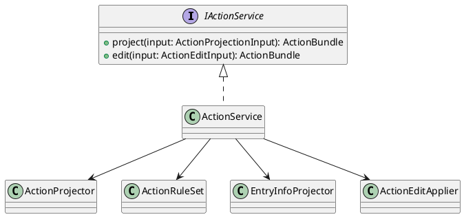
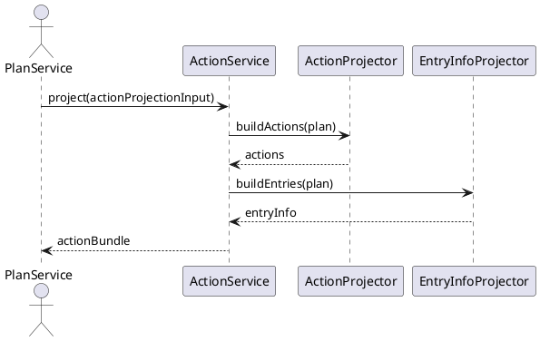

<!--
{
  "document_contracts": [
    {
      "check_item": "document_structure_complete",
      "description": "The document should contain the required top-level sections and expected subsection structure.",
      "severity": "high"
    },
    {
      "check_item": "section_contract_alignment",
      "description": "Each major section should be described by an explicit SectionContract-style comment including section_id, title, expected_format, and hints.",
      "severity": "high"
    },
    {
      "check_item": "format_consistency",
      "description": "The document should keep section formatting, code-block style, and terminology consistent across all sections.",
      "severity": "medium"
    }
  ]
}
-->

# ActionService Design

## 1. Goal

### 1.1 Purpose

<!--
{
  "section_contract": {
    "section_id": "1.1",
    "title": "Purpose",
    "checkitems": [
      "define the purpose of the current module design document",
      "make the module boundary explicit"
    ],
    "severity": "medium",
    "expected_format": "`{Purpose}`"
  }
}
-->

定义 `ActionService` 如何从稳定 `plan` 结果投影出结构化 `action` 与 `entryInfo`，并约束该模块只负责派生结果生成，不负责最终提交编排。

### 1.2 Involved Modules

<!--
{
  "section_contract": {
    "section_id": "1.2",
    "title": "Involved Modules",
    "checkitems": [
      "list the directly involved module",
      "list the collaborating modules only when they are necessary for understanding the design"
    ],
    "severity": "medium",
    "expected_format": "This module design directly involves:\n\n- `{ModulePath}`\n\nThis module design collaborates with:\n\n- `{CollaboratorA}`\n- `{CollaboratorB}`"
  }
}
-->

This module design directly involves:

- `./module_design/action_service.md`

This module design collaborates with:

- `./module_design/plan_service.md`
- `./module_design/schedule_service.md`
- `./module_design/trip_repository.md`
- `./module_design/trip_record_service.md`
- `./module_design/experience_layer.md`

### 1.3 Core Functions

<!--
{
  "section_contract": {
    "section_id": "1.3",
    "title": "Core Functions",
    "checkitems": [
      "summarize the module role",
      "list the core functions only",
      "explicitly state what is out of scope for this module"
    ],
    "severity": "medium",
    "expected_format": "`{ModulePath}` is the `{ModuleRole}` module.\n\nIts core functions are:\n\n- `{CoreFunction1}`\n- `{CoreFunction2}`\n- `{CoreFunction3}`\n- `{CoreFunction4}`\n\n`{ModuleName}` does not `{OutOfScope1}`, `{OutOfScope2}`, or `{OutOfScope3}`."
  }
}
-->

`ActionService` is the plan-to-action projection module.

Its core functions are:

- derive actionable task, reminder, booking, and entry projections from a validated current plan
- keep action projection stable across whole-plan and local-day update flows
- support explicit action add/remove edits initiated by upstream application flows
- return projection bundles in a form that can be persisted by the submit owner

`ActionService` does not own plan generation, execute device actions, or persist final writes independently of the submit owner.

## 2. Core Classes

<!--
{
  "section_contract": {
    "section_id": "2",
    "title": "Core Classes",
    "checkitems": [
      "this section must be expressed using UML class diagram language",
      "do not replace the class diagram with prose-only description"
    ],
    "severity": "medium"
  }
}
-->

### 2.1 Class Diagram

<!--
{
  "section_contract": {
    "section_id": "2.1",
    "title": "Class Diagram",
    "checkitems": [
      "show the important classes, interfaces, and dependencies",
      "keep the diagram focused on core module structure"
    ],
    "severity": "medium",
    "expected_format": "```plantuml\n' UML class diagram here\n```"
  }
}
-->



### 2.2 Core Class Responsibilities

<!--
{
  "section_contract": {
    "section_id": "2.2",
    "title": "Core Class Responsibilities",
    "checkitems": [
      "describe the role and responsibilities of the key classes or interfaces shown in the class diagram",
      "keep one subsection per important class, interface, or component",
      "do not restate every field unless it affects responsibilities or boundaries"
    ],
    "severity": "medium",
    "expected_format": "### 2.2 `PrimaryService`\n\nRole:\n\n- `{PrimaryRole}`\n\nResponsibilities:\n\n- `{Responsibility1}`\n- `{Responsibility2}`\n- `{Responsibility3}`"
  }
}
-->

### 2.2 `ActionService`

Role:

- action and entry projection facade

Responsibilities:

- expose stable projection and edit APIs to upstream modules
- keep projection logic independent from plan solving logic
- return derived bundles without taking ownership of final persistence

### 2.2 `ActionProjector`

Role:

- action item generator from validated plan structures

Responsibilities:

- derive reminders, to-dos, booking nodes, and execution-oriented items
- apply stable projection rules over plan shape instead of raw LLM output
- emit deterministic action structures for downstream use

### 2.2 `EntryInfoProjector`

Role:

- external entry projection builder

Responsibilities:

- derive map, booking, browse, and detail-view entry metadata
- keep entry projection aligned with current plan scope
- separate entry generation from task/reminder generation

### 2.2 `ActionEditApplier`

Role:

- manual action edit handler

Responsibilities:

- merge user-created or user-removed actions into the current projection bundle
- preserve stable action identifiers where possible
- avoid mutating the current plan semantics outside allowed action edits

## 3. Core Runtime Flow

<!--
{
  "section_contract": {
    "section_id": "3",
    "title": "Core Runtime Flow",
    "checkitems": [
      "this section must be expressed using UML sequence diagram language",
      "the diagram should focus on core runtime interactions between the module and its collaborators"
    ],
    "severity": "medium"
  }
}
-->

### 3.1 Main Sequence Diagram

<!--
{
  "section_contract": {
    "section_id": "3.1",
    "title": "Main Sequence Diagram",
    "checkitems": [
      "show the main runtime interaction between the initiating actor, the module, and its collaborators",
      "keep the flow focused on the primary success path"
    ],
    "severity": "medium",
    "expected_format": "```plantuml\n' UML sequence diagram here\n```"
  }
}
-->



## 4. Detailed Design

### 4.1 Core APIs And Fields

<!--
{
  "section_contract": {
    "section_id": "4.1",
    "title": "Core APIs And Fields",
    "checkitems": [
      "define only stable interfaces and types needed to understand the module",
      "prefer concise and implementation-oriented type definitions"
    ],
    "severity": "medium"
  }
}
-->

#### 4.1.1 Public API

<!--
{
  "section_contract": {
    "section_id": "4.1.1",
    "title": "Public API",
    "checkitems": [
      "define only the public API that upstream modules need to call",
      "keep the API structure stable and minimal"
    ],
    "severity": "medium",
    "expected_format": "```typescript\ninterface I{ModuleName} {\n  {PublicMethod}({PrimaryInputName}: {PrimaryInputType}): {PrimaryOutputType}\n}\n```"
  }
}
-->

```typescript
interface IActionService {
  project(input: ActionProjectionInput): Promise<ActionBundle>
  edit(input: ActionEditInput): Promise<ActionBundle>
}
```

#### 4.1.2 Input Types

<!--
{
  "section_contract": {
    "section_id": "4.1.2",
    "title": "Input Types",
    "checkitems": [
      "define only input structures that belong to this module",
      "do not repeat upstream shared types unless this module owns them",
      "when the module contains contract-style section definitions, prefer stable names such as `document_contracts` and `section_contracts`",
      "input format must be defined explicitly in code blocks",
      "do not use natural-language prose to describe input structure"
    ],
    "severity": "medium",
    "expected_format": "```typescript\ninterface {PrimaryInputType} {\n  {InputFieldA}: {InputFieldTypeA}\n  {InputFieldB}?: {InputFieldTypeB}\n}\n\ninterface ContractSpec {\n  document_contracts: DocumentContract[]\n  section_contracts: SectionContract[]\n}\n```\n\nNo prose outside code blocks."
  }
}
-->

```typescript
interface ActionProjectionInput {
  tripId: string
  username: string
  plan: Record<string, unknown>
  projectionScope: 'full_plan' | 'local_schedule'
}

interface ActionEditInput {
  tripId: string
  username: string
  currentPlan: Record<string, unknown>
  editOperation: 'create_action' | 'delete_action'
  actionInput: Record<string, unknown>
}
```

#### 4.1.3 Runtime Types

<!--
{
  "section_contract": {
    "section_id": "4.1.3",
    "title": "Runtime Types",
    "checkitems": [
      "define internal runtime structures only when they are necessary for understanding the design",
      "keep runtime types implementation-oriented but concise"
    ],
    "severity": "medium",
    "expected_format": "```typescript\ninterface {RuntimeTypeA} {\n  {RuntimeFieldA}: {RuntimeFieldTypeA}\n}\n\ninterface {RuntimeTypeB} {\n  {RuntimeFieldB}: {RuntimeFieldTypeB}\n}\n```"
  }
}
-->

```typescript
interface ProjectedAction {
  actionId: string
  type: string
  title: string
  scope: string
  status: string
}

interface ProjectedEntryInfo {
  entryId: string
  entryType: string
  title: string
  targetRef: string
}
```

#### 4.1.4 Output Types

<!--
{
  "section_contract": {
    "section_id": "4.1.4",
    "title": "Output Types",
    "checkitems": [
      "define the stable output structure produced by this module",
      "make downstream-consumed fields explicit",
      "output format must be defined explicitly in code blocks",
      "do not use natural-language prose to describe output structure"
    ],
    "severity": "medium",
    "expected_format": "```typescript\ninterface {PrimaryOutputType} {\n  {OutputFieldA}: {OutputFieldTypeA}\n  {OutputFieldB}?: {OutputFieldTypeB}\n}\n```\n\nNo prose outside code blocks."
  }
}
-->

```typescript
interface ActionBundle {
  actions: ProjectedAction[]
  entryInfo: ProjectedEntryInfo[]
}
```

#### 4.1.5 Module-Specific Rules

<!--
{
  "section_contract": {
    "section_id": "4.1.5",
    "title": "Module-Specific Rules",
    "checkitems": [
      "add this subsection only when the module has important transformation, validation, mapping, or request-construction rules",
      "express stable rules that downstream modules depend on",
      "prefer bullets over long prose"
    ],
    "severity": "medium",
    "expected_format": "- `{Rule1}`\n- `{Rule2}`\n- `{Rule3}`"
  }
}
-->

- `ActionService` only consumes validated plan-shaped input and must not depend on raw LLM output.
- Projection rules must be deterministic for the same plan input and projection scope.
- Manual action edits may change the action bundle but must not rewrite plan semantics.
- `ActionService` returns derived bundles only; final persistence remains owned by the caller's submission boundary.

### 4.2 Constraints

<!--
{
  "section_contract": {
    "section_id": "4.2",
    "title": "Constraints",
    "checkitems": [
      "record the key module constraints and non-goals",
      "include runtime semantics here when needed",
      "avoid implementation trivia"
    ],
    "severity": "medium",
    "expected_format": "- `{Constraint1}`\n- `{Constraint2}`\n- `{Constraint3}`\n- `{Constraint4}`"
  }
}
-->

- `ActionService` must stay downstream of validated plan data and upstream of terminal execution.
- The module cannot assume a final action field contract beyond the stable bundle shape required by current collaborators.
- `ActionService` does not own usernames, ownership checks, or repository transaction boundaries.
- External execution adapters such as map, calendar, or booking apps remain out of scope.
