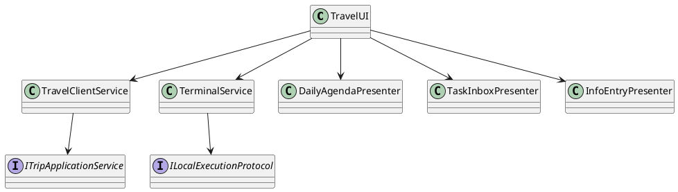
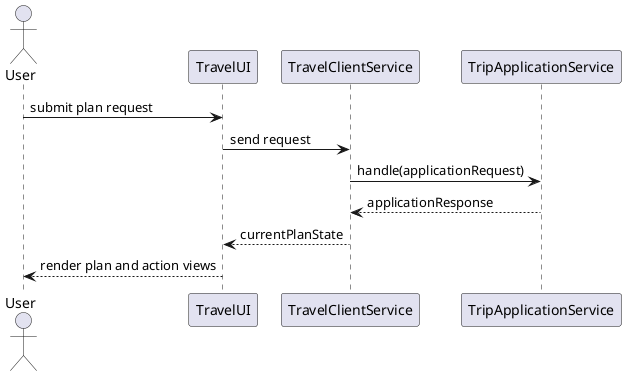

<!--
{
  "document_contracts": [
    {
      "check_item": "document_structure_complete",
      "description": "The document should contain the required top-level sections and expected subsection structure.",
      "severity": "high"
    },
    {
      "check_item": "section_contract_alignment",
      "description": "Each major section should be described by an explicit SectionContract-style comment including section_id, title, expected_format, and hints.",
      "severity": "high"
    },
    {
      "check_item": "format_consistency",
      "description": "The document should keep section formatting, code-block style, and terminology consistent across all sections.",
      "severity": "medium"
    }
  ]
}
-->

# ExperienceLayer Design

## 1. Goal

### 1.1 Purpose

<!--
{
  "section_contract": {
    "section_id": "1.1",
    "title": "Purpose",
    "checkitems": [
      "define the purpose of the current module design document",
      "make the module boundary explicit"
    ],
    "severity": "medium",
    "expected_format": "`{Purpose}`"
  }
}
-->

定义 `ExperienceLayer` 中 `TravelUI`、`TravelClientService`、`TerminalService` 的协作边界，聚焦客户端状态承接、服务端交互和本地执行衔接。

### 1.2 Involved Modules

<!--
{
  "section_contract": {
    "section_id": "1.2",
    "title": "Involved Modules",
    "checkitems": [
      "list the directly involved module",
      "list the collaborating modules only when they are necessary for understanding the design"
    ],
    "severity": "medium",
    "expected_format": "This module design directly involves:\n\n- `{ModulePath}`\n\nThis module design collaborates with:\n\n- `{CollaboratorA}`\n- `{CollaboratorB}`"
  }
}
-->

This module design directly involves:

- `./module_design/experience_layer.md`

This module design collaborates with:

- `./module_design/trip_application_service.md`
- `./module_design/action_service.md`

### 1.3 Core Functions

<!--
{
  "section_contract": {
    "section_id": "1.3",
    "title": "Core Functions",
    "checkitems": [
      "summarize the module role",
      "list the core functions only",
      "explicitly state what is out of scope for this module"
    ],
    "severity": "medium",
    "expected_format": "`{ModulePath}` is the `{ModuleRole}` module.\n\nIts core functions are:\n\n- `{CoreFunction1}`\n- `{CoreFunction2}`\n- `{CoreFunction3}`\n- `{CoreFunction4}`\n\n`{ModuleName}` does not `{OutOfScope1}`, `{OutOfScope2}`, or `{OutOfScope3}`."
  }
}
-->

`ExperienceLayer` is the user-facing interaction and local-execution bridging module.

Its core functions are:

- collect planning, adjustment, viewing, and action-trigger inputs from users
- synchronize client-side state with server-side current plan results
- organize `plan`, `action`, and `entryInfo` into view-ready structures
- invoke local device capabilities such as map, browser, reminder, or sharing entry points

`ExperienceLayer` does not solve plans, validate domain rules, or persist trip data directly.

## 2. Core Classes

<!--
{
  "section_contract": {
    "section_id": "2",
    "title": "Core Classes",
    "checkitems": [
      "this section must be expressed using UML class diagram language",
      "do not replace the class diagram with prose-only description"
    ],
    "severity": "medium"
  }
}
-->

### 2.1 Class Diagram

<!--
{
  "section_contract": {
    "section_id": "2.1",
    "title": "Class Diagram",
    "checkitems": [
      "show the important classes, interfaces, and dependencies",
      "keep the diagram focused on core module structure"
    ],
    "severity": "medium",
    "expected_format": "```plantuml\n' UML class diagram here\n```"
  }
}
-->



### 2.2 Core Class Responsibilities

<!--
{
  "section_contract": {
    "section_id": "2.2",
    "title": "Core Class Responsibilities",
    "checkitems": [
      "describe the role and responsibilities of the key classes or interfaces shown in the class diagram",
      "keep one subsection per important class, interface, or component",
      "do not restate every field unless it affects responsibilities or boundaries"
    ],
    "severity": "medium",
    "expected_format": "### 2.2 `PrimaryService`\n\nRole:\n\n- `{PrimaryRole}`\n\nResponsibilities:\n\n- `{Responsibility1}`\n- `{Responsibility2}`\n- `{Responsibility3}`"
  }
}
-->

### 2.2 `TravelUI`

Role:

- user-facing interaction surface

Responsibilities:

- collect user intent for planning, viewing, adjusting, and action triggering
- render current plan views and related reminders or entries
- delegate network and local execution concerns to dedicated collaborators

### 2.2 `TravelClientService`

Role:

- client-server interaction facade

Responsibilities:

- send stable requests to `TripApplicationService`
- keep client-side current-plan state in sync with server responses
- isolate server transport behavior from UI presentation logic

### 2.2 `TerminalService`

Role:

- local execution bridge

Responsibilities:

- invoke device-local capabilities based on `action` and `entryInfo`
- collect execution feedback and return it to the backend through `TravelClientService`
- keep local protocol details outside `TravelUI`

## 3. Core Runtime Flow

<!--
{
  "section_contract": {
    "section_id": "3",
    "title": "Core Runtime Flow",
    "checkitems": [
      "this section must be expressed using UML sequence diagram language",
      "the diagram should focus on core runtime interactions between the module and its collaborators"
    ],
    "severity": "medium"
  }
}
-->

### 3.1 Main Sequence Diagram

<!--
{
  "section_contract": {
    "section_id": "3.1",
    "title": "Main Sequence Diagram",
    "checkitems": [
      "show the main runtime interaction between the initiating actor, the module, and its collaborators",
      "keep the flow focused on the primary success path"
    ],
    "severity": "medium",
    "expected_format": "```plantuml\n' UML sequence diagram here\n```"
  }
}
-->



## 4. Detailed Design

### 4.1 Core APIs And Fields

<!--
{
  "section_contract": {
    "section_id": "4.1",
    "title": "Core APIs And Fields",
    "checkitems": [
      "define only stable interfaces and types needed to understand the module",
      "prefer concise and implementation-oriented type definitions"
    ],
    "severity": "medium"
  }
}
-->

#### 4.1.1 Public API

<!--
{
  "section_contract": {
    "section_id": "4.1.1",
    "title": "Public API",
    "checkitems": [
      "define only the public API that upstream modules need to call",
      "keep the API structure stable and minimal"
    ],
    "severity": "medium",
    "expected_format": "```typescript\ninterface I{ModuleName} {\n  {PublicMethod}({PrimaryInputName}: {PrimaryInputType}): {PrimaryOutputType}\n}\n```"
  }
}
-->

```typescript
interface ITravelClientService {
  send(request: ClientRequest): Promise<ClientState>
}
```

#### 4.1.2 Input Types

<!--
{
  "section_contract": {
    "section_id": "4.1.2",
    "title": "Input Types",
    "checkitems": [
      "define only input structures that belong to this module",
      "do not repeat upstream shared types unless this module owns them",
      "when the module contains contract-style section definitions, prefer stable names such as `document_contracts` and `section_contracts`",
      "input format must be defined explicitly in code blocks",
      "do not use natural-language prose to describe input structure"
    ],
    "severity": "medium",
    "expected_format": "```typescript\ninterface {PrimaryInputType} {\n  {InputFieldA}: {InputFieldTypeA}\n  {InputFieldB}?: {InputFieldTypeB}\n}\n\ninterface ContractSpec {\n  document_contracts: DocumentContract[]\n  section_contracts: SectionContract[]\n}\n```\n\nNo prose outside code blocks."
  }
}
-->

```typescript
interface ClientRequest {
  route: string
  username: string
  payload: Record<string, unknown>
}

interface LocalExecutionTask {
  executionId: string
  executionType: string
  handledActions: string[]
  relatedEntries: string[]
}
```

#### 4.1.3 Runtime Types

<!--
{
  "section_contract": {
    "section_id": "4.1.3",
    "title": "Runtime Types",
    "checkitems": [
      "define internal runtime structures only when they are necessary for understanding the design",
      "keep runtime types implementation-oriented but concise"
    ],
    "severity": "medium",
    "expected_format": "```typescript\ninterface {RuntimeTypeA} {\n  {RuntimeFieldA}: {RuntimeFieldTypeA}\n}\n\ninterface {RuntimeTypeB} {\n  {RuntimeFieldB}: {RuntimeFieldTypeB}\n}\n```"
  }
}
-->

```typescript
interface ClientState {
  tripId?: string
  plan?: Record<string, unknown>
  tripRecords?: Record<string, unknown>[]
}

interface PresentedDailyAgenda {
  dayKey: string
  items: Record<string, unknown>[]
}
```

#### 4.1.4 Output Types

<!--
{
  "section_contract": {
    "section_id": "4.1.4",
    "title": "Output Types",
    "checkitems": [
      "define the stable output structure produced by this module",
      "make downstream-consumed fields explicit",
      "output format must be defined explicitly in code blocks",
      "do not use natural-language prose to describe output structure"
    ],
    "severity": "medium",
    "expected_format": "```typescript\ninterface {PrimaryOutputType} {\n  {OutputFieldA}: {OutputFieldTypeA}\n  {OutputFieldB}?: {OutputFieldTypeB}\n}\n```\n\nNo prose outside code blocks."
  }
}
-->

```typescript
interface LocalExecutionFeedback {
  executionId: string
  executionStatus: string
  handledActions: string[]
  relatedEntries: string[]
  resultSummary?: string
  failureReason?: string
}
```

#### 4.1.5 Module-Specific Rules

<!--
{
  "section_contract": {
    "section_id": "4.1.5",
    "title": "Module-Specific Rules",
    "checkitems": [
      "add this subsection only when the module has important transformation, validation, mapping, or request-construction rules",
      "express stable rules that downstream modules depend on",
      "prefer bullets over long prose"
    ],
    "severity": "medium",
    "expected_format": "- `{Rule1}`\n- `{Rule2}`\n- `{Rule3}`"
  }
}
-->

- `TravelUI` should only render view models derived from current server-backed plan state or local execution state.
- `TravelClientService` is the only network-facing component inside the experience layer.
- `TerminalService` may execute local capabilities, but execution feedback must be returned through the backend contract.
- The experience layer may organize presentation data, but it must not re-derive business decisions that belong to backend modules.

### 4.2 Constraints

<!--
{
  "section_contract": {
    "section_id": "4.2",
    "title": "Constraints",
    "checkitems": [
      "record the key module constraints and non-goals",
      "include runtime semantics here when needed",
      "avoid implementation trivia"
    ],
    "severity": "medium",
    "expected_format": "- `{Constraint1}`\n- `{Constraint2}`\n- `{Constraint3}`\n- `{Constraint4}`"
  }
}
-->

- The experience layer must support both desktop planning and mobile-friendly follow-up usage without changing backend contracts.
- The layer may trigger external device capabilities, but it does not own deep third-party app synchronization.
- UI state remains a consumer of the single current effective plan and should not invent parallel plan history models.
- Visual layout and page-level interaction details remain outside this module design document.
