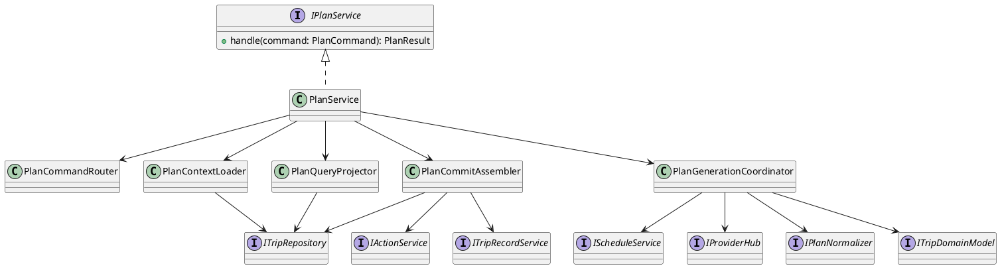
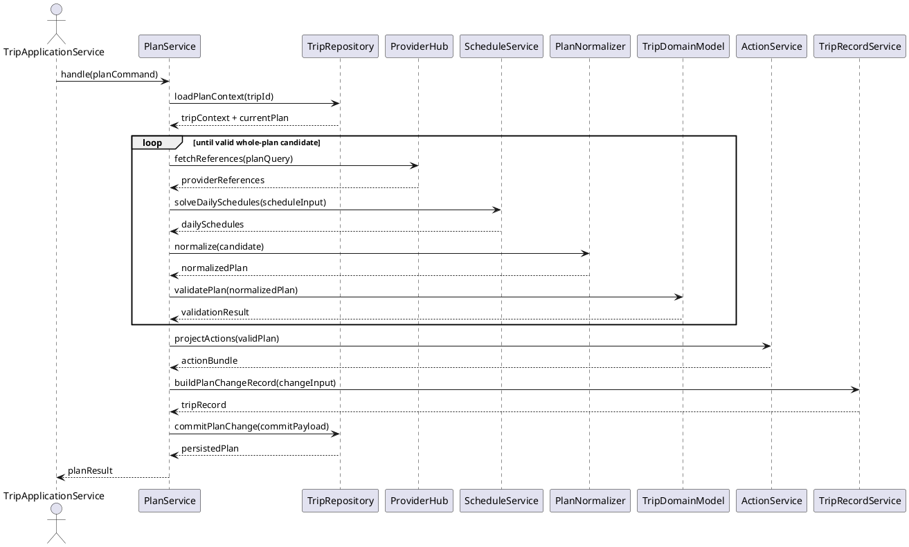

<!--
{
  "document_contracts": [
    {
      "check_item": "document_structure_complete",
      "description": "The document should contain the required top-level sections and expected subsection structure.",
      "severity": "high"
    },
    {
      "check_item": "section_contract_alignment",
      "description": "Each major section should be described by an explicit SectionContract-style comment including section_id, title, expected_format, and hints.",
      "severity": "high"
    },
    {
      "check_item": "format_consistency",
      "description": "The document should keep section formatting, code-block style, and terminology consistent across all sections.",
      "severity": "medium"
    }
  ]
}
-->

# PlanService Design

## 1. Goal

### 1.1 Purpose

<!--
{
  "section_contract": {
    "section_id": "1.1",
    "title": "Purpose",
    "checkitems": [
      "define the purpose of the current module design document",
      "make the module boundary explicit"
    ],
    "severity": "medium",
    "expected_format": "`{Purpose}`"
  }
}
-->

定义 `PlanService` 的模块边界、核心职责、内部协调方式和稳定接口，聚焦“整份当前计划”的生成、更新与读取，不展开 `ScheduleService`、`ActionService`、`TripRepository` 的内部实现。

### 1.2 Involved Modules

<!--
{
  "section_contract": {
    "section_id": "1.2",
    "title": "Involved Modules",
    "checkitems": [
      "list the directly involved module",
      "list the collaborating modules only when they are necessary for understanding the design"
    ],
    "severity": "medium",
    "expected_format": "This module design directly involves:\n\n- `{ModulePath}`\n\nThis module design collaborates with:\n\n- `{CollaboratorA}`\n- `{CollaboratorB}`"
  }
}
-->

This module design directly involves:

- `./module_design/plan_service.md`

This module design collaborates with:

- `./module_design/schedule_service.md`
- `./module_design/action_service.md`
- `./module_design/trip_repository.md`
- `./module_design/plan_normalizer.md`
- `./module_design/trip_domain_model.md`
- `./module_design/provider_hub.md`
- `./module_design/trip_record_service.md`

### 1.3 Core Functions

<!--
{
  "section_contract": {
    "section_id": "1.3",
    "title": "Core Functions",
    "checkitems": [
      "summarize the module role",
      "list the core functions only",
      "explicitly state what is out of scope for this module"
    ],
    "severity": "medium",
    "expected_format": "`{ModulePath}` is the `{ModuleRole}` module.\n\nIts core functions are:\n\n- `{CoreFunction1}`\n- `{CoreFunction2}`\n- `{CoreFunction3}`\n- `{CoreFunction4}`\n\n`{ModuleName}` does not `{OutOfScope1}`, `{OutOfScope2}`, or `{OutOfScope3}`."
  }
}
-->

`PlanService` is the whole-trip planning and plan-domain coordination module.

Its core functions are:

- load current trip context and current plan state for whole-plan scenarios
- orchestrate whole-plan generation and update flows with `ScheduleService`
- normalize and validate whole-plan candidates before they become current plan
- submit unified plan changes together with derived `action` and `TripRecord` results

`PlanService` does not persist data directly outside `TripRepository`, define provider adapter internals, or own local-day schedule logic that belongs to `ScheduleService`.

## 2. Core Classes

<!--
{
  "section_contract": {
    "section_id": "2",
    "title": "Core Classes",
    "checkitems": [
      "this section must be expressed using UML class diagram language",
      "do not replace the class diagram with prose-only description"
    ],
    "severity": "medium"
  }
}
-->

### 2.1 Class Diagram

<!--
{
  "section_contract": {
    "section_id": "2.1",
    "title": "Class Diagram",
    "checkitems": [
      "show the important classes, interfaces, and dependencies",
      "keep the diagram focused on core module structure"
    ],
    "severity": "medium",
    "expected_format": "```plantuml\n' UML class diagram here\n```"
  }
}
-->



### 2.2 Core Class Responsibilities

<!--
{
  "section_contract": {
    "section_id": "2.2",
    "title": "Core Class Responsibilities",
    "checkitems": [
      "describe the role and responsibilities of the key classes or interfaces shown in the class diagram",
      "keep one subsection per important class, interface, or component",
      "do not restate every field unless it affects responsibilities or boundaries"
    ],
    "severity": "medium",
    "expected_format": "### 2.2 `PrimaryService`\n\nRole:\n\n- `{PrimaryRole}`\n\nResponsibilities:\n\n- `{Responsibility1}`\n- `{Responsibility2}`\n- `{Responsibility3}`"
  }
}
-->

### 2.2 `PlanService`

Role:

- whole-plan use case entry inside the `plan` domain

Responsibilities:

- accept stable whole-plan commands from `TripApplicationService`
- route commands into generate, update, or query branches
- own the final submission boundary for whole-plan changes

### 2.2 `PlanGenerationCoordinator`

Role:

- internal coordinator for whole-plan generation and update flows

Responsibilities:

- pull runtime provider references through `ProviderHub`
- delegate day-level solving to `ScheduleService` when daily output is needed
- run normalize and domain-validation loops until a stable candidate is produced

### 2.2 `PlanContextLoader`

Role:

- trip and current-plan state loader for whole-plan operations

Responsibilities:

- load trip context and current effective plan from `TripRepository`
- expose a stable in-memory context for generation and query paths
- keep repository access out of validation and projection logic

### 2.2 `PlanCommitAssembler`

Role:

- unified change submission builder

Responsibilities:

- derive `action` and `entryInfo` from the validated plan
- derive the current change record through `TripRecordService`
- submit a single aggregated payload to `TripRepository`

### 2.2 `PlanQueryProjector`

Role:

- read-path projector for whole-plan or partial-plan views

Responsibilities:

- read the current plan from `TripRepository`
- shape full-plan or daily-scope responses without entering generation flow
- keep query projection logic separate from write coordination

## 3. Core Runtime Flow

<!--
{
  "section_contract": {
    "section_id": "3",
    "title": "Core Runtime Flow",
    "checkitems": [
      "this section must be expressed using UML sequence diagram language",
      "the diagram should focus on core runtime interactions between the module and its collaborators"
    ],
    "severity": "medium"
  }
}
-->

### 3.1 Main Sequence Diagram

<!--
{
  "section_contract": {
    "section_id": "3.1",
    "title": "Main Sequence Diagram",
    "checkitems": [
      "show the main runtime interaction between the initiating actor, the module, and its collaborators",
      "keep the flow focused on the primary success path"
    ],
    "severity": "medium",
    "expected_format": "```plantuml\n' UML sequence diagram here\n```"
  }
}
-->



## 4. Detailed Design

### 4.1 Core APIs And Fields

<!--
{
  "section_contract": {
    "section_id": "4.1",
    "title": "Core APIs And Fields",
    "checkitems": [
      "define only stable interfaces and types needed to understand the module",
      "prefer concise and implementation-oriented type definitions"
    ],
    "severity": "medium"
  }
}
-->

#### 4.1.1 Public API

<!--
{
  "section_contract": {
    "section_id": "4.1.1",
    "title": "Public API",
    "checkitems": [
      "define only the public API that upstream modules need to call",
      "keep the API structure stable and minimal"
    ],
    "severity": "medium",
    "expected_format": "```typescript\ninterface I{ModuleName} {\n  {PublicMethod}({PrimaryInputName}: {PrimaryInputType}): {PrimaryOutputType}\n}\n```"
  }
}
-->

```typescript
interface IPlanService {
  handle(command: PlanCommand): Promise<PlanResult>
}
```

#### 4.1.2 Input Types

<!--
{
  "section_contract": {
    "section_id": "4.1.2",
    "title": "Input Types",
    "checkitems": [
      "define only input structures that belong to this module",
      "do not repeat upstream shared types unless this module owns them",
      "when the module contains contract-style section definitions, prefer stable names such as `document_contracts` and `section_contracts`",
      "input format must be defined explicitly in code blocks",
      "do not use natural-language prose to describe input structure"
    ],
    "severity": "medium",
    "expected_format": "```typescript\ninterface {PrimaryInputType} {\n  {InputFieldA}: {InputFieldTypeA}\n  {InputFieldB}?: {InputFieldTypeB}\n}\n\ninterface ContractSpec {\n  document_contracts: DocumentContract[]\n  section_contracts: SectionContract[]\n}\n```\n\nNo prose outside code blocks."
  }
}
-->

```typescript
type PlanCommand =
  | CreatePlanCommand
  | UpdatePlanCommand
  | QueryPlanCommand

interface CreatePlanCommand {
  kind: 'create_plan'
  tripId: string
  username: string
  planningIntent: WholeTripPlanningIntent
}

interface UpdatePlanCommand {
  kind: 'update_plan'
  tripId: string
  username: string
  updateReason: string
  planningIntent: WholeTripPlanningIntent
}

interface QueryPlanCommand {
  kind: 'query_plan'
  tripId: string
  username: string
  viewScope: 'full_plan' | 'daily_view'
  targetDays?: string[]
}

interface WholeTripPlanningIntent {
  destination: string
  dates: string[]
  budget?: string
  preferences?: string[]
  mustGo?: string[]
  avoid?: string[]
  pace?: string
}
```

#### 4.1.3 Runtime Types

<!--
{
  "section_contract": {
    "section_id": "4.1.3",
    "title": "Runtime Types",
    "checkitems": [
      "define internal runtime structures only when they are necessary for understanding the design",
      "keep runtime types implementation-oriented but concise"
    ],
    "severity": "medium",
    "expected_format": "```typescript\ninterface {RuntimeTypeA} {\n  {RuntimeFieldA}: {RuntimeFieldTypeA}\n}\n\ninterface {RuntimeTypeB} {\n  {RuntimeFieldB}: {RuntimeFieldTypeB}\n}\n```"
  }
}
-->

```typescript
interface PlanContextSnapshot {
  tripId: string
  username: string
  tripContext: Record<string, unknown>
  currentPlan?: Record<string, unknown>
}

interface PlanCandidateEnvelope {
  candidatePlan: Record<string, unknown>
  providerReferences: Record<string, unknown>[]
  iteration: number
}

interface PlanCommitPayload {
  tripId: string
  username: string
  plan: Record<string, unknown>
  actionBundle: Record<string, unknown>
  tripRecord: Record<string, unknown>
}
```

#### 4.1.4 Output Types

<!--
{
  "section_contract": {
    "section_id": "4.1.4",
    "title": "Output Types",
    "checkitems": [
      "define the stable output structure produced by this module",
      "make downstream-consumed fields explicit",
      "output format must be defined explicitly in code blocks",
      "do not use natural-language prose to describe output structure"
    ],
    "severity": "medium",
    "expected_format": "```typescript\ninterface {PrimaryOutputType} {\n  {OutputFieldA}: {OutputFieldTypeA}\n  {OutputFieldB}?: {OutputFieldTypeB}\n}\n```\n\nNo prose outside code blocks."
  }
}
-->

```typescript
interface PlanResult {
  tripId: string
  plan: Record<string, unknown>
  warnings?: string[]
  changeSummary?: string[]
  updatedAt?: string
}
```

#### 4.1.5 Module-Specific Rules

<!--
{
  "section_contract": {
    "section_id": "4.1.5",
    "title": "Module-Specific Rules",
    "checkitems": [
      "add this subsection only when the module has important transformation, validation, mapping, or request-construction rules",
      "express stable rules that downstream modules depend on",
      "prefer bullets over long prose"
    ],
    "severity": "medium",
    "expected_format": "- `{Rule1}`\n- `{Rule2}`\n- `{Rule3}`"
  }
}
-->

- `PlanService` only owns whole-plan commands; partial-day mutation must be delegated to `ScheduleService`.
- A candidate plan cannot be committed before both normalization and domain validation succeed.
- `PlanService` is the submit owner for whole-plan writes; `ActionService` and `TripRecordService` produce derived artifacts but do not persist independently.
- Query paths must not trigger generation loops or provider fan-out unless the request is explicitly a write command.

### 4.2 Constraints

<!--
{
  "section_contract": {
    "section_id": "4.2",
    "title": "Constraints",
    "checkitems": [
      "record the key module constraints and non-goals",
      "include runtime semantics here when needed",
      "avoid implementation trivia"
    ],
    "severity": "medium",
    "expected_format": "- `{Constraint1}`\n- `{Constraint2}`\n- `{Constraint3}`\n- `{Constraint4}`"
  }
}
-->

- `PlanService` must operate on the single current effective plan and does not manage version-history comparison flows.
- Provider references are runtime-only inputs and must not be treated as durable truth.
- The module must return whole-plan results stable enough for `TravelUI`, `ActionService`, and later V2/V3 extensions to consume.
- `PlanService` does not own OTA booking, external execution, or downstream summary generation.
