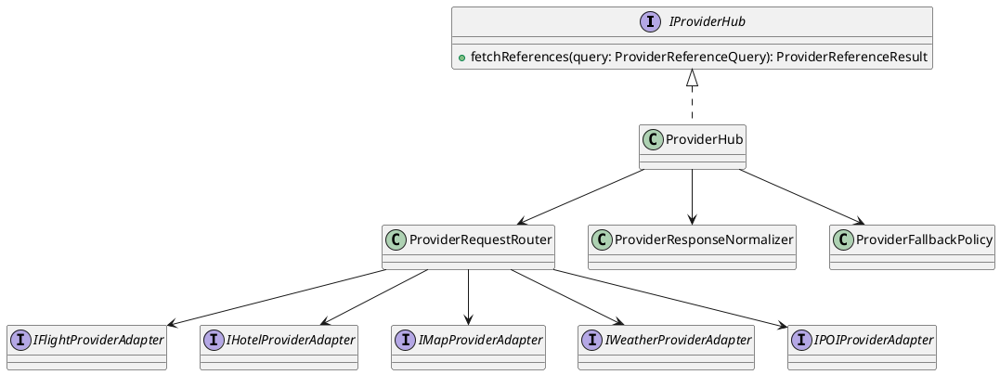
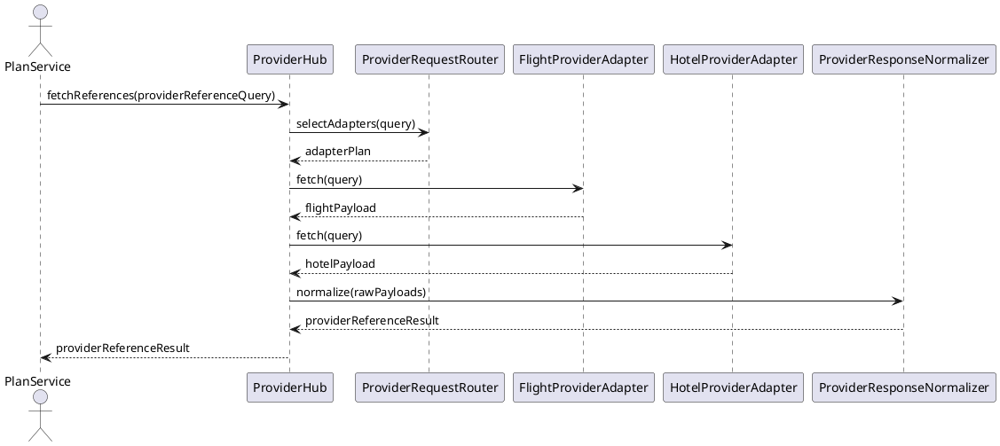

<!--
{
  "document_contracts": [
    {
      "check_item": "document_structure_complete",
      "description": "The document should contain the required top-level sections and expected subsection structure.",
      "severity": "high"
    },
    {
      "check_item": "section_contract_alignment",
      "description": "Each major section should be described by an explicit SectionContract-style comment including section_id, title, expected_format, and hints.",
      "severity": "high"
    },
    {
      "check_item": "format_consistency",
      "description": "The document should keep section formatting, code-block style, and terminology consistent across all sections.",
      "severity": "medium"
    }
  ]
}
-->

# ProviderHub Design

## 1. Goal

### 1.1 Purpose

<!--
{
  "section_contract": {
    "section_id": "1.1",
    "title": "Purpose",
    "checkitems": [
      "define the purpose of the current module design document",
      "make the module boundary explicit"
    ],
    "severity": "medium",
    "expected_format": "`{Purpose}`"
  }
}
-->

定义 `ProviderHub` 如何统一接入外部 provider、返回运行时参考数据并屏蔽具体 provider 差异，明确其不承担规划推理与长期数据持久化职责。

### 1.2 Involved Modules

<!--
{
  "section_contract": {
    "section_id": "1.2",
    "title": "Involved Modules",
    "checkitems": [
      "list the directly involved module",
      "list the collaborating modules only when they are necessary for understanding the design"
    ],
    "severity": "medium",
    "expected_format": "This module design directly involves:\n\n- `{ModulePath}`\n\nThis module design collaborates with:\n\n- `{CollaboratorA}`\n- `{CollaboratorB}`"
  }
}
-->

This module design directly involves:

- `./module_design/provider_hub.md`

This module design collaborates with:

- `./module_design/plan_service.md`
- `./module_design/schedule_service.md`
- `./module_design/trip_domain_model.md`

### 1.3 Core Functions

<!--
{
  "section_contract": {
    "section_id": "1.3",
    "title": "Core Functions",
    "checkitems": [
      "summarize the module role",
      "list the core functions only",
      "explicitly state what is out of scope for this module"
    ],
    "severity": "medium",
    "expected_format": "`{ModulePath}` is the `{ModuleRole}` module.\n\nIts core functions are:\n\n- `{CoreFunction1}`\n- `{CoreFunction2}`\n- `{CoreFunction3}`\n- `{CoreFunction4}`\n\n`{ModuleName}` does not `{OutOfScope1}`, `{OutOfScope2}`, or `{OutOfScope3}`."
  }
}
-->

`ProviderHub` is the external reference aggregation and adapter facade module.

Its core functions are:

- accept provider-oriented reference queries from upper modules
- route queries to the correct provider adapter set
- normalize provider responses into runtime reference structures with freshness metadata
- apply timeout, retry, fallback, and partial-result behavior at the integration boundary

`ProviderHub` does not own planning decisions, persist provider cache long term, or define domain legality rules.

## 2. Core Classes

<!--
{
  "section_contract": {
    "section_id": "2",
    "title": "Core Classes",
    "checkitems": [
      "this section must be expressed using UML class diagram language",
      "do not replace the class diagram with prose-only description"
    ],
    "severity": "medium"
  }
}
-->

### 2.1 Class Diagram

<!--
{
  "section_contract": {
    "section_id": "2.1",
    "title": "Class Diagram",
    "checkitems": [
      "show the important classes, interfaces, and dependencies",
      "keep the diagram focused on core module structure"
    ],
    "severity": "medium",
    "expected_format": "```plantuml\n' UML class diagram here\n```"
  }
}
-->



### 2.2 Core Class Responsibilities

<!--
{
  "section_contract": {
    "section_id": "2.2",
    "title": "Core Class Responsibilities",
    "checkitems": [
      "describe the role and responsibilities of the key classes or interfaces shown in the class diagram",
      "keep one subsection per important class, interface, or component",
      "do not restate every field unless it affects responsibilities or boundaries"
    ],
    "severity": "medium",
    "expected_format": "### 2.2 `PrimaryService`\n\nRole:\n\n- `{PrimaryRole}`\n\nResponsibilities:\n\n- `{Responsibility1}`\n- `{Responsibility2}`\n- `{Responsibility3}`"
  }
}
-->

### 2.2 `ProviderHub`

Role:

- integration facade for provider-backed travel references

Responsibilities:

- receive abstract provider queries from planning modules
- fan out to the required provider adapters
- return normalized runtime reference bundles with freshness boundaries

### 2.2 `ProviderRequestRouter`

Role:

- adapter selection component

Responsibilities:

- dispatch provider queries to the right adapter type
- keep provider selection logic centralized
- avoid leaking adapter details to upstream modules

### 2.2 `ProviderResponseNormalizer`

Role:

- provider-response normalization component

Responsibilities:

- map heterogeneous provider payloads into stable runtime references
- attach fetch time, source, and degradation markers
- keep provider-specific formats from leaking upward

### 2.2 `ProviderFallbackPolicy`

Role:

- integration degradation policy component

Responsibilities:

- apply timeout, retry, fallback, and partial-result behavior
- mark missing or stale provider information explicitly
- prevent single provider failure from collapsing the whole planning request when avoidable

## 3. Core Runtime Flow

<!--
{
  "section_contract": {
    "section_id": "3",
    "title": "Core Runtime Flow",
    "checkitems": [
      "this section must be expressed using UML sequence diagram language",
      "the diagram should focus on core runtime interactions between the module and its collaborators"
    ],
    "severity": "medium"
  }
}
-->

### 3.1 Main Sequence Diagram

<!--
{
  "section_contract": {
    "section_id": "3.1",
    "title": "Main Sequence Diagram",
    "checkitems": [
      "show the main runtime interaction between the initiating actor, the module, and its collaborators",
      "keep the flow focused on the primary success path"
    ],
    "severity": "medium",
    "expected_format": "```plantuml\n' UML sequence diagram here\n```"
  }
}
-->



## 4. Detailed Design

### 4.1 Core APIs And Fields

<!--
{
  "section_contract": {
    "section_id": "4.1",
    "title": "Core APIs And Fields",
    "checkitems": [
      "define only stable interfaces and types needed to understand the module",
      "prefer concise and implementation-oriented type definitions"
    ],
    "severity": "medium"
  }
}
-->

#### 4.1.1 Public API

<!--
{
  "section_contract": {
    "section_id": "4.1.1",
    "title": "Public API",
    "checkitems": [
      "define only the public API that upstream modules need to call",
      "keep the API structure stable and minimal"
    ],
    "severity": "medium",
    "expected_format": "```typescript\ninterface I{ModuleName} {\n  {PublicMethod}({PrimaryInputName}: {PrimaryInputType}): {PrimaryOutputType}\n}\n```"
  }
}
-->

```typescript
interface IProviderHub {
  fetchReferences(query: ProviderReferenceQuery): Promise<ProviderReferenceResult>
}
```

#### 4.1.2 Input Types

<!--
{
  "section_contract": {
    "section_id": "4.1.2",
    "title": "Input Types",
    "checkitems": [
      "define only input structures that belong to this module",
      "do not repeat upstream shared types unless this module owns them",
      "when the module contains contract-style section definitions, prefer stable names such as `document_contracts` and `section_contracts`",
      "input format must be defined explicitly in code blocks",
      "do not use natural-language prose to describe input structure"
    ],
    "severity": "medium",
    "expected_format": "```typescript\ninterface {PrimaryInputType} {\n  {InputFieldA}: {InputFieldTypeA}\n  {InputFieldB}?: {InputFieldTypeB}\n}\n\ninterface ContractSpec {\n  document_contracts: DocumentContract[]\n  section_contracts: SectionContract[]\n}\n```\n\nNo prose outside code blocks."
  }
}
-->

```typescript
interface ProviderReferenceQuery {
  tripId: string
  queryKinds: string[]
  destination?: string
  targetDays?: string[]
  constraints?: string[]
}
```

#### 4.1.3 Runtime Types

<!--
{
  "section_contract": {
    "section_id": "4.1.3",
    "title": "Runtime Types",
    "checkitems": [
      "define internal runtime structures only when they are necessary for understanding the design",
      "keep runtime types implementation-oriented but concise"
    ],
    "severity": "medium",
    "expected_format": "```typescript\ninterface {RuntimeTypeA} {\n  {RuntimeFieldA}: {RuntimeFieldTypeA}\n}\n\ninterface {RuntimeTypeB} {\n  {RuntimeFieldB}: {RuntimeFieldTypeB}\n}\n```"
  }
}
-->

```typescript
interface ProviderReference {
  source: string
  kind: string
  fetchedAt: string
  payload: Record<string, unknown>
  stale?: boolean
}

interface ProviderError {
  source: string
  code: string
  message: string
}
```

#### 4.1.4 Output Types

<!--
{
  "section_contract": {
    "section_id": "4.1.4",
    "title": "Output Types",
    "checkitems": [
      "define the stable output structure produced by this module",
      "make downstream-consumed fields explicit",
      "output format must be defined explicitly in code blocks",
      "do not use natural-language prose to describe output structure"
    ],
    "severity": "medium",
    "expected_format": "```typescript\ninterface {PrimaryOutputType} {\n  {OutputFieldA}: {OutputFieldTypeA}\n  {OutputFieldB}?: {OutputFieldTypeB}\n}\n```\n\nNo prose outside code blocks."
  }
}
-->

```typescript
interface ProviderReferenceResult {
  references: ProviderReference[]
  warnings?: string[]
  errors?: ProviderError[]
}
```

#### 4.1.5 Module-Specific Rules

<!--
{
  "section_contract": {
    "section_id": "4.1.5",
    "title": "Module-Specific Rules",
    "checkitems": [
      "add this subsection only when the module has important transformation, validation, mapping, or request-construction rules",
      "express stable rules that downstream modules depend on",
      "prefer bullets over long prose"
    ],
    "severity": "medium",
    "expected_format": "- `{Rule1}`\n- `{Rule2}`\n- `{Rule3}`"
  }
}
-->

- `ProviderHub` must return normalized runtime references with explicit source and freshness metadata.
- Provider failures should degrade into partial results whenever the planning flow can still continue.
- Provider-specific payload shapes must not leak past the `ProviderHub` boundary.
- Runtime provider references are short-lived integration input and are not part of the durable trip model.

### 4.2 Constraints

<!--
{
  "section_contract": {
    "section_id": "4.2",
    "title": "Constraints",
    "checkitems": [
      "record the key module constraints and non-goals",
      "include runtime semantics here when needed",
      "avoid implementation trivia"
    ],
    "severity": "medium",
    "expected_format": "- `{Constraint1}`\n- `{Constraint2}`\n- `{Constraint3}`\n- `{Constraint4}`"
  }
}
-->

- `ProviderHub` is an adapter facade and must not absorb LLM reasoning or domain policy logic.
- The module must tolerate provider instability through timeout, retry, and fallback behavior.
- Runtime references are advisory only and cannot be treated as durable truth.
- Provider selection strategy may evolve, but the upstream query and normalized result shapes should remain stable.
