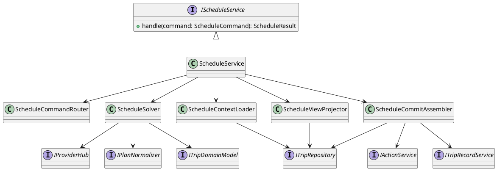
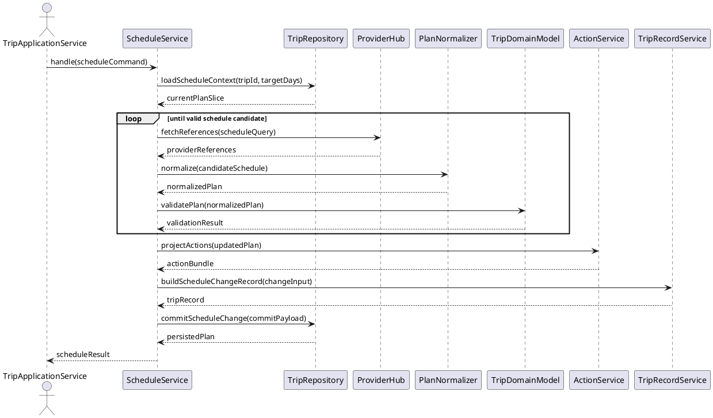

<!--
{
  "document_contracts": [
    {
      "check_item": "document_structure_complete",
      "description": "The document should contain the required top-level sections and expected subsection structure.",
      "severity": "high"
    },
    {
      "check_item": "section_contract_alignment",
      "description": "Each major section should be described by an explicit SectionContract-style comment including section_id, title, expected_format, and hints.",
      "severity": "high"
    },
    {
      "check_item": "format_consistency",
      "description": "The document should keep section formatting, code-block style, and terminology consistent across all sections.",
      "severity": "medium"
    }
  ]
}
-->

# ScheduleService Design

## 1. Goal

### 1.1 Purpose

<!--
{
  "section_contract": {
    "section_id": "1.1",
    "title": "Purpose",
    "checkitems": [
      "define the purpose of the current module design document",
      "make the module boundary explicit"
    ],
    "severity": "medium",
    "expected_format": "`{Purpose}`"
  }
}
-->

定义 `ScheduleService` 的模块边界、局部日程处理职责和统一提交规则，聚焦单日或局部范围日程的生成、更新与读取，不覆盖整份计划级策略决策。

### 1.2 Involved Modules

<!--
{
  "section_contract": {
    "section_id": "1.2",
    "title": "Involved Modules",
    "checkitems": [
      "list the directly involved module",
      "list the collaborating modules only when they are necessary for understanding the design"
    ],
    "severity": "medium",
    "expected_format": "This module design directly involves:\n\n- `{ModulePath}`\n\nThis module design collaborates with:\n\n- `{CollaboratorA}`\n- `{CollaboratorB}`"
  }
}
-->

This module design directly involves:

- `./module_design/schedule_service.md`

This module design collaborates with:

- `./module_design/plan_service.md`
- `./module_design/action_service.md`
- `./module_design/trip_repository.md`
- `./module_design/plan_normalizer.md`
- `./module_design/trip_domain_model.md`
- `./module_design/provider_hub.md`
- `./module_design/trip_record_service.md`

### 1.3 Core Functions

<!--
{
  "section_contract": {
    "section_id": "1.3",
    "title": "Core Functions",
    "checkitems": [
      "summarize the module role",
      "list the core functions only",
      "explicitly state what is out of scope for this module"
    ],
    "severity": "medium",
    "expected_format": "`{ModulePath}` is the `{ModuleRole}` module.\n\nIts core functions are:\n\n- `{CoreFunction1}`\n- `{CoreFunction2}`\n- `{CoreFunction3}`\n- `{CoreFunction4}`\n\n`{ModuleName}` does not `{OutOfScope1}`, `{OutOfScope2}`, or `{OutOfScope3}`."
  }
}
-->

`ScheduleService` is the local-day schedule solving and schedule-domain coordination module.

Its core functions are:

- load current plan context for day-scoped operations
- generate or update one day or a small target-day set inside the current plan
- normalize and validate local schedule candidates before they replace current data
- submit unified local schedule changes together with derived `action` and `TripRecord` results

`ScheduleService` does not own whole-trip goal decomposition, define shared action schema, or persist data outside `TripRepository`.

## 2. Core Classes

<!--
{
  "section_contract": {
    "section_id": "2",
    "title": "Core Classes",
    "checkitems": [
      "this section must be expressed using UML class diagram language",
      "do not replace the class diagram with prose-only description"
    ],
    "severity": "medium"
  }
}
-->

### 2.1 Class Diagram

<!--
{
  "section_contract": {
    "section_id": "2.1",
    "title": "Class Diagram",
    "checkitems": [
      "show the important classes, interfaces, and dependencies",
      "keep the diagram focused on core module structure"
    ],
    "severity": "medium",
    "expected_format": "```plantuml\n' UML class diagram here\n```"
  }
}
-->



### 2.2 Core Class Responsibilities

<!--
{
  "section_contract": {
    "section_id": "2.2",
    "title": "Core Class Responsibilities",
    "checkitems": [
      "describe the role and responsibilities of the key classes or interfaces shown in the class diagram",
      "keep one subsection per important class, interface, or component",
      "do not restate every field unless it affects responsibilities or boundaries"
    ],
    "severity": "medium",
    "expected_format": "### 2.2 `PrimaryService`\n\nRole:\n\n- `{PrimaryRole}`\n\nResponsibilities:\n\n- `{Responsibility1}`\n- `{Responsibility2}`\n- `{Responsibility3}`"
  }
}
-->

### 2.2 `ScheduleService`

Role:

- local schedule use case entry inside the `schedule` domain

Responsibilities:

- accept stable day-scoped commands from `TripApplicationService` or `PlanService`
- route commands into create, update, or query branches
- own the final submission boundary for local schedule writes

### 2.2 `ScheduleSolver`

Role:

- schedule candidate solver for local-day changes

Responsibilities:

- fetch runtime provider references needed for local schedule decisions
- build and revise local-day candidates
- run normalize and validation loops until the local result is acceptable

### 2.2 `ScheduleContextLoader`

Role:

- current-plan and target-day context reader

Responsibilities:

- load the current plan and target-day slice from `TripRepository`
- provide stable local context for solve and query paths
- ensure local operations do not lose whole-plan linkage

### 2.2 `ScheduleCommitAssembler`

Role:

- aggregated local-change submission builder

Responsibilities:

- update plan-scoped `action` and `entryInfo` after local day changes
- build the corresponding `TripRecord`
- submit a single local-change payload to `TripRepository`

## 3. Core Runtime Flow

<!--
{
  "section_contract": {
    "section_id": "3",
    "title": "Core Runtime Flow",
    "checkitems": [
      "this section must be expressed using UML sequence diagram language",
      "the diagram should focus on core runtime interactions between the module and its collaborators"
    ],
    "severity": "medium"
  }
}
-->

### 3.1 Main Sequence Diagram

<!--
{
  "section_contract": {
    "section_id": "3.1",
    "title": "Main Sequence Diagram",
    "checkitems": [
      "show the main runtime interaction between the initiating actor, the module, and its collaborators",
      "keep the flow focused on the primary success path"
    ],
    "severity": "medium",
    "expected_format": "```plantuml\n' UML sequence diagram here\n```"
  }
}
-->



## 4. Detailed Design

### 4.1 Core APIs And Fields

<!--
{
  "section_contract": {
    "section_id": "4.1",
    "title": "Core APIs And Fields",
    "checkitems": [
      "define only stable interfaces and types needed to understand the module",
      "prefer concise and implementation-oriented type definitions"
    ],
    "severity": "medium"
  }
}
-->

#### 4.1.1 Public API

<!--
{
  "section_contract": {
    "section_id": "4.1.1",
    "title": "Public API",
    "checkitems": [
      "define only the public API that upstream modules need to call",
      "keep the API structure stable and minimal"
    ],
    "severity": "medium",
    "expected_format": "```typescript\ninterface I{ModuleName} {\n  {PublicMethod}({PrimaryInputName}: {PrimaryInputType}): {PrimaryOutputType}\n}\n```"
  }
}
-->

```typescript
interface IScheduleService {
  handle(command: ScheduleCommand): Promise<ScheduleResult>
}
```

#### 4.1.2 Input Types

<!--
{
  "section_contract": {
    "section_id": "4.1.2",
    "title": "Input Types",
    "checkitems": [
      "define only input structures that belong to this module",
      "do not repeat upstream shared types unless this module owns them",
      "when the module contains contract-style section definitions, prefer stable names such as `document_contracts` and `section_contracts`",
      "input format must be defined explicitly in code blocks",
      "do not use natural-language prose to describe input structure"
    ],
    "severity": "medium",
    "expected_format": "```typescript\ninterface {PrimaryInputType} {\n  {InputFieldA}: {InputFieldTypeA}\n  {InputFieldB}?: {InputFieldTypeB}\n}\n\ninterface ContractSpec {\n  document_contracts: DocumentContract[]\n  section_contracts: SectionContract[]\n}\n```\n\nNo prose outside code blocks."
  }
}
-->

```typescript
type ScheduleCommand =
  | UpdateScheduleCommand
  | QueryScheduleCommand

interface UpdateScheduleCommand {
  kind: 'update_schedule'
  tripId: string
  username: string
  targetDays: string[]
  changeType: 'replace' | 'compress' | 'reorder' | 'remove' | 'add'
  changeInput: Record<string, unknown>
  constraints?: string[]
}

interface QueryScheduleCommand {
  kind: 'query_schedule'
  tripId: string
  username: string
  targetDays: string[]
  viewScope: 'day_detail' | 'day_summary'
}
```

#### 4.1.3 Runtime Types

<!--
{
  "section_contract": {
    "section_id": "4.1.3",
    "title": "Runtime Types",
    "checkitems": [
      "define internal runtime structures only when they are necessary for understanding the design",
      "keep runtime types implementation-oriented but concise"
    ],
    "severity": "medium",
    "expected_format": "```typescript\ninterface {RuntimeTypeA} {\n  {RuntimeFieldA}: {RuntimeFieldTypeA}\n}\n\ninterface {RuntimeTypeB} {\n  {RuntimeFieldB}: {RuntimeFieldTypeB}\n}\n```"
  }
}
-->

```typescript
interface ScheduleContextSnapshot {
  tripId: string
  username: string
  currentPlan: Record<string, unknown>
  targetDayPlans: Record<string, unknown>[]
}

interface ScheduleCommitPayload {
  tripId: string
  username: string
  updatedPlan: Record<string, unknown>
  actionBundle: Record<string, unknown>
  tripRecord: Record<string, unknown>
}
```

#### 4.1.4 Output Types

<!--
{
  "section_contract": {
    "section_id": "4.1.4",
    "title": "Output Types",
    "checkitems": [
      "define the stable output structure produced by this module",
      "make downstream-consumed fields explicit",
      "output format must be defined explicitly in code blocks",
      "do not use natural-language prose to describe output structure"
    ],
    "severity": "medium",
    "expected_format": "```typescript\ninterface {PrimaryOutputType} {\n  {OutputFieldA}: {OutputFieldTypeA}\n  {OutputFieldB}?: {OutputFieldTypeB}\n}\n```\n\nNo prose outside code blocks."
  }
}
-->

```typescript
interface ScheduleResult {
  tripId: string
  targetDays: string[]
  plan: Record<string, unknown>
  changeSummary?: string[]
  warnings?: string[]
}
```

#### 4.1.5 Module-Specific Rules

<!--
{
  "section_contract": {
    "section_id": "4.1.5",
    "title": "Module-Specific Rules",
    "checkitems": [
      "add this subsection only when the module has important transformation, validation, mapping, or request-construction rules",
      "express stable rules that downstream modules depend on",
      "prefer bullets over long prose"
    ],
    "severity": "medium",
    "expected_format": "- `{Rule1}`\n- `{Rule2}`\n- `{Rule3}`"
  }
}
-->

- `ScheduleService` may update the current plan only through a target-day bounded change and cannot silently rewrite unrelated days.
- Local schedule candidates must still be normalized as plan-shaped data before validation and commit.
- `ScheduleService` is the submit owner for local schedule writes; derived `action` and `TripRecord` data must be included in the same logical submission.
- Query paths must reuse current stored plan data and avoid solve loops when the request is read-only.

### 4.2 Constraints

<!--
{
  "section_contract": {
    "section_id": "4.2",
    "title": "Constraints",
    "checkitems": [
      "record the key module constraints and non-goals",
      "include runtime semantics here when needed",
      "avoid implementation trivia"
    ],
    "severity": "medium",
    "expected_format": "- `{Constraint1}`\n- `{Constraint2}`\n- `{Constraint3}`\n- `{Constraint4}`"
  }
}
-->

- `ScheduleService` must keep local-day edits compatible with the single current effective plan.
- The module must not absorb whole-trip objective planning logic that belongs to `PlanService`.
- Provider references remain advisory runtime input and cannot bypass domain validation.
- `ScheduleService` does not own external execution, device actions, or summary-generation behavior.
