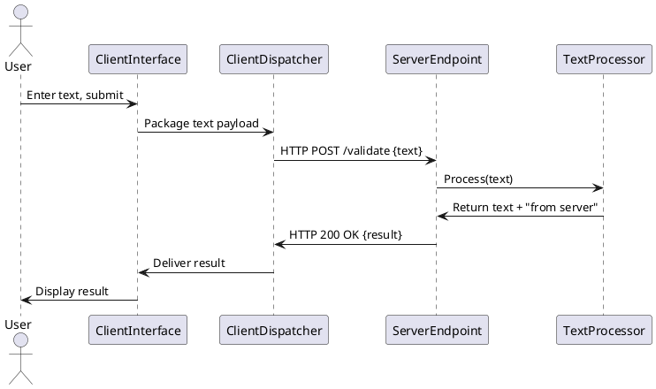

# Technical Architecture

## 1. Purpose

Define the overall technical architecture of the Text Validation Client-Server platform.

- Team members: provide a shared high-level baseline for the team.
- Senior engineers: review architecture direction and boundaries.
- Junior engineers: understand system and module structure for later design and implementation.

## 2. Scope

### 2.1 In Scope
- Overall system interaction and control flow at architecture level.
- Major modules or subsystems and their responsibilities at architecture level.
- Collaboration boundaries and dependency direction between major parts of the system.
- Key architecture constraints related to reliability, operability, security, scalability, or evolution.

### 2.2 Out of Scope
- Detailed module internals and implementation logic.
- Detailed API contracts, message formats, and parameter definitions inside each module.
- Database schema details and storage-level design.
- UI-level interaction design and visual behavior details.
- Deployment runbooks, environment setup, and operational procedures.

Cross-module interaction contracts are covered at a lightweight shared-boundary level in a separate design document, not in full module-level detail here.

---

## 3. Design Drivers
- **Functional Driver**: Support a single, clear text request-response validation interaction.
- **Verifiability Driver**: Return predictable, easily verifiable content for test confirmation.
- **Simplicity Driver**: Maintain minimal scope and architectural complexity to serve as a stable validation target.
- **Repeatability Driver**: Support consistent, repeated test execution without side effects.
- **Clarity Driver**: Preserve a clear client-server interaction pattern that mirrors real program flow.

---

# 4. Architecture Design

### 4.1 Architecture Style
The system adopts a **Client-Server** architecture.

### 4.2 Layers or Partitions
- **ClientLayer**: Responsible for user input capture, request dispatch, and response presentation.
- **ServerLayer**: Responsible for request reception, text processing, and response generation.

### 4.3 Allowed Dependencies
ALLOW:
- `ClientLayer` -> `ServerLayer`
- `ServerLayer` -> (none - for V1)

### 4.4 High-level Diagram
```text
    +------------+         HTTP POST         +------------+
    |            | ----------------------->  |            |
    |   Client   |                           |   Server   |
    |   Layer    | <-----------------------  |   Layer    |
    |            |        HTTP 200 OK        |            |
    +------------+                           +------------+
         |                                        |
         | User Input Text                        | Appends suffix
         |                                        | "from server"
         v                                        v
    [Text Input]                           [Text Processor]
```

### 4.5 Runtime Topology
- **ClientRuntime**: A web browser or lightweight standalone application hosting the client interface.
- **ServerRuntime**: A single HTTP server instance handling validation requests.
- **SharedInfrastructure**: Network connectivity between client and server.

### 4.6 Technology Choices
- **ClientLayer**: HTML/JavaScript for web-based validation; allows quick access and minimal setup for testers.
- **ServerLayer**: Lightweight HTTP server framework (e.g., node.js) for V1; chosen for simplicity and fast implementation of the single endpoint.

---

## 5. System Interactions

### 5.1 Primary Interaction Path
```text
[User] -> [ClientInterface] -> [ClientLayer] -> [ServerEndpoint] -> [ServerLayer] -> [Response] -> [ClientLayer] -> [User]
```

1. **User Action**: User enters text and triggers submission via the ClientInterface.
2. **Request Dispatch**: ClientLayer packages the text into an HTTP POST request and sends it to the ServerEndpoint.
3. **Request Processing**: ServerLayer receives the request, extracts the text, appends the fixed suffix `"from server"`, and constructs the response.
4. **Response Return**: ServerLayer returns the processed text in an HTTP 200 OK response.
5. **Result Presentation**: ClientLayer receives the response and presents the full result to the user for verification.

The flow is synchronous and request-response oriented, with no branching or complex state management.

### 5.2 Core Modules

- **ClientLayer**
  - **ClientInterface**
    - responsibility: Provide the user-facing entry point for text input and result display.
    - inputs: User text input via UI controls.
    - outputs: Formatted request to ClientDispatcher; formatted result display to user.
    - ownership boundary: Owns the user interaction surface.
  - **ClientDispatcher**
    - responsibility: Handle HTTP communication with the server.
    - inputs: Text payload from ClientInterface.
    - outputs: HTTP request to ServerEndpoint; processed HTTP response to ClientInterface.
    - ownership boundary: Owns the network client logic and request lifecycle.

- **ServerLayer**
  - **ServerEndpoint**
    - responsibility: Expose the single HTTP endpoint for receiving validation requests.
    - inputs: HTTP POST request containing user text.
    - outputs: HTTP response containing processed text.
    - ownership boundary: Owns the public API surface and request routing.
  - **TextProcessor**
    - responsibility: Apply the fixed business logic (appending `"from server"`) to the input text.
    - inputs: Raw text string from the request.
    - outputs: Processed text string with suffix appended.
    - ownership boundary: Owns the core validation transformation logic.

### 5.3 Interaction Model
This section describes high-level cross-module interaction
#### 5.3.1 Primary Validation Scenario
- user scenario: Tester submits text for validation.
- stage position: V1 (CurrentScope)
- goal: Complete the request-response validation loop and present verifiable result.

##### 5.3.1.1 Text Submission and Processing
- summary: The end-to-end flow from user input to result display.
- modules involved: ClientInterface, ClientDispatcher, ServerEndpoint, TextProcessor
- control focus: Synchronous request-response handoff.



##### 5.3.1.2 Error Handling (V2 Extension)
- summary: Basic error feedback when the primary path fails.
- modules involved: ClientDispatcher, ServerEndpoint
- control focus: HTTP error code propagation and user notification.
- stage position: V2 (FutureStage)

```text
ClientDispatcher -> ServerEndpoint: HTTP POST /validate {text}
ServerEndpoint -> ClientDispatcher: HTTP 4xx/5xx {error}
ClientDispatcher -> ClientInterface: Deliver error state
```

### 5.4 Key Considerations
- **Statelessness**: The ServerLayer is stateless; each request is independent, supporting repeatability.
- **Predictable Output**: The TextProcessor's logic is fixed and deterministic, ensuring consistent validation results.
- **Clear Boundary**: The HTTP interface between ClientDispatcher and ServerEndpoint defines a clean separation of concerns.

---

## 6. Non-Functional Considerations

### 6.1 High Availability
- Why it matters:
  - As a validation tool, sporadic unavailability would disrupt testing workflows.
- Architectural support:
  - The stateless ServerLayer allows for straightforward process restarts.
  - For V2, consider a simple health check endpoint for basic operational monitoring.

### 6.2 High Scalability
- Why it matters:
  - While current load is minimal, the architecture should not prevent parallel test execution.
- Architectural support:
  - Stateless design allows horizontal scaling of the ServerLayer if needed.
  - No shared state or database dependencies eliminate scaling bottlenecks.

### 6.3 High Performance
- Why it matters:
  - Fast response times ensure efficient validation cycles for testers.
- Architectural support:
  - Minimal processing logic (string concatenation) guarantees low latency.
  - Direct client-server communication without intermediate hops.

---

## 7. Design Documents

### 7.1 Design Document Categories
Different design documents have different focus. All of them must still follow the module boundaries, dependency rules, and shared architectural constraints defined in this architecture.

- **Module Design**: Detailed internal design for a single architectural module.
- **Cross-Module Interaction**: Definition of shared APIs and communication contracts between modules.
- **Shared Contracts**: Canonical definitions of data structures used across module boundaries.

### 7.2 Design Document Breakdown
- [`client_layer_design`](./module_design/client_layer_design.md): covers `ClientInterface` and `ClientDispatcher` modules.
- [`server_layer_design`](./module_design/server_layer_design.md): covers `ServerEndpoint` and `TextProcessor` modules.
- [`cross_module_interaction_contracts`](./module_design/cross_module_interaction_contracts.md): covers the HTTP API contract between `ClientDispatcher` and `ServerEndpoint`.

---

## 8. Open Issues
- **Network Configuration**: Assumes client and server can communicate over HTTP; specific network constraints (proxies, firewalls) are not yet addressed.
- **Error Feedback Detail**: V2 error handling requires definition of error message format and user presentation.
- **Deployment Packaging**: The exact packaging (e.g., Docker container for server, static hosting for client) is deferred to implementation planning.
