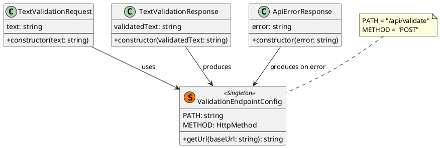
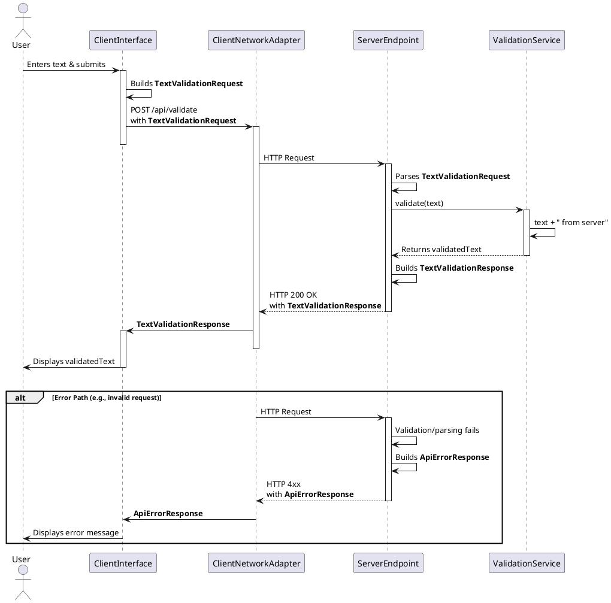

<!--
{
  "document_contracts": [
    {
      "check_item": "document_structure_complete",
      "description": "The document should contain the required top-level sections and expected subsection structure.",
      "severity": "high"
    },
    {
      "check_item": "section_contract_alignment",
      "description": "Each major section should be described by an explicit SectionContract-style comment including section_id, title, expected_format, and hints.",
      "severity": "high"
    },
    {
      "check_item": "format_consistency",
      "description": "The document should keep section formatting, code-block style, and terminology consistent across all sections.",
      "severity": "medium"
    }
  ]
}
-->

# Client Server Contract Design

## 1. Goal

### 1.1 Purpose

<!--
{
  "section_contract": {
    "section_id": "1.1",
    "title": "Purpose",
    "checkitems": [
      "define the purpose of the current module design document",
      "make the module boundary explicit"
    ],
    "severity": "medium",
    "expected_format": "`{Purpose}`"
  }
}
-->
This design document defines the stable, shared HTTP API contract between the Client Layer and the Server Layer. It explicitly establishes the communication boundary, specifying the data formats, endpoint, and interaction patterns that both sides must adhere to for the text validation scenario to function correctly.

### 1.2 Involved Modules

<!--
{
  "section_contract": {
    "section_id": "1.2",
    "title": "Involved Modules",
    "checkitems": [
      "list the directly involved module",
      "list the collaborating modules only when they are necessary for understanding the design"
    ],
    "severity": "medium",
    "expected_format": "This module design directly involves:\\n\\n- `{ModulePath}`\\n\\nThis module design collaborates with:\\n\\n- `{CollaboratorA}`\\n- `{CollaboratorB}`"
  }
}
-->
This module design directly involves:
- `ClientNetworkAdapter` and `ServerEndpoint` (the communication layer implementations).

This module design collaborates with:
- `ClientInterface` (which constructs the request payload and consumes the response).
- `ValidationService` (which produces the response payload).

### 1.3 Core Functions

<!--
{
  "section_contract": {
    "section_id": "1.3",
    "title": "Core Functions",
    "checkitems": [
      "summarize the module role",
      "list the core functions only",
      "explicitly state what is out of scope for this module"
    ],
    "severity": "medium",
    "expected_format": "`{ModulePath}` is the `{ModuleRole}` module.\\n\\nIts core functions are:\\n\\n- `{CoreFunction1}`\\n- `{CoreFunction2}`\\n- `{CoreFunction3}`\\n- `{CoreFunction4}`\\n\\n`{ModuleName}` does not `{OutOfScope1}`, `{OutOfScope2}`, or `{OutOfScope3}`."
  }
}
-->
The `Client Server Contract` is the **communication protocol** module. It is not a runtime module with code, but a shared specification.

Its core functions are:
- Define the HTTP endpoint URL and method for submitting text.
- Define the structure of the request body sent from the client.
- Define the structure of the successful response body returned by the server.
- Define the structure and semantics of error responses.

`Client Server Contract` does not **implement client-side logic, implement server-side validation logic, or define UI/UX behavior**.

## 2. Core Classes

<!--
{
  "section_contract": {
    "section_id": "2",
    "title": "Core Classes",
    "checkitems": [
      "this section must be expressed using UML class diagram language",
      "do not replace the class diagram with prose-only description"
    ],
    "severity": "medium"
  }
}
-->

### 2.1 Class Diagram

<!--
{
  "section_contract": {
    "section_id": "2.1",
    "title": "Class Diagram",
    "checkitems": [
      "show the important classes, interfaces, and dependencies",
      "keep the diagram focused on core module structure"
    ],
    "severity": "medium",
    "expected_format": "```plantuml\\n' UML class diagram here\\n```"
  }
}
-->


### 2.2 Core Class Responsibilities

<!--
{
  "section_contract": {
    "section_id": "2.2",
    "title": "Core Class Responsibilities",
    "checkitems": [
      "describe the role and responsibilities of the key classes or interfaces shown in the class diagram",
      "keep one subsection per important class, interface, or component",
      "do not restate every field unless it affects responsibilities or boundaries"
    ],
    "severity": "medium",
    "expected_format": "### 2.2 `PrimaryService`\\n\\nRole:\\n\\n- `{PrimaryRole}`\\n\\nResponsibilities:\\n\\n- `{Responsibility1}`\\n- `{Responsibility2}`\\n- `{Responsibility3}`"
  }
}
-->

#### 2.2.1 `TextValidationRequest`

Role:
- The **request data transfer object (DTO)** sent from the Client Layer to the Server Layer.

Responsibilities:
- Encapsulates the user-provided text input for transmission.
- Provides a stable, versionable structure for the request payload.

#### 2.2.2 `TextValidationResponse`

Role:
- The **success response DTO** returned from the Server Layer to the Client Layer.

Responsibilities:
- Encapsulates the server-validated text result for transmission.
- Provides a stable, versionable structure for the successful response payload.

#### 2.2.3 `ApiErrorResponse`

Role:
- The **error response DTO** returned from the Server Layer to the Client Layer when a request cannot be processed successfully.

Responsibilities:
- Encapsulates a human-readable error message for client display.
- Provides a stable, versionable structure for error communication, distinct from the success path.

#### 2.2.4 `ValidationEndpointConfig`

Role:
- The **static configuration** defining how to access the server's validation capability.

Responsibilities:
- Defines the exact HTTP path and method for the validation endpoint.
- Provides a utility to construct the full endpoint URL given a server base address.

## 3. Core Runtime Flow

<!--
{
  "section_contract": {
    "section_id": "3",
    "title": "Core Runtime Flow",
    "checkitems": [
      "this section must be expressed using UML sequence diagram language",
      "the diagram should focus on core runtime interactions between the module and its collaborators"
    ],
    "severity": "medium"
  }
}
-->

### 3.1 Main Sequence Diagram

<!--
{
  "section_contract": {
    "section_id": "3.1",
    "title": "Main Sequence Diagram",
    "checkitems": [
      "show the main runtime interaction between the initiating actor, the module, and its collaborators",
      "keep the flow focused on the primary success path"
    ],
    "severity": "medium",
    "expected_format": "```plantuml\\n' UML sequence diagram here\\n```"
  }
}
-->


## 4. Detailed Design

### 4.1 Core APIs And Fields

<!--
{
  "section_contract": {
    "section_id": "4.1",
    "title": "Core APIs And Fields",
    "checkitems": [
      "define only stable interfaces and types needed to understand the module",
      "prefer concise and implementation-oriented type definitions"
    ],
    "severity": "medium"
  }
}
-->

#### 4.1.1 Public API

<!--
{
  "section_contract": {
    "section_id": "4.1.1",
    "title": "Public API",
    "checkitems": [
      "define only the public API that upstream modules need to call",
      "keep the API structure stable and minimal"
    ],
    "severity": "medium",
    "expected_format": "```typescript\\ninterface I{ModuleName} {\\n  {PublicMethod}({PrimaryInputName}: {PrimaryInputType}): {PrimaryOutputType}\\n}\\n```"
  }
}
-->
The public API is the HTTP endpoint itself.
```typescript
// HTTP Contract
interface ValidationApi {
  POST /api/validate (request: TextValidationRequest): TextValidationResponse | ApiErrorResponse
}
```

#### 4.1.2 Input Types

<!--
{
  "section_contract": {
    "section_id": "4.1.2",
    "title": "Input Types",
    "checkitems": [
      "define only input structures that belong to this module",
      "do not repeat upstream shared types unless this module owns them",
      "when the module contains contract-style section definitions, prefer stable names such as `document_contracts` and `section_contracts`",
      "input format must be defined explicitly in code blocks",
      "do not use natural-language prose to describe input structure"
    ],
    "severity": "medium",
    "expected_format": "```typescript\\ninterface {PrimaryInputType} {\\n  {InputFieldA}: {InputFieldTypeA}\\n  {InputFieldB}?: {InputFieldTypeB}\\n}\\n\\ninterface ContractSpec {\\n  document_contracts: DocumentContract[]\\n  section_contracts: SectionContract[]\\n}\\n```\\n\\nNo prose outside code blocks."
  }
}
-->
```typescript
/**
 * The request body for text validation.
 * @property {string} text - The user-provided text to be validated. Must be a non-empty string.
 */
interface TextValidationRequest {
  text: string;
}
```

#### 4.1.3 Runtime Types

<!--
{
  "section_contract": {
    "section_id": "4.1.3",
    "title": "Runtime Types",
    "checkitems": [
      "define internal runtime structures only when they are necessary for understanding the design",
      "keep runtime types implementation-oriented but concise"
    ],
    "severity": "medium",
    "expected_format": "```typescript\\ninterface {RuntimeTypeA} {\\n  {RuntimeFieldA}: {RuntimeFieldTypeA}\\n}\\n\\ninterface {RuntimeTypeB} {\\n  {RuntimeFieldB}: {RuntimeFieldTypeB}\\n}\\n```"
  }
}
-->
*Not applicable for this contract specification module. The types defined are the contract.*

#### 4.1.4 Output Types

<!--
{
  "section_contract": {
    "section_id": "4.1.4",
    "title": "Output Types",
    "checkitems": [
      "define the stable output structure produced by this module",
      "make downstream-consumed fields explicit",
      "output format must be defined explicitly in code blocks",
      "do not use natural-language prose to describe output structure"
    ],
    "severity": "medium",
    "expected_format": "```typescript\\ninterface {PrimaryOutputType} {\\n  {OutputFieldA}: {OutputFieldTypeA}\\n  {OutputFieldB}?: {OutputFieldTypeB}\\n}\\n```\\n\\nNo prose outside code blocks."
  }
}
-->
```typescript
/**
 * The successful response body from text validation.
 * @property {string} validatedText - The input text concatenated with the fixed suffix " from server".
 */
interface TextValidationResponse {
  validatedText: string;
}

/**
 * The error response body.
 * @property {string} error - A human-readable description of the error.
 */
interface ApiErrorResponse {
  error: string;
}
```

#### 4.1.5 Module-Specific Rules

<!--
{
  "section_contract": {
    "section_id": "4.1.5",
    "title": "Module-Specific Rules",
    "checkitems": [
      "add this subsection only when the module has important transformation, validation, mapping, or request-construction rules",
      "express stable rules that downstream modules depend on",
      "prefer bullets over long prose"
    ],
    "severity": "medium",
    "expected_format": "- `{Rule1}`\\n- `{Rule2}`\\n- `{Rule3}`"
  }
}
-->
- **Request Validation Rule**: The server must reject (HTTP 400) any `TextValidationRequest` where the `text` property is an empty string or contains only whitespace.
- **Response Construction Rule**: For a successful request, the server must produce the `validatedText` by concatenating the input `text` with the literal suffix `" from server"` (including the leading space).
- **Character Set Rule**: The `text` field and the resulting `validatedText` field are UTF-8 strings.
- **Idempotency Rule**: Identical `TextValidationRequest` payloads must produce identical `TextValidationResponse` payloads.

### 4.2 Constraints

<!--
{
  "section_contract": {
    "section_id": "4.2",
    "title": "Constraints",
    "checkitems": [
      "record the key module constraints and non-goals",
      "include runtime semantics here when needed",
      "avoid implementation trivia"
    ],
    "severity": "medium",
    "expected_format": "- `{Constraint1}`\\n- `{Constraint2}`\\n- `{Constraint3}`\\n- `{Constraint4}`"
  }
}
-->
- **Stateless Interaction**: The contract defines a single, stateless request-response pair. No session identifiers, authentication tokens, or correlation IDs are part of the contract.
- **Synchronous Only**: The interaction is strictly synchronous (request-response). The contract does not support polling, webhooks, or asynchronous callbacks.
- **Fixed Response Logic**: The transformation rule (appending " from server") is an invariant part of the success response contract and cannot be configured or altered via the API.
- **No Versioning in Initial Scope**: The initial contract (`/api/validate`) is unversioned. Future breaking changes would require a new endpoint (e.g., `/api/v2/validate`).
- **Transport Protocol**: The contract is bound to HTTP/1.1 or HTTP/2 over TCP. Other transport mechanisms (e.g., WebSockets, message queues) are out of scope.