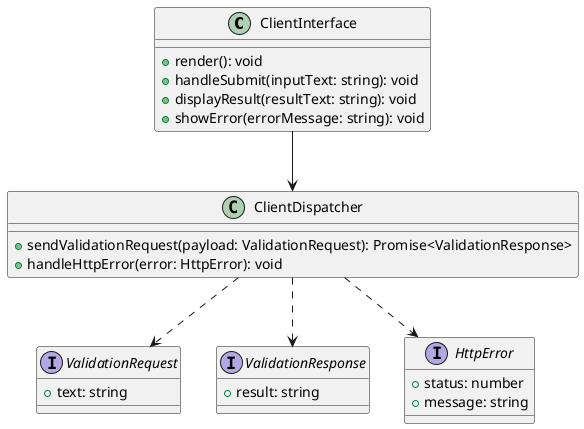
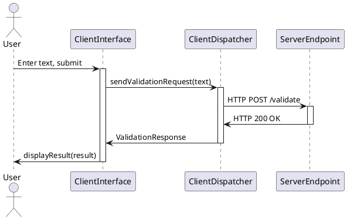

# Client Layer Design

## 1. Goal

### 1.1 Purpose
Define the detailed design of the `ClientInterface` and `ClientDispatcher` modules for text validation input, request dispatch, and result presentation.

### 1.2 Involved Modules
This module design directly involves:

- `ClientInterface`
- `ClientDispatcher`

This module design collaborates with:

- `ServerEndpoint`

### 1.3 Core Functions
`client_layer_design` defines the user interaction and network dispatch behavior owned by `ClientInterface` and `ClientDispatcher`.

Its core functions are:

- Provide user interface for text input and result display
- Format text payload for server transmission
- Handle HTTP communication with the server endpoint
- Present processed results and error states to the user

`client_layer_design` does not perform text transformation logic, define server-side validation rules, or manage server-side operational concerns.

## 2. Core Classes

### 2.1 Class Diagram



### 2.2 Core Class Responsibilities

#### 2.2.1 `ClientInterface`

Role:

- User interaction handler

Responsibilities:

- Render input form and result display area
- Capture user text input and trigger validation requests
- Present processed results from server in readable format
- Display error states when server communication fails

#### 2.2.2 `ClientDispatcher`

Role:

- Network communication handler

Responsibilities:

- Construct HTTP requests with proper headers and payload format
- Send validation requests to server endpoint
- Handle HTTP response status codes and parse response body
- Manage request timeouts and network errors
- Convert HTTP errors to user-presentable error states

## 3. Core Runtime Flow

### 3.1 Main Sequence Diagram



## 4. Detailed Design

### 4.1 Core APIs And Fields

#### 4.1.1 Public API

```typescript
interface ClientInterface {
    render(): void;
    handleSubmit(inputText: string): void;
    displayResult(resultText: string): void;
    showError(errorMessage: string): void;
}

interface ClientDispatcher {
    sendValidationRequest(payload: ValidationRequest): Promise<ValidationResponse>;
    handleHttpError(error: HttpError): void;
}
```

#### 4.1.2 Input Types

```typescript
interface ValidationRequest {
    text: string;
}

interface HttpError {
    status: number;
    message: string;
}
```

#### 4.1.3 Runtime Types

```typescript
interface RequestConfig {
    endpointUrl: string;
    timeoutMs: number;
    headers: Record<string, string>;
}

type RequestState = 'idle' | 'pending' | 'success' | 'error';

interface UiState {
    inputText: string;
    resultText: string;
    errorMessage: string;
    requestState: RequestState;
}
```

#### 4.1.4 Output Types

```typescript
interface ValidationResponse {
    result: string;
}

interface ErrorDisplay {
    message: string;
    type: 'network' | 'server' | 'timeout';
}
```

#### 4.1.5 Module-Specific Rules

- Request payload must include `text` field with user input
- HTTP POST requests use `Content-Type: application/json`
- Server endpoint URL configurable via environment or configuration
- Input text validation limited to non-empty string check
- Network timeouts default to 5000ms, configurable
- Error messages must not expose server implementation details

### 4.2 Constraints

- Client must not store validation results beyond current session
- No client-side caching of server responses
- Single active request at a time (no concurrent validation)
- Input length limited by browser capabilities, not client logic
- No authentication or authorization requirements
- No support for file uploads or multi-part requests
- No persistent connection or WebSocket communication
- No offline capability or local validation
