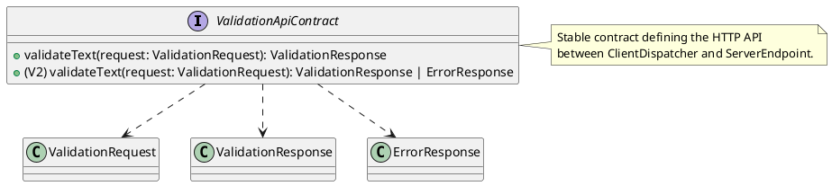
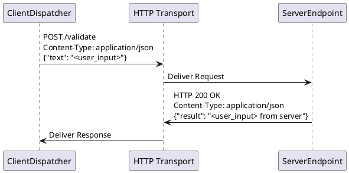

# cross_module_interaction_contracts Design

## 1. Goal

### 1.1 Purpose
Define the stable HTTP API contract between the `ClientDispatcher` and `ServerEndpoint` modules.

### 1.2 Involved Modules
This module design directly involves:
- `ClientDispatcher`
- `ServerEndpoint`

This module design collaborates with:
- `ClientInterface`
- `TextProcessor`

### 1.3 Core Functions
`cross_module_interaction_contracts` defines the shared HTTP boundary between `ClientDispatcher` and `ServerEndpoint`.

Its core functions are:
- Define the request format for text validation.
- Define the success response format for text validation.
- Define the error response format for text validation (V2).
- Specify the HTTP method, endpoint, and headers for the interaction.

`cross_module_interaction_contracts` does not implement client network logic, implement server request handling, or define internal runtime structures inside either side of the boundary.

## 2. Core Classes

### 2.1 Class Diagram


### 2.2 Core Class Responsibilities

#### 2.2.1 `ValidationApiContract`

Role:
- Represents the formal, shared interface for the validation HTTP API.

Responsibilities:
- Defines the canonical endpoint path and HTTP method (`POST /validate`).
- Defines the canonical request payload structure (`ValidationRequest`).
- Defines the canonical success response structure (`ValidationResponse`).
- Defines the canonical error response structure (`ErrorResponse`) for V2.
- Serves as the single source of truth for cross-layer communication.

## 3. Core Runtime Flow

### 3.1 Main Sequence Diagram


## 4. Detailed Design

### 4.1 Core APIs And Fields

#### 4.1.1 Public API
```typescript
/**
 * The stable HTTP API contract for the text validation endpoint.
 */
interface ValidationApiContract {
    endpoint: '/validate';
    method: 'POST';
    request: ValidationRequest;
    successResponse: ValidationResponse;
    errorResponse?: ErrorResponse; // V2
}
```

#### 4.1.2 Input Types
```typescript
interface ValidationRequest {
    text: string;
}
```

#### 4.1.3 Runtime Types
This design item does not define module-owned runtime types. Internal request parsing state remains inside `ServerEndpoint` and is out of scope for this shared contract document.

#### 4.1.4 Output Types
```typescript
interface ValidationResponse {
    result: string;
}

interface ErrorResponse {
    error: {
        code: string;
        message: string;
    };
}
```

#### 4.1.5 Module-Specific Rules
- The `Content-Type` header for all requests and responses must be `application/json`.
- The HTTP method is strictly `POST`.
- The success HTTP status code is strictly `200 OK`.
- The `result` field in a `ValidationResponse` is the concatenation of the input `text` with the literal suffix `" from server"` (including the leading space).

### 4.2 Constraints
- The contract is stateless; no session or authentication headers are required.
- The `text` field in the request is required and must be a string (empty string is allowed).
- The transformation rule (appending `" from server"`) is fixed and must not be configurable via the API.
- For V1, error responses are not formally defined in the contract; unexpected HTTP status codes may be generated by the transport layer.
- The API does not support request batching or bulk operations.
