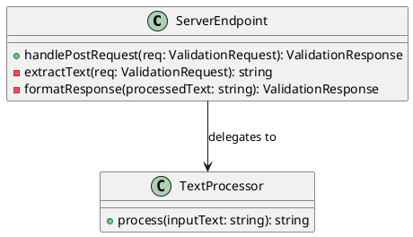
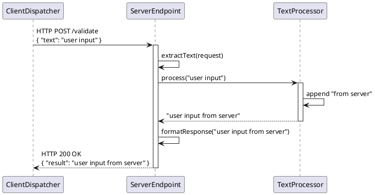

# Server Layer Design

## 1. Goal

### 1.1 Purpose
This module design document details the internal structure and design of the ServerLayer, specifically covering the `ServerEndpoint` and `TextProcessor` modules.

### 1.2 Involved Modules
This module design directly involves:
- `ServerLayer/ServerEndpoint`
- `ServerLayer/TextProcessor`

This module design collaborates with:
- `ClientLayer/ClientDispatcher`

### 1.3 Core Functions
`ServerLayer/ServerEndpoint` and `ServerLayer/TextProcessor` are the modules responsible for receiving validation requests and applying the core business logic.

Their core functions are:
- `ServerEndpoint`: Expose a single HTTP endpoint to receive text validation requests.
- `ServerEndpoint`: Extract the text payload from the incoming HTTP request.
- `TextProcessor`: Apply the fixed transformation logic (appending `"from server"`) to the input text.
- `ServerEndpoint`: Format and return the processed text in an HTTP 200 OK response.

`ServerLayer` does not handle user interface presentation, manage client-side state, or perform any persistence or database operations.

## 2. Core Classes

### 2.1 Class Diagram


### 2.2 Core Class Responsibilities
#### 2.2.1 `ServerEndpoint`
Role:
- The public gateway for the server's validation functionality.

Responsibilities:
- Own the HTTP routing and request lifecycle for the `/validate` endpoint.
- Extract the user-provided text from the incoming request body.
- Delegate the core text transformation to the `TextProcessor`.
- Construct and return the appropriate HTTP success response containing the processed text.

#### 2.2.2 `TextProcessor`
Role:
- The engine for the system's deterministic validation logic.

Responsibilities:
- Own the implementation of the fixed business rule: appending the suffix `"from server"` to any input string.
- Ensure the transformation is pure, stateless, and produces predictable output.

## 3. Core Runtime Flow

### 3.1 Main Sequence Diagram


## 4. Detailed Design

### 4.1 Core APIs And Fields

#### 4.1.1 Public API
```typescript
interface ValidationServer {
  handlePostRequest(req: ValidationRequest): ValidationResponse;
}
```

#### 4.1.2 Input Types
```typescript
interface ValidationRequest {
  text: string;
}
```
No prose outside code blocks.

#### 4.1.4 Output Types
```typescript
interface ValidationResponse {
  result: string;
}
```
No prose outside code blocks.

#### 4.1.5 Module-Specific Rules
- The `TextProcessor.process` method must append the exact string `"from server"` (including a leading space) to the input text.
- The `ServerEndpoint` must respond with HTTP status code `200` for all successfully processed requests in V1.
- The `result` field in the `ValidationResponse` must contain the full string returned by the `TextProcessor`.

### 4.2 Constraints
- The server is stateless; no request context or user data is persisted between requests.
- V1 error handling is limited to standard HTTP transport errors; detailed error messaging is a V2 feature.
- The module does not perform input validation beyond what is required for the `TextProcessor` to operate (e.g., it accepts an empty string).